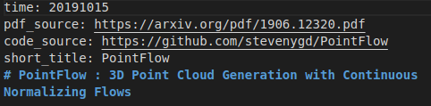

# 论文阅读

对进行的论文阅读进行记录。

[网页](https://owen-liuyuxuan.github.io/papers_reading_sharing.github.io/)
<!-- [网页](http://192.168.1.122:8000) -->

# For Developers

总体文件结构:

./custom 存放自定义的HTML,css,js以及小图标等文件

./doc 分文件夹、类别存储论文阅读笔记,每一个子文件夹里面都有一个对应的res文件夹,用于存放对应类别笔记markdown中的图片等资料

./mkdocs.yml 为mkdocs的主设置文件

./deploy.sh ,运行./deploy.sh [commit-message]。会连续执行pull,commit, push, deploy的指令。

## Getting Started

总览：本文使用[mkdocs](https://www.mkdocs.org/)包,运行“pip install mkdocs”即可完成基础安装，git clone 本repo到本地即可开始工作。

编译测试：下载后,在repo目录下运行“mkdocs build”会在本地编译网页，内容放在./site文件夹中，不需要更改，本repo的.gitignore自动忽略了此文件夹。

预览：运行"mkdocs serve"，编译成功后可以在本地开启浏览器输入"127.0.0.1:8000"(默认端口),即可预览网页。建议每次增添内容准备deploy的时候都进行一次预览。

部署：运行"./deploy.sh [commit-message]"。过约半分钟后可以在[github page](https://owen-liuyuxuan.github.io/papers_reading_sharing.github.io/)上看到更新。

## 记录新的论文

### 基础信息
在docs文件夹，自己选定的子文件夹中创建markdown，文件名建议不要留空格。

在markdown中，建议只使用一个#号引入标题，这个将会成为默认标题

在markdown中若想插入图片，建议将图片保存在对应类别的res文件夹中。然后根据[markdown语法](http://xianbai.me/learn-md/article/syntax/images.html)，链接使用相对(相对于当前markdown文件)路径指向图片1

在markdown中若想输入公式，使用正常的[markdown数学公式语法](https://www.zybuluo.com/codeep/note/163962)即可。

在markdown中若想输入在网页上能使用的跳转到本站其他页面的超链接，只需要使用正常的[markdown超链接语法](http://xianbai.me/learn-md/article/syntax/links.html)，链接目标建议使用相对地址(相对于当前markdown文件)，指向对应的markdown文件即可(注意不需要指向html)。若想提供外部链接，则与正常markdown输入一致。

### meta信息

我们利用mkdocs的meta插件，让我们在写markdown时可以引入了一些有用的信息。目前每一个信息域都是optional的。

在markdown标题上方插入如图格式的段落(注意冒号前面不能有空格，但冒号后面可以有white space)。

- time: 表明修改文章的时间。信息请严格根据格式 yyyymmdd(如:20100302),否则可能引起解析报错，
- pdf_source: 一般给出pdf链接，这可以给文章自身的目录顶部带上一个pdf外链的图标。
- code_source: 一般给出较为官方的开源代码链接，这可以给文章自身的目录顶部带上一个github外链的图标
- short_title: 给出简短的题目记号，这会影响文章标题在首页以及下拉菜单栏中的显示

目前版本效果如图:

## 网页设计

网页的设计内容主要在custom文件夹中

目前主要需要做(本人不够技术完成)的功能：

1. 让主页有序放置最近的文章(最近X天添加，或者最近的X篇，或者both)
2. 让主页有一个random walk的按钮，也就是随机跳转至某一篇论文
3. 优化搜索