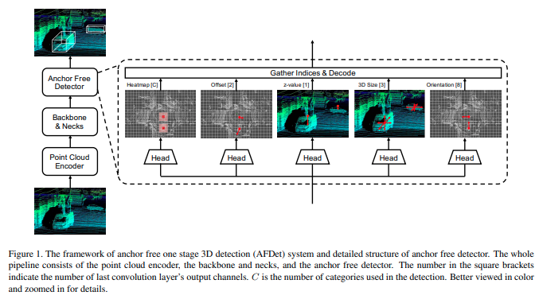

time: 20200701
pdf_source: https://arxiv.org/abs/2006.11275
code_source: https://github.com/tianweiy/CenterPoint
short_title: CenterNet for Point cloud

# CenterNet for Point cloud

这里引入两篇paper，都使用[object as point](../other_categories/object_detection_2D/Object_as_points.md)作为基础进行object 3D detection.

##  Center-based 3D Object Detection and Tracking
[pdf](https://arxiv.org/abs/2006.11275) [code](https://github.com/tianweiy/CenterPoint)

这篇是Xingyi Zhou组的官方延续代码，主要修改，Heat Map调整了 正样本的覆盖面积。Detection head增加了可变形卷积。使用基于半径的NMS取代基于IOU的NMS；两轴翻转的数据增强

## AFDet: Anchor Free One Stage 3D Object Detection

[pdf](https://arxiv.org/pdf/2006.12671.pdf)

