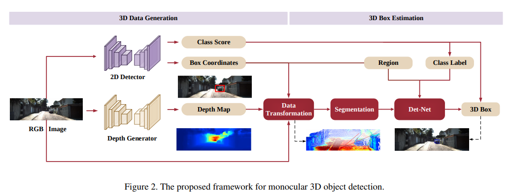
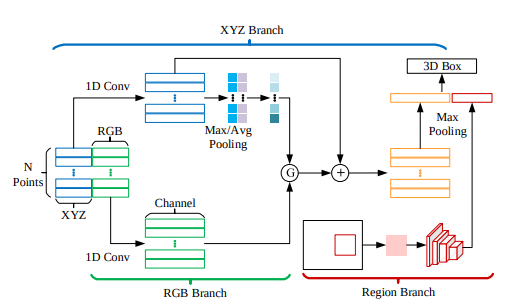

pdf_source: https://arxiv.org/pdf/1903.11444.pdf
short_title: Color-Embedded 3D Reconstructio Mono3D
# Accurate Monocular Object Detection via Color-Embedded 3D Reconstruction for Autonomous Driving

这篇文章利用了depth estimation以及Pseudo lidar的思路，是目前单目视觉3D检测的SOTA,但是额外出彩的地方在于其对RGB信息以及深度信息融合时的做法。

## 主要结构与流程图

对单一图像分别使用RPN提取RoI以及使用深度网络生成深度信息，然后对提取出来的区域，进行简单的数据转换、分割、融合检测回归

## 局部详解

### 数据转换

已知深度d，使用

$$
\left\{\begin{array}{l}{z=d} \\ {x=\left(u-C_{x}\right) * z / f} \\ {y=\left(v-C_{y}\right) * z / f}\end{array}\right.
$$
将RoI区域转换为目标点云(密集表达)。

### 点云分割

方法简单，在RoI区域内，求出深度平均值，比均值高出一个阈值以上的判断为背景点

$$
S^{\prime}=\left\{p | p_{v} \leq \frac{\sum_{p \in S} p_{v}}{|S|}+r, p \in S\right\}
$$

并从中随机选取一定量的点作为输出点，大小一致便于后期处理
###

### 坐标转换

用一个经典[文章](https://arxiv.org/pdf/1711.08488.pdf)的方法，利用一个小网络估计出RoI的中心，然后将所有点转到相对坐标系中
$$
S^{\prime \prime}=\left\{p | p-\delta, p \in S^{\prime}\right\}
$$

然后用pointnet预测

### 融合

用如图方式融合点云以及彩色点。

$G$是一个注意力模块，得到它的公式是$G = \sigma(f([F^{xyz}_{max}, F^{xyz}_{avg}]))$,有一点[CBAM](../Building_Blocks/CBAM:Convolutional_Block_Attention_Module.md)的效果，

后面的点乘与相加可以写成

$$
\mathbf{F}^{x y z} \leftarrow \mathbf{F}^{x y z}+\mathbf{G} \odot \mathbf{F}^{r g b}
$$

另一方面，从图中的2D RoI中，使用RoIAlign调到$128\times 128$，用CNN提取一个特征向量，并联

### 训练细节

1. 两阶段训练，先训练两个中间网络，然后只用3D信息训练整个网络
2. 损失函数包括，中间轻量级的对center的估计，预测输出的corner loss(8个角)

