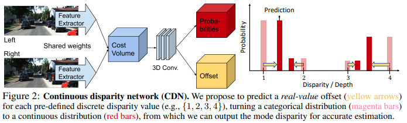

time: 20200714
pdf_source: https://arxiv.org/pdf/2007.03085v1.pdf
code_source: https://github.com/Div99/W-Stereo-Disp
# Wasserstein Distances for Stereo Disparity Estimation

这篇paper提出了双目匹配的一个新的输出方式与训练方式，作者将其替换到不同的双目匹配以及双目检测的方案中，都得到了直接的性能提升。

## 输出方式

此前的双目匹配是建立在单模预测的假设上的，每一个点预测一个概率，然后期望将结果训练成为一个单峰的高斯分布。

但是作者指出，在物体边界上的点，大概率得到的disparity是一个双模的分布(disparity可能对应前景也可能对应后景)，如果直接对结果进行加权平均，就会观察到像[P-lidar](Pseudo-Lidar.md)文章图片中看到的情况，也就是边缘点洒落在物体前景与后景之间。

作者给出的方案是让每一个base disparity独立地计算ground truth与自己的offset以及概率，网络的输出则是直接输出其中概率最高的模态。

## 训练方式

对于单模态训练，作者提出使用wasserstein距离进行训练:

$$\begin{aligned}
W_{p}\left(\tilde{p}, p^{\star}\right)=\left(\mathbb{E}_{\tilde{p}}\left\|d^{\prime}-d^{*}\right\|^{p}\right)^{1 / p} &=\left(\sum_{d \in \mathcal{D}} p(d \mid u, v)\left\|d+b(u, v, d)-d^{\star}\right\|^{p}\right)^{1 / p} \\
&=\left(\sum_{d \in \mathcal{D}} \operatorname{softmax}\left(-S_{\text {disp }}(u, v, d)\right)\left\|d+b(u, v, d)-d^{\star}\right\|^{p}\right)^{1 / p}
\end{aligned}$$

