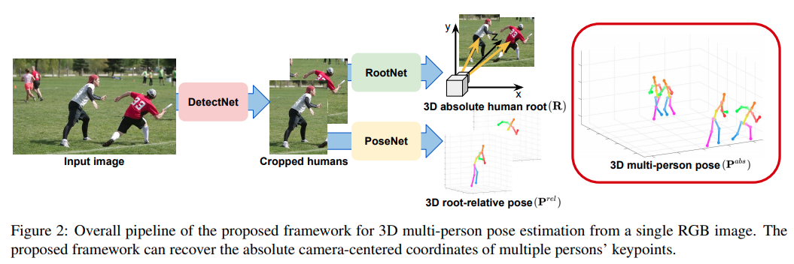
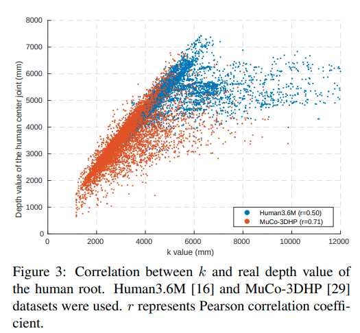
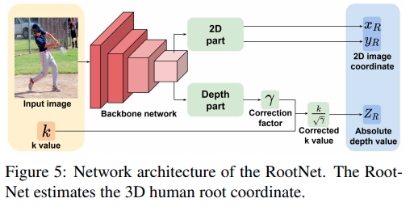

time: 20191220
pdf_source: https://arxiv.org/pdf/1907.11346.pdf
code_source: https://github.com/mks0601/3DMPPE_ROOTNET_RELEASE
short_title: camera distance-aware Mono 3D pose estimation
# Camera Distance-aware Top-down Approach for 3D Multi-person Pose Estimation from a Single RGB Image

这篇论文采用了基于几何与相机的特性的方式对人的肢体进行3D detection，pose estimation的输出是关节坐标，本文进一步需要计算人与相机的距离。代码分两部分开源
分别是[rootnet]与[posenet].

## 总体流程

流程分为三个网络，第一个网络为DetectNet,简单来说就是two-stage object detection的proposal阶段，采用的res网络以及roialign操作皆为常规。

第二个网络为rootNet主要负责预测人体在3维空间中的位置，在下文讲解。

第三个网络为PoseNet，采用的类似于常规的pose-estimation网络，输出的是小图片中人体各个关节的heatmap。

## RootNet

rootnet主要观测的是图片中2D框大小与深度的一个相关性

网络结构如下，

$$
k=\sqrt{\alpha_{x} \alpha_{y} \frac{A_{r e a l}}{A_{i m g}}}
$$
其中$\alpha_{x}$为相机内参的$f_x$, $A$分别为实际面积大小与图片中的大小。$A_{real}$为一个估计值，网络的责任在于估计这个k值.

[rootnet]:https://github.com/mks0601/3DMPPE_ROOTNET_RELEASE
[posenet]:https://github.com/mks0601/3DMPPE_POSENET_RELEASE