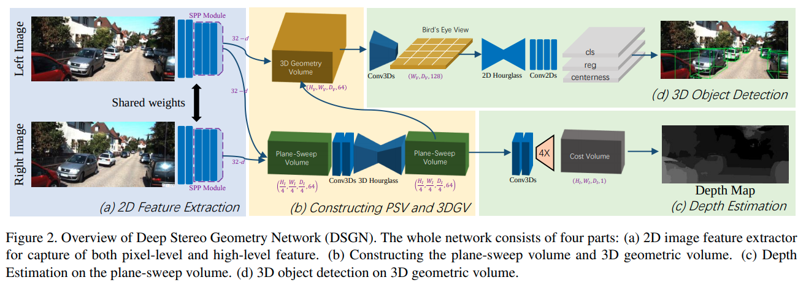
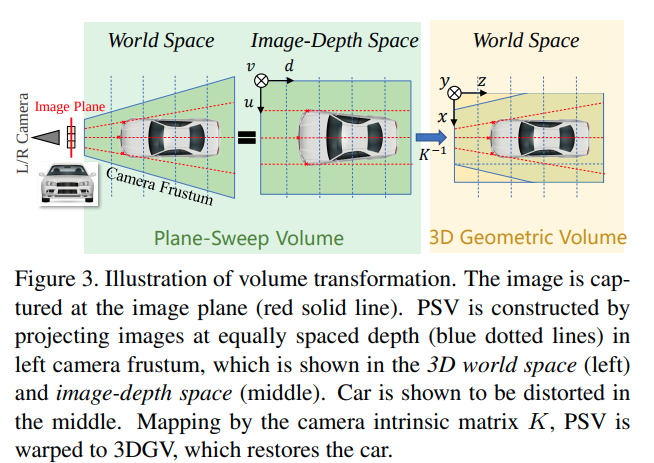

short_title:DSGN
time: 20200409
pdf_source: https://arxiv.org/pdf/2001.03398.pdf
code_source: https://github.com/chenyilun95/DSGN

# DSGN: Deep Stereo Geometry Network for 3D Object Detection

这篇论文不同于此前的使用Pseudo-lidar的方式，采用了类似于plane-sweeping 的思路。将双目图像转换为三维坐标下的信息。

在总体上来说计算确实很暴力，inference也很慢，但是它的结构能让它同时进行双目深度估计，也可以读取点云作为辅助的监督信息，并经过测试能提升模型性能。

Update:
    20200409: 作者已经开源，里面有CostVolume的cuda实现，值得关注学习

## Pipeline

以双目为例子，如图，两帧图像同时进行特征提取，

## Plane Sweep Volumn

PSV模块里面每一个index $(u,v,d)$是在所谓的图片坐标中表达的,所以这里的做法是，对每一个平面$d_{i}$,将右目的特征在这个平面内找到与左目对应的坐标，将特征concat起来。然后用3D卷积的[hourglass]模型进行处理.

## 3D Geometry Volumn

下一步要做的就是将建立在image-depth space的PSV特征投影到世界坐标中，这里的做法是，对于每一个world space点，找到它在 image-depth space中的位置，使用三向插值得到其值。(differential warping)

## 检测分支

之后使用3D 卷积与2D hourglass，类似[OFT]或者[MV3D]的模式压缩处理BEV图片,物体检测的模式是按照[FCOS]的算法进行的，这是一种anchor-less的算法。

深度估计分支，经过几个Conv3D以及上采样处理，得到$(H_1,W_1,D_1,1)$的矩阵。对$D$维度取softmin并加权求和，得到对深度的估计。

后面的实验中，作者的implementation是同时用点云与物体在两个分支上同时进行监督，得到的性能是最好的。另外本文里面所有的模型都没有pretrain，都是train from scratch。

[hourglass]:../Building_Blocks/Stacked_Hourglass_Networks_for_Human_Pose_Estimation.md
[OFT]:Orthographic_Feature_Transform_3D_detection.md
[MV3D]:Multi-View_3D_Detection_Network_for_autonomous_Driving.md
[FCOS]:../other_categories/object_detection_2D/FCOS.md