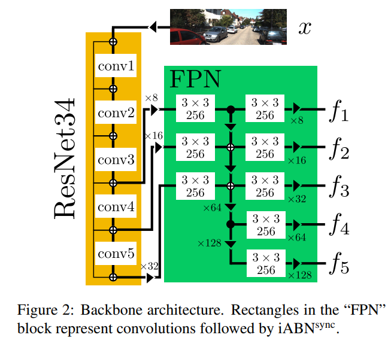
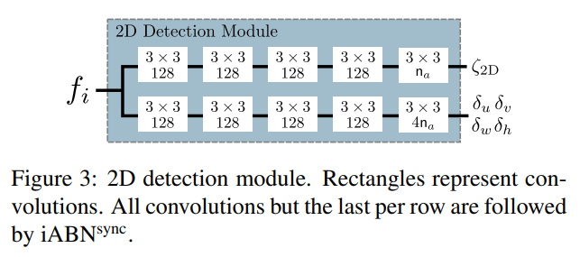
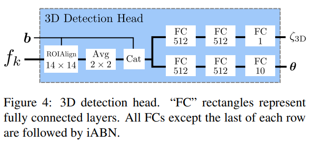
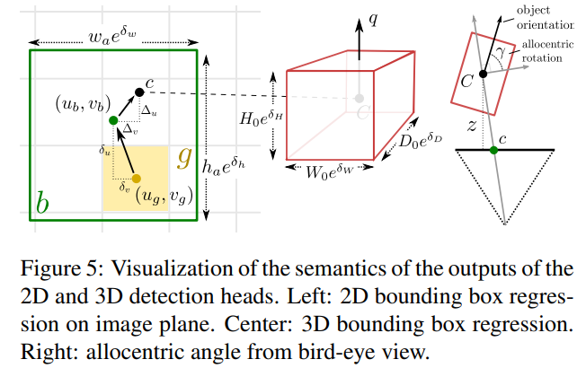
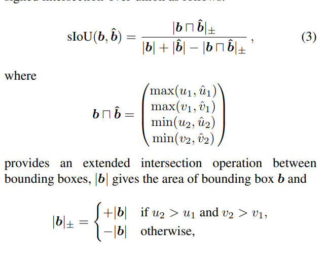
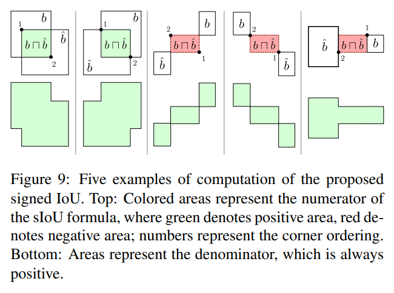

pdf_source: https://arxiv.org/pdf/1905.12365.pdf
short_title: MonoDIS
# Disentangling Monocular 3D Object Detection

这篇论文目前在nuScene以及Kitti上实现了单目视觉三维检测的SOTA的性能。

使用Two Stage的检测方式，与M3D-RPN类似，利用了多尺度特征，增加了多个特殊设计的Loss function

# 整体结构

网络分为backbone, 2D head, 3d head三个部分，结构分别为

直觉上来说，就是使用Res34以及feature pyramid network(FPN)提取多尺度特征，输出多个feature map，每一个feature map输出2D detection Output.对每一个Proposal，使用ROIAlign层将对应框resize为14*14，提取出特征后与2D输出连接再输入到全连接层，最终输出3D output.

注意其中的iABN为In-Place Activated BatchNorm,是一个可以较少training time memory cost的模块，其pytorch实现可以在[此处](https://github.com/mapillary/inplace_abn)找到

其输出定义:

注意旋转输出的是四元数

# 损失函数

## 2D Loss

1. Focal loss
源自与[这篇文章](https://arxiv.org/pdf/1708.02002.pdf)
$$
L_{2 \mathrm{D}}^{\mathrm{conf}}\left(p_{2 \mathrm{D}}, y\right)=-\alpha y\left(1-p_{2 \mathrm{D}}\right)^{\gamma} \log p_{2 \mathrm{D}}-\overline{\alpha} \overline{y} p_{2 \mathrm{D}}^{\gamma} \log \left(1-p_{2 \mathrm{D}}\right)
$$

1. Loss based on sIoU
$$
L_{2 \mathrm{D}}^{\mathrm{bb}}(\boldsymbol{b}, \hat{\boldsymbol{b}})=1-\operatorname{sIoU}(\boldsymbol{b}, \hat{\boldsymbol{b}})
$$

sIoU的计算公式为：

实际上有以下五种情况，sIoU会在[-1, 1]之间， 

## 3D Loss

1. Regression
网络输出10个参数x,y,z,w,h,l,quarternion,使用lifting transformation 将这组参数转换为目标参数8个，对8个参数进行回归

2. Classification
Focal loss

### lifting transform
实际上就是将预测点提升为8个角点
令$z, c = (u_c, v_c), s = (W,H,D), q$为预测的中心点深度、在图中投影的坐标，车辆三维以及四元数。K为相机内参
$$
K=\left[\begin{array}{ccc}{f_{x}} & {0} & {c_{x}} \\ {0} & {f_{y}} & {c_{y}} \\ {0} & {0} & {1}\end{array}\right]
$$
令
$$
C=\left(\begin{array}{cc}{\frac{u_{c}-c_{x}}{f_{x}} z,} & {\left.\frac{v_{c}-c_{y}}{f_{y}} z, \quad z\right)^{\top}=\left(C_{x}, C_{y}, C_{z}\right)^{\top}}\end{array}\right.
$$
这个是中心点是实际坐标
lifting transform $\mathcal{F}$为

$$
\mathcal{F}(\boldsymbol{\theta})=\frac{1}{2} R_{\boldsymbol{q}_{\mathrm{c}}} S B_{0}+\boldsymbol{C}
$$

## Disentangling 2D and 3D Detection Losses

直觉来说，二维Regression loss与三维Regression loss,直接叠加的好处是两者不会相互影响，但是它们会产生不平衡，影响优化的过程

比如对于本文的三维回归来说，原始参数分为四组，也就是深度、相机坐标、三维以及角度，回归时需要计算的参数是八个角点的坐标，其中需要一个转换。

在计算loss时，分成四组。其中第$i$组计算loss时，第$i$组参数用预测值，其余用ground_truth，如此每一组都会分开优化。

具体直觉看原文
