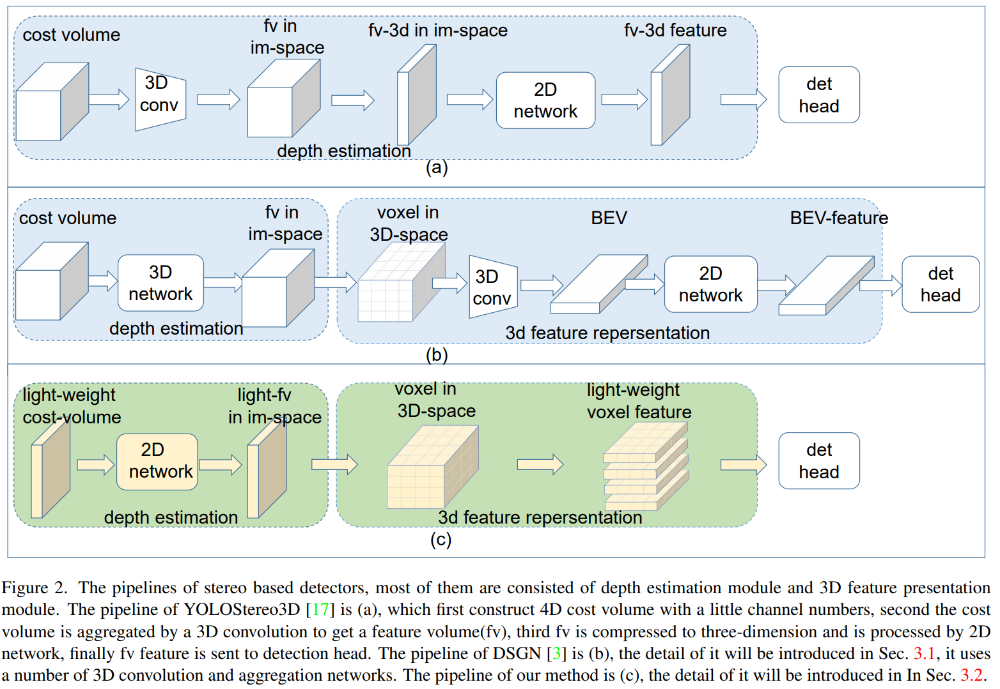
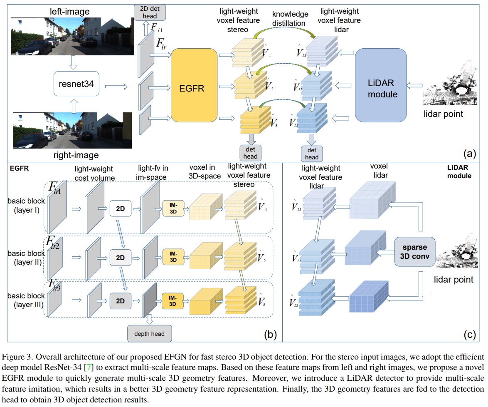
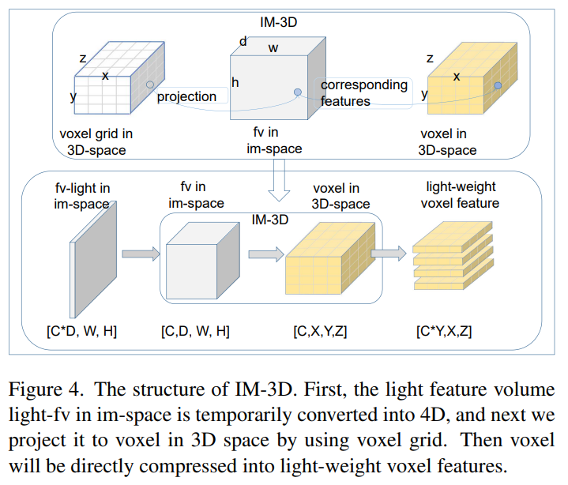

time:20211216
pdf_source:https://arxiv.org/pdf/2111.14055.pdf

# EGFN: Efficient Geometry Feature Network for Fast Stereo 3D Object Detection

这篇paper基于[YOLOStereo3D](YOLOStereo3D.md)开发,增加了image-view 与 BEV feature的转化以及更加激进的蒸馏策略.

根据上图,简单来说,在YOLOStereo3D的基础上,进一步通过IM3D模块把特征转到3D space. 然后参考LiDAR的输入进行蒸馏训练.输出头改成 [LIGAStereo](RecentCollectionForStereo3D.md) 的方案.

整体的思路类似于结合了[YOLOStereo3D](YOLOStereo3D.md)的前端结构&匹配思路和[LIGAStereo](RecentCollectionForStereo3D.md)的点云蒸馏&三维推理.

得到一个更高的速度&精度平衡点.
