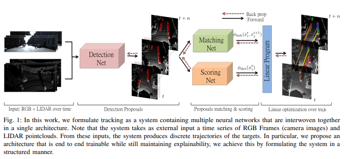
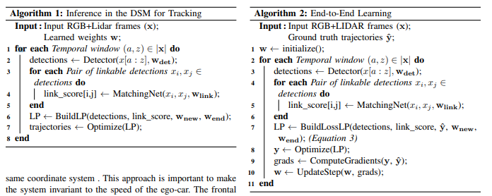
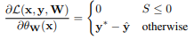

pdf_source: https://www.cs.toronto.edu/~frossard/papers/frossard_etal_tracking.pdf
# End-to-end Learning of Multi-sensor 3D Tracking by Detection

这篇论文主要讨论的是一个tracking问题，突出贡献是使用了离散优化的概念(在求解时转换为了线性优化问题)，并解决了如何训练这个问题，过程中有较多的数学巧合，但是其实这是一类问题的解决方法,这个问题称为general matching problem,可以[参考引文6](https://www.idiap.ch/~fleuret/papers/berclaz-et-al-tpami2011.pdf)的问题阐述以及附录1。

## 推断结构

逐个分析：

1. Detection Net用的是[MV3D](Multi-View_3D_Detection_Network_for_autonomous_Driving.md)
2. Scoring Net，将每一个3D框投影回图片中，用VGG总结，给出这个图片是true positive的cost
3. Matching Net，分两支，一个是Siamese Network，将两个3D框对应的图片送到network中提取共同信息，第二个是运动矫正后的3D投影图，送到network中提取信息。然后最后由FC Net得到预测。这个network需要对每一对可能的匹配计算。
4. new cost and end cost:对一个detection是新的或是最终出现的预测，是一个常量，可学习。

## 过程简介

## 两个Linear、Integer Programming的定义

约束矩阵

$$y_j^{new} + \sum_{k of last frame}y^{link}_{j,k} = y^{end}_{j} + \sum_{k of next frame} y_{j,k}^{link} = y_j^{det}$$

简单地说就是新生的or从上一帧来的object = 结束的or去往下一帧的object = 这一帧这个object是否是true positive

在纯粹inference的时候，优化目标就是$\theta_{\bold w}(\bold x) y$,每一个布尔决策y前的cost由前文的Matching Net， scoring net，以及可学习常量给出。直接用OR-tools求解,相当于已知reward参数找出最好的解

在需要train的时候，优化目标就是
$$L(x, y, W) = \sum_x[\max_{y}(\Delta(y, \hat y) + \theta_{\bold w}(\bold x) (y-\hat y)))]$$
里面的
$$\max_{y}(\Delta(y, \hat y) + \theta_{\bold w}(\bold x) (y-\hat y))$$
作为inference时候需要求解的LP函数。思路类似于SVM中的对偶优化问题，在训练的时候，我们需要找到$w$，使得,worst case的一个"错判loss"最小，而这个worst case的错判loss，首先要定义错判loss，其次是用max找出worst case(简单).而错判loss这里用汉明距离+reward difference,理想情况下，汉明距离越大，reward difference就应该越小,反之亦然，并最好保持为一个常数

对于错判loss，首先汉明距离小时reward difference自然也会小，而汉明距离大时reward difference也应该为一个大的负数以抵消，如果出现汉明距离大而reward difference不够小，则这个worst case需要被修正，也就是这个玩意儿的intuition。

关于其梯度，建议参考[这篇](https://www.wikiwand.com/en/Hinge_loss)。得到的结果是

关键是根据引文6，这个约束矩阵A是一个单模矩阵，所以其逆矩阵的解都是整数，所以Integer programming被转换为Linear Programming并同时保证了最优解一定是整数。
