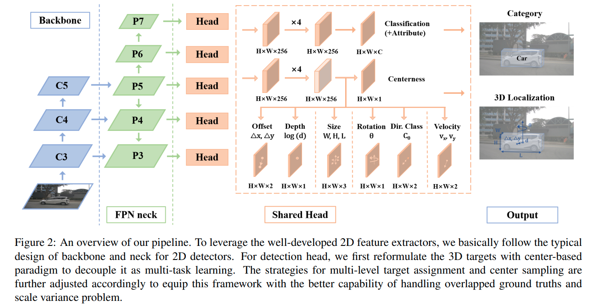

time: 20210502
pdf_source: https://arxiv.org/pdf/2104.10956.pdf
code_source: https://github.com/open-mmlab/mmdetection3d

# FCOS3D: Fully Convolutional One-Stage Monocular 3D Object Detection

本文将[FCOS](../other_categories/object_detection_2D/FCOS.md)转为了3D的版本.