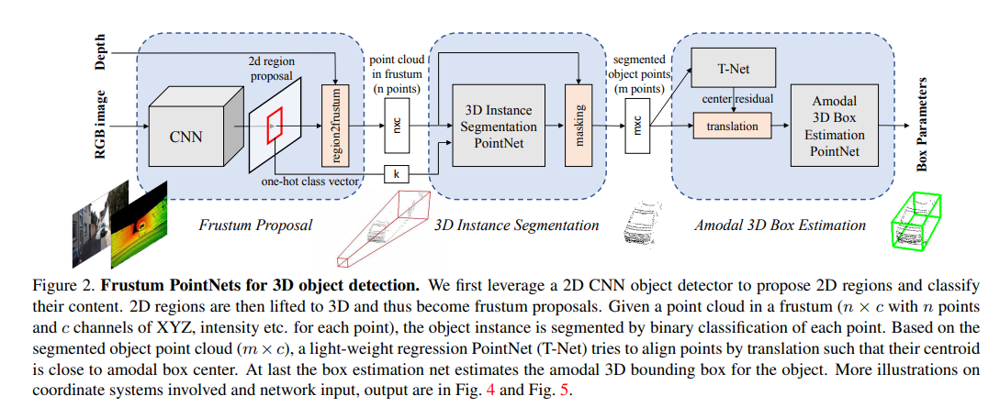
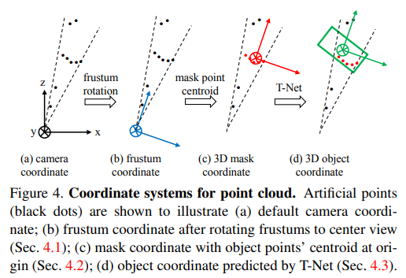
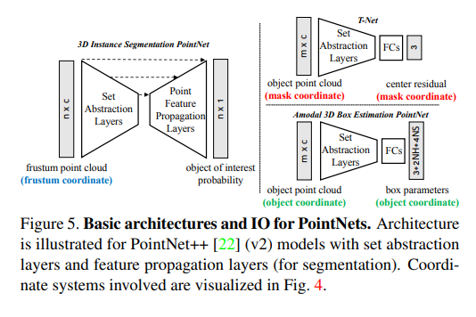

pdf_source: http://zpascal.net/cvpr2018/Qi_Frustum_PointNets_for_CVPR_2018_paper.pdf
code_source: https://github.com/charlesq34/frustum-pointnets
short_title: Frustum PointNets
# Frustum PointNets for 3D Object Detection from RGB-D Data

这篇论文给出了使用RGB-D数据进行3D检测的baseline pipeline.

## 网络结构

对RGB图片执行2D detection，给出2D proposal以及分类one-hot矢量,从proposal中采样出n个点，使用pointnet进行Instance Segmentation区分背景以及foreground,执行masking再采样m个点，使用T-Net等回归估计三维框结果

代码中使用的坐标系示意图

PointNet使用的结构

点云语义分割中，除了使用pointnet之外，在输入特征中还concat了语义分类的category。
在点云回归时，先用T-Net求出中心点坐标，将剩余点转换为以中心点为中心的位置上在估计box size

## Loss

1. Multitask Loss
2. Corner Loss