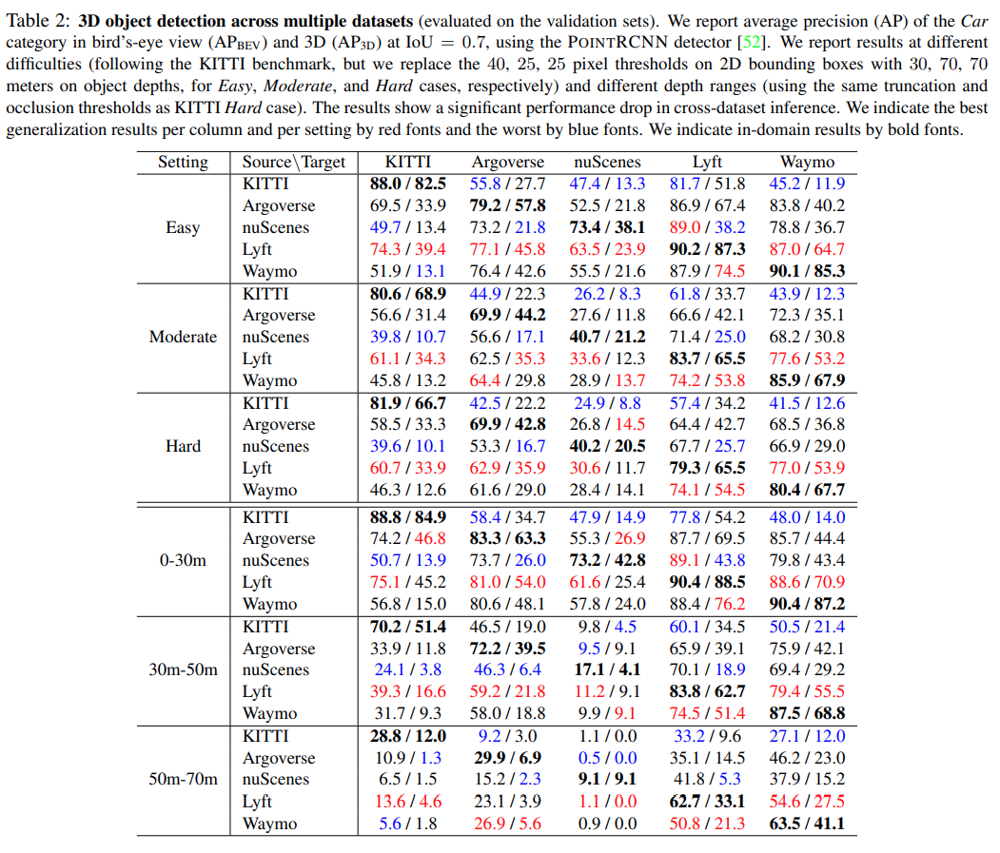
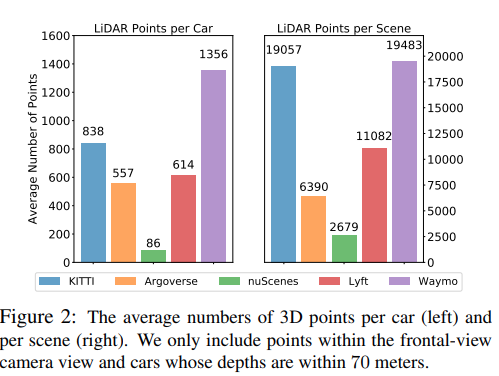
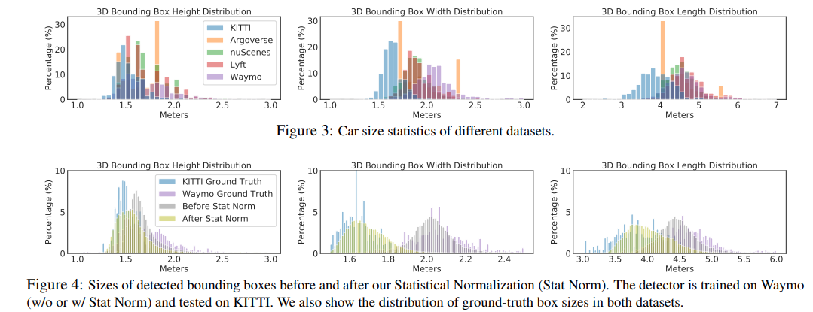
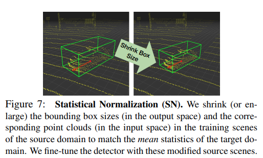

pdf_source: https://arxiv.org/pdf/2005.08139v1.pdf
time:20200520
short_title: Generalization for 3D Detection
code_source: https://github.com/cxy1997/3D_adapt_auto_driving
# Train in Germany, Test in The USA: Making 3D Object Detectors Generalize

这篇paper讨论的是点云3D检测器的鲁棒性问题。并提出doman transfer的问题

## Biased in Datasets

作者分析研究了五个数据集的特点，分别是[KITTI], [Argoverse], [nuScenes], [Lyft], [Waymo].

(注，Argoverse与KITTI都有双目)

先使用一个[PointRCNN](pointnet_related.md),在各个数据集上训练，看看直接跨数据集test的结果。

作者指出nuScenes与Argoverse作为target的时候性能下降特别厉害，这可能是与Lidar点数的输入有关的。nuScenes只有一个32线的雷达，而Argoverse是用两个32线的雷达直接上下堆叠形成一个64线的结果。

同时由于地点以及标注偏差的原因，不同数据集车辆长宽高的分布差距很大，作者认为这是因为车子的地区差异。

(注：个人观察不同数据集时，得到的结论其实是只有KITTI的3D框是严格与物体紧贴的，其他数据集的框投影到相机上能看到显然是不紧贴的)

作者做了一个实验，对所有IoU > 0.2为界限匹配的prediction，保持其中心位置与角度不变，将whl改为正确值，cross domain性能显著提升。作者下的结论就是网络预测不正确的原因单纯地就是因为whl不正确。

## Generalize to differet datasets

做法与结论如下:

1. fine tuning有用，仅在20个scene上微调的结果能够比得上在原来500个scene上直接训练的性能。
2. 上图使用的Statistical Normalization进行微调（没有使用新domain的标注数据），性能也能很好。
3. 不finetune,在点云结果直接附加一个数据集的mean偏移，性能有部分提升，但是可能会over-react(因为网络本身就会adjust一部分，再加偏移会over-react)

[KITTI]:http://www.cvlibs.net/datasets/kitti/eval_object.php?obj_benchmark=3d
[Argoverse]:https://www.argoverse.org/data.html#tracking-link
[nuScenes]:https://www.nuscenes.org/
[Lyft]:https://level5.lyft.com/dataset/
[Waymo]:https://waymo.com/open/challenges/3d-detection/#