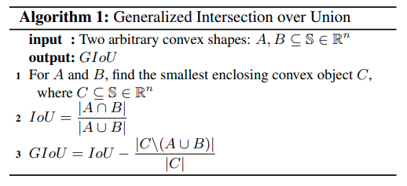
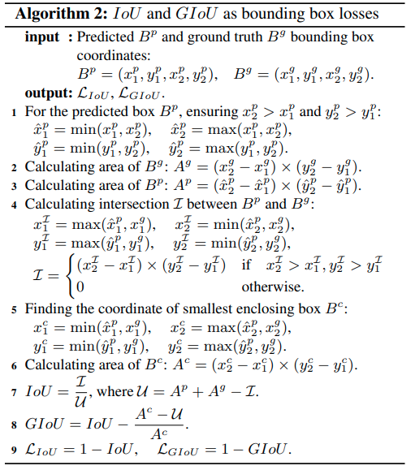
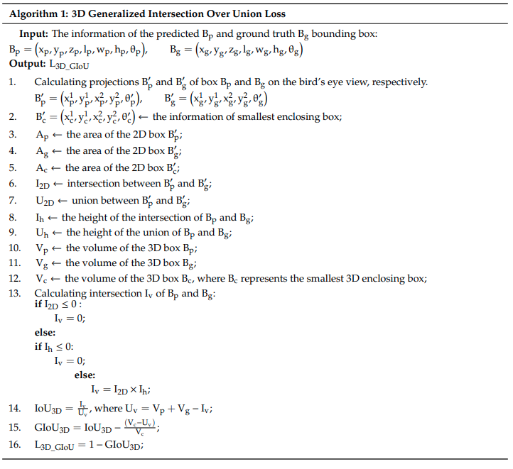
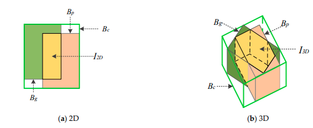

time: 20191214
pdf_source: https://giou.stanford.edu/GIoU.pdf
code_source: https://github.com/diggerdu/Generalized-Intersection-over-Union/blob/master/bbox_overlaps.py
short_title: Genearlized IoU 2D and 3D

# Generalized IoU for 2D and 3D

这里尝试同时记录两篇相关的论文，分别描述的Generalized 2D IoU 与Generalized 3D IoU，最终解决的都是在没有intersection的情况下得到一个对IoU的估计

## Generalized Intersection over Union: A Metric and A Loss for Bounding Box Regression

这篇是CVPR使用Generalized 2D IoU的原文，至于是这个算法好，还是[signed_iou]效果好，有待测试

## 3D-GIoU: 3D Generalized Intersection over Union for Object Detection in Point Cloud

3D IoU的算法在[这篇文章](IoU&#32;Loss&#32;for&#32;2D.md)有详细描述

[signed_iou]:Disentangling_Monocular_3D_Object_Detection.md

算法

