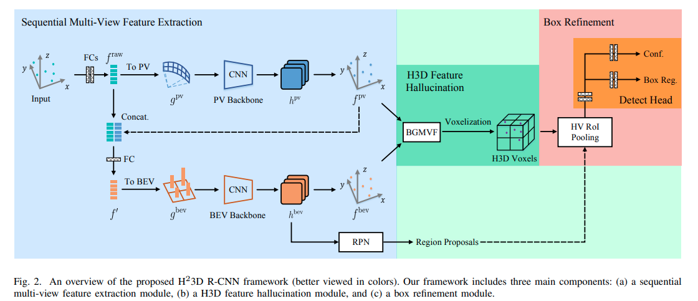
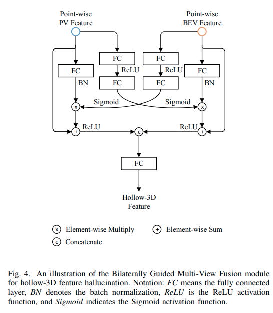
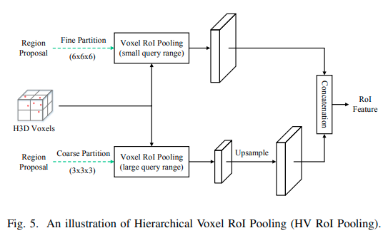
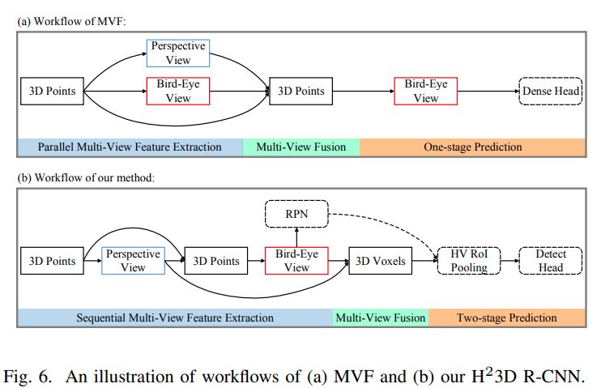

time: 20210802
pdf_source: https://arxiv.org/pdf/2107.14391.pdf
code_source: https://github.com/djiajunustc/H-23D_R-CNN
# From Multi-View to Hollow-3D: Hallucinated Hollow-3D R-CNN for 3D Object Detection: (H23D-RCNN)

这篇paper提出了一个基于跨视角融合的two-stage点云检测算法。其主要的motivation是说点云是在物体表面的，所以用two-stage可能更好。

## 方法:

### 多视角特征提取:

- Multiview Grid Indexing: BEV使用笛卡尔坐标系，而Perspective View(PV)使用圆柱坐标系。
- 对每个点先用全连接提一次特征，在投射到PV/BEV时，由于voxelization,会有重叠点，这里采用的方案是max-pooling.
- PV backbone 与 BEV backbone权重共享。 但是BEV能获取PV的信息。

### H3D Feature Hallucination

这个模块的输入是来自两个模态的点集特征，输出的形态上来说是 proposal generator, 也就是第一阶段的结果. 这里和PointRCNN很像，让每一个点给出一个proposal.

融合的时候，文章提出新融合模块  Bilaterally Guided Multi-View Fusion(BGMVF)

输出是point-wise H3D 特征，再次进行voxelization, 其indexing 方法是 $i_n, j_n, k_n$， 其中$(i_n, j_n)$对应BEV的位置， $k_n$对应PV的高度。再次用max-pooling进行voxelization.

### Box Refinement

这指的是方法的second stage.

方法的meta architecture 如图

