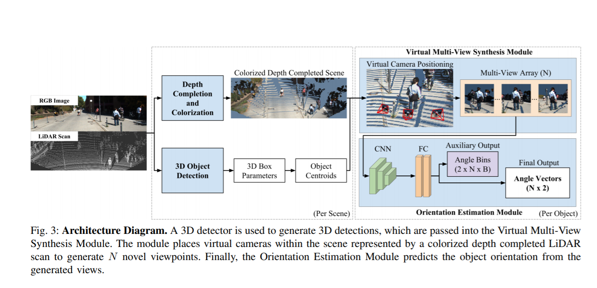
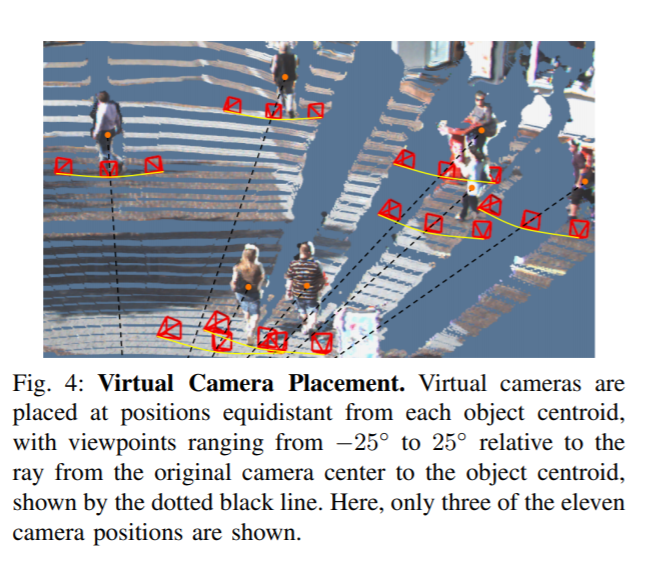

time: 20191221
pdf_source: https://arxiv.org/pdf/1907.06777.pdf
code_source: https://github.com/kujason/vmvs
short_title: Multi-View Synthesis for Orientation Estimation
# Improving 3D Object Detection for Pedestrians with Virtual Multi-View Synthesis Orientation Estimation

这篇论文讨论的问题是提升3D行人检测过程中对行人朝向角度的预测精度问题。采用的思路是使用几个人工角度合成相片实现很巧妙的pooling.输入是RGB + Lidar

Update:
    2019.12.21: Code has been [open-sourced](https://github.com/kujason/vmvs)
## 总体思路

总体思路:

1. 使用RGB图像与Lidar数据，进行Depth Completion and colorization 形成彩色的更密集的点云场景
2. 进行3D物体检测,求出3D box参数以及物体中心。
3. 根据物体中心，在设计的物体放置数个个虚拟的相机，将彩色点云投影到这几个相机内，得到几张合成的图片
4. 将这个合成的图片输入到CNN中进一步输出角度预测。

## 合成相机布置

相机放置方式,与原来相对射线相对±25°之间连续放置，本文采用的是11个虚拟相机的排列。

## 深度补全上色

原来的点云只能提供一个稀疏的深度估计，本文利用了作者的[另一篇深度补全算法.pdf](https://arxiv.org/pdf/1802.00036.pdf),[简介](../other_categories/others/In_Defense_of_Classical_Image_Processing_Fast_Depth_Completion_on_the_CPU.md),将稀疏的点云变成密集的深度图，也就可以对应像素上色。

## 其他训练细节

基础的3D检测使用的是[AVOD.pdf](https://arxiv.org/pdf/1712.02294.pdf),角度估计使用的是在kitti 2D检测问题中预训练的Res101(个人理解这是一个相当大的网络)

本文的成果是将行人三维检测的角度估计精度大幅度提升。