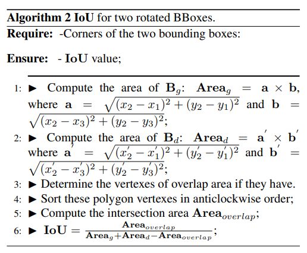

pdf_source: https://arxiv.org/pdf/1908.03851.pdf
# IoU Loss for 2D/3D Object Detection

这篇论文的核心贡献是给出了所谓的IoU Loss,因为拼点的过程中关键点在于提升IoU的值，但是我们目前没有直接梯度优化IoU的方法，这篇文章给出的IoU Loss就是给出一个可微分的损失函数，通过直接优化IoU提高分数

## 一般带有旋转的2D IoU算法

1. 计算两个平面区域的面积
2. 找出两个区域相交得到的凸多边形的点，这些点有两种来源可能，一个是两个box边缘的交点，一个是出现在另一个bbox区域中的原来box的点
3. 将这些凸多边形的边缘点逆时针或者顺时针排序，算法是：先求出凸多边形的中心点，然后逐个求出旋转角度，然后将这个旋转角度排序
4. 将凸多边形分解为多个小三角形，并求出总合面积
5. 得到overlap面积后求出IoU

## 3D IoU

只需要在求出over lap的基础上，在高度上补充一些参数即可：

$$
IoU_{3D} = \frac{Area_{overlap} \times h_{overlap}}
{Area_g \times h_g + Area_d \times h_d - Area_{overlap} \times h_{overlap}}
$$

