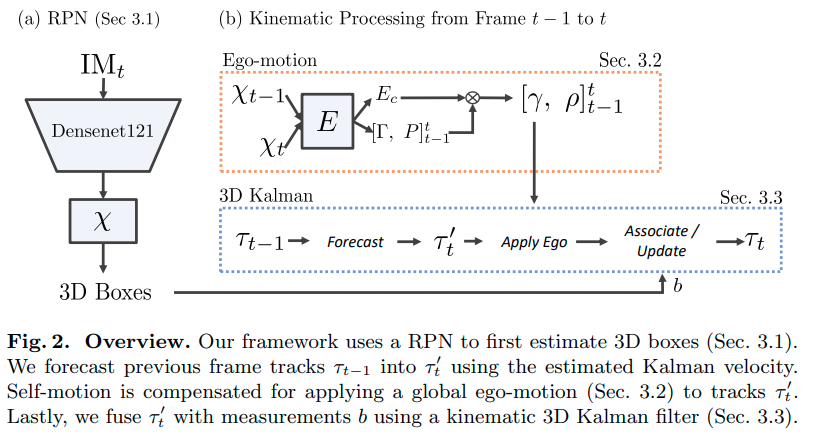
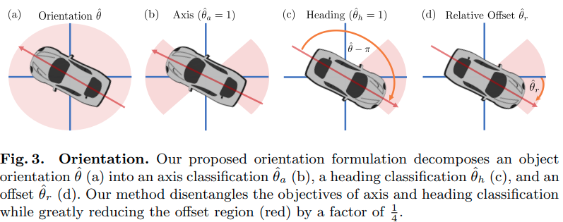

time: 20200724
pdf_source: https://arxiv.org/pdf/2007.09548.pdf
code_source: https://github.com/garrickbrazil/kinematic3d
# Kinematic 3D Object Detection in Monocular Video

这篇paper是基于[M3D-RPN](M3D-RPN_Monocular_3D_Region_Proposal_Network_for_Object_Detection.md)的单目时序融合。

## 整体推理结构

### Modified M3D-RPN

修改的版本主要是两个，一个是角度的预测，一个是自平衡损失函数。

角度的预测被分为两个分类以及一个回归

自平衡损失有两个作用，一方面是让网络决定不确定性，用于卡尔曼滤波，另一方面减少对过于困难的instance的过拟合。

$$L=L_{2 \mathrm{D}}+\omega \cdot L_{3 \mathrm{D}}+\lambda_{L} \cdot(1-\omega)$$
其中$\lambda{L}$为过去$n_L$个最近的$L_{3D}$的均值。

在推理的时候，最终的不确定性就是$\mu = c \cdot \omega$

### Ego-Motion

作者使用raw data里面的devkit在training set上生成了odometry ground truth, 然后用网络Densely predict 6DOF的ego motion.最后相当于求全局的均值作为预测。

因而也就可以用在test时将其他车辆的运动限制在自己的orientation上。

### 3D Kalman Filter

状态空间的设置为 $\tau = [\tau_x, \tau_y, \tau_z, \tau_w, \tau_h, \tau_l, \tau_\theta, \tau_{\theta_h}, \tau_v]$ 3D中心点，3D大小，方向以及速度

线性系统矩阵
$$\mathbf{F}=\left[\mathbf{I}^{9 \times 8} \begin{array}{cc}
\cos \left(\tau_{\theta}+\pi\left\lfloor\tau_{\theta_{h}}\right\rceil\right) \\
0 \\
-\sin \left(\tau_{\theta}+\pi\left\lfloor\tau_{\theta_{h}}\right\rceil\right) \\
0 \\
\vdots \\
1
\end{array}\right]$$

预测时注意需要处理ego-motion,状态方程是在世界坐标系上的，而网络的预测是在相机的坐标系下的。

$$\mathbf{P}_{t}^{\prime}=\mathbf{F}_{t-1} \cdot \mathbf{P}_{t-1} \cdot \mathbf{F}_{t-1}^{T}+\mathbf{I}^{9 \times 9} \cdot\left(1-\mu_{t-1}\right)$$

### Association

将卡尔曼滤波的输出与新一帧的预测进行组合，这边选择的方案是贪心的最低距离+2D IoU匹配。

观测更新

$$\mathbf{K}=\mathbf{P}^{\prime} \mathbf{H}^{T}\left(\mathbf{H} \mathbf{P}^{\prime} \mathbf{H}^{T}+\mathbf{I}^{8 \times 8}(1-\mu) \cdot \lambda_{o}\right)^{-1}$$

$$\tau_{t}=\tau_{t}^{\prime}+\mathbf{K}\left(b-\mathbf{H} \tau_{t}^{\prime}\right), \quad \mathbf{P}_{t}=\left(\mathbf{I}^{9 \times 9}-\mathbf{K} \mathbf{H}\right) \mathbf{P}_{t}^{\prime}$$

