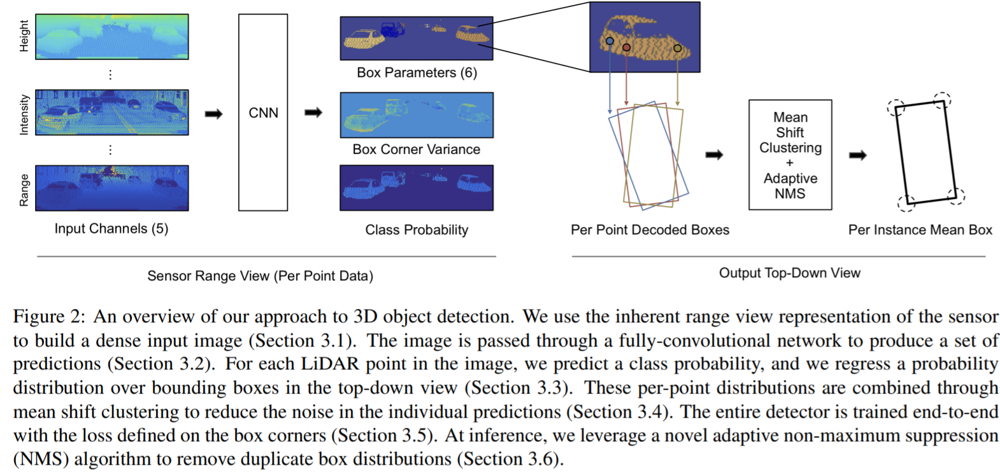
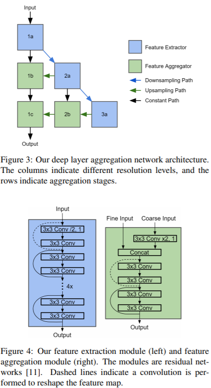
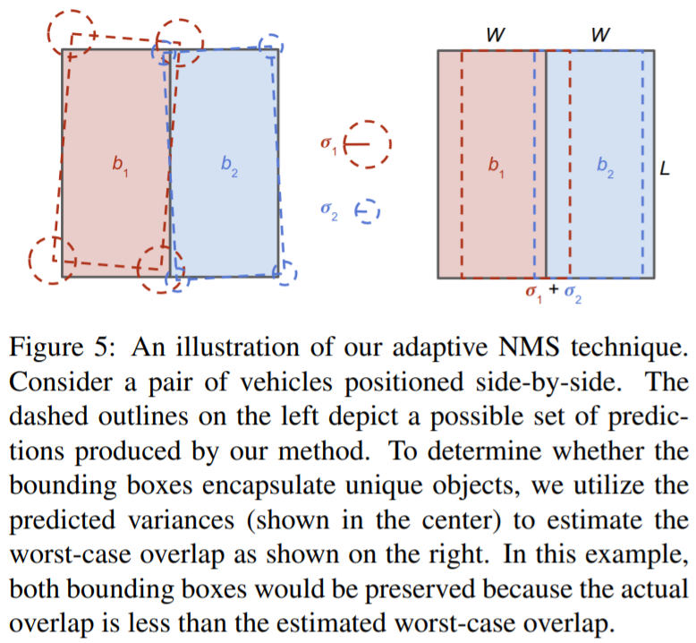

time: 20191113
pdf_source: https://arxiv.org/pdf/1903.08701.pdf
short_title: LaserNet
# LaserNet: An Efficient Probabilistic 3D Object Detector for Autonomous Driving

这篇论文实现3D object detection利用的数据类型主要是点云的Range view图像。目的是避免BEV过于稀疏的问题。

## 总体pipeline

### 数据组织方式

Lidar会随着旋转生成一个圆柱状的range image,数据集中使用的激光雷达velodyne 64线，垂直方向角度分辨率约为0.4°，水平方向的角度分辨率约为0.2°,直接将圆柱坐标的lidar转换为"图像",这个稍微类似于[MV3D](./Multi-View_3D_Detection_Network_for_autonomous_Driving.md)

距离、高度、反射强度、是否存在点的flag分别成为五个range view image的channel

### 网络结构

本文采用一个全卷积的结构，输出的是每一个Range view image对应一个pixel对应一个prediction。

### 预测输出

由于不同的点有不同的观测，而点云观测有不确定性，这里就将不确定性具体的考虑，(多预测variance)。
同时假设所有物体都在同一个ground plane上，因此一个bounding box由一个四个角落确定(BEV中)，并且高度固定。

这里具体的输出是relative center$(d_x, d_y)$，相对转角$(\omega_x, \omega_y) = (cos\omega, sin\omega)$以及dimensions=$(l,w)$
。这个$\omega$是观测角(视觉探测里面常用的)。最终输出矢量$={d_{x,k}, d_{y,k}, \omega_{x,k}, \omega_{y,k},l_k, w_k}^K_{k=1} + {s_k}_{k=1}^K + {\alpha_k}^K_{k=1}$.其中$\alpha$为mixture weights, $K$为mixture model的数量子模型。

### 均值偏移聚类(Mean Shift Clustering)

这里的考虑是，由于预测是密集的，但是相同点附近的预测很有可能会有很大的相似(向同一个物体靠拢)，而单个预测会有噪声，这里考虑的是让附近多个点的prediction对同一个object进行贡献。

这里对中心点的xy点这两个维度进行聚类。关于mean shift clustering 可以参见[wiki](https://www.wikiwand.com/en/Mean_shift).

本文算法：

1. 将俯视图使用$\Delta x \Delta y$离散化，初始化桶(bin) $m_i$，
2. 对于拥有多于一个box center的桶$m_i$,用均值计算，得到桶对中心坐标的初始估计，用$S_i$记录桶内的点集
3. 更新新的中心$m_i = \frac{\sum_{j \in i \bigcup N(i)} K_{i,j}(m_j * |S_j|)}{\sum_{j \in i \bigcup N(i)} K_{i,j}|S_j|}$ 其中,$K = exp(-\frac{||m_i-m_j||^2}{\Delta x^2 + \Delta y^2})$为核函数，$N(i)$为第$i$个桶附近的8个桶.其中对集合的$||$操作为取集合中点的数量。
4. 如果第$i$个桶的中心在$j$个桶的内部，那么将$i,j$加权融合，第$i$个桶的中心和$S_i$归0
作者表示这些内容都是可以用GPU加速的。对第3,4步迭代可得到融合点。

对于每一个集合，可以用如下公式将桶内的预测值进行求和，方差重算
$$
    \hat b_i = \frac{\sum_{j \in S_i} w_j b_j}{\sum_{j \in S_i} w_j}
$$
$$
    \hat \sigma^2 = (\sum_{j\in S_i}\frac{1}{\sigma_j^2})^{-1}
$$
本文建议$\Delta x  = \Delta y = 0.5$

### 训练损失

最终可以带着不确定性输出。

首先$\mathcal{L}_{cls}$为focal loss，这里可以参考[这篇](Disentangling_Monocular_3D_Object_Detection.md)

$\mathcal{L}_{box} = \sum_n \frac{1}{\hat\sigma_{k*}} |\hat b_{n, k*} - b^{gt}_n| + log\hat\sigma_k$

### 自适应NMS

经过本图的分析

得到可容忍的最大IoU为

$$
    t = max(\frac{\sigma_1 + \sigma_2}{0.5 * w_1 + 0.5 * w_2 - \sigma_1 - \sigma2} ,0)
$$
其中$w_1, w_2$为宽度。

