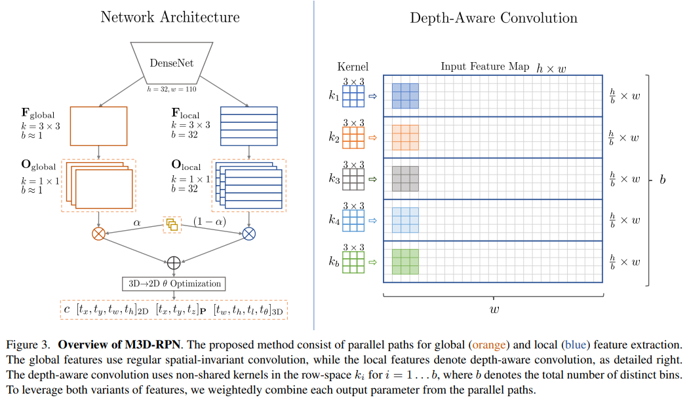
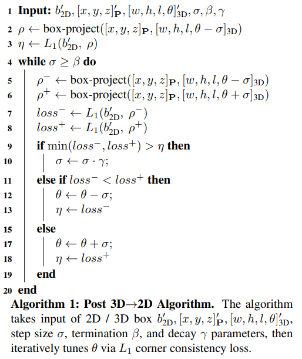

pdf_source: https://arxiv.org/pdf/1907.06038.pdf
code_source: https://github.com/garrickbrazil/M3D-RPN
short_title: M3D-RPN
# M3D-RPN: Monocular 3D Region Proposal Network for Object Detection

这篇论文提出了一个使用单目相机进行目标检测的方法，使用了融合2D-3D proposal的方式，use depth-aware convolution,后端优化结合各种信息，提升对$\theta$的预测性能

## 总体思路

这个网络被要求同时输出2D与3D预测，cost function同时有3D框以及2D框

depth-aware convolution如图，就是在不同的高度上使用不同的卷积核，为了使得运算快，pytorch implementation上作者将其reshape，然后使用depth-wise convolution(channel维度分组convolution)

其后使用的是逐步修改$\theta$使得三维坐标与二维框对齐，类似于模拟退火

具体算上来说就是每一步计算3D对应2D框与预测2D框的L1-loss，从而来给预测的$\theta$打分