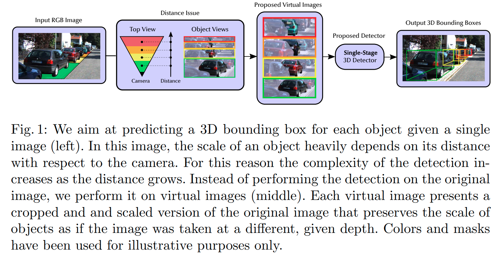
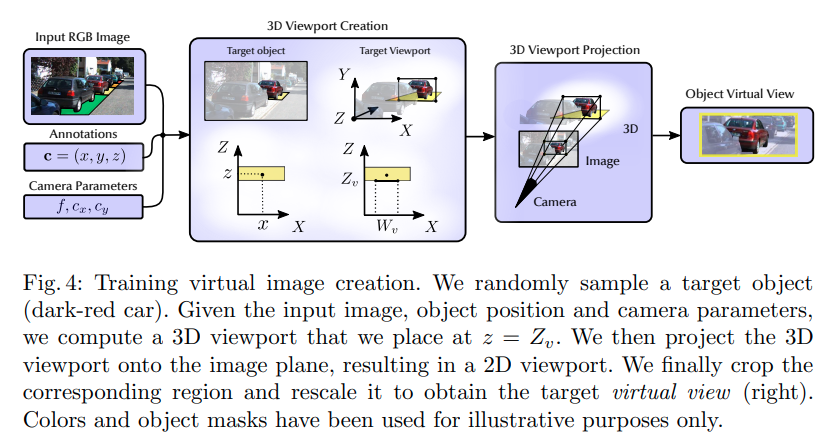
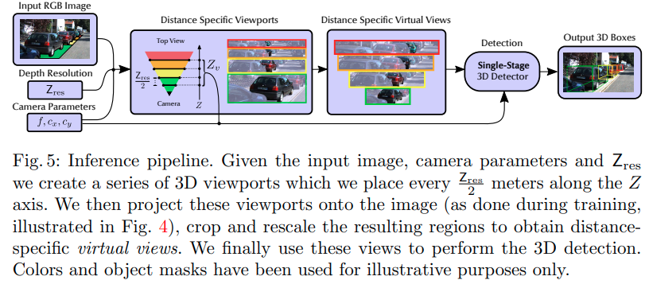
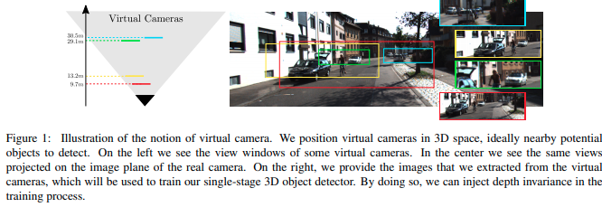
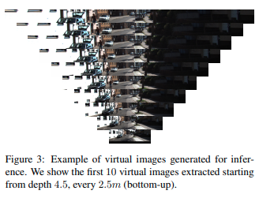
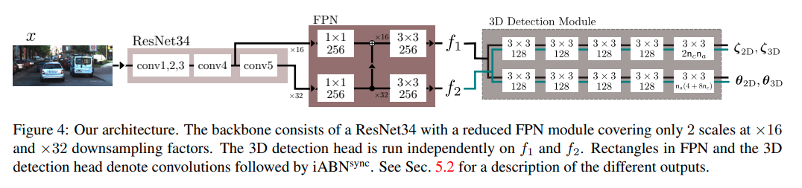

time:20200822
pdf_source: https://arxiv.org/pdf/1912.08035.pdf
short_title: Mono3d with virtual cameras

#  Towards Generalization Across Depth for Monocular 3D Object Detection (Former: Single-Stage Monocular 3D Object Detection with Virtual Cameras)

这篇文章来自于[MonoDIS]的作者组，采用的是virtual camera的方法，得到了相对不错的结果

**Update**: 

作者在2020.08将arxiv上的题目做了修改，文章内容表达上也发生了大改，并中了ECCV.

## 更新后的整体pipeline

ECCV版本基本是除了基础思想延续之外的完全重做。作者的思路是通过virtual camera 形成对距离不敏感的分类器， 

在训练的时候，对每个ground truth,随机在一定范围内采样 virtual camera viewpoint.

在推理的时候，均匀采集多个3D viewpoints，然后在各自viewpoint中进行detection.

其性能没有在KITTI排行榜上公开，为 $[15.19, 10.90, 9.26]$

## virtual camera (更新前)

核心思路，在图中核心区域crop出多个有效区域，然后在里面进行3D detection，重要的有几个insight.

1. 思路与传统的RCNN有相似之处，也就是使用传统方法(根据3D空间遍历或者其他提示)，从原图中crop出有效框再进行分析，区别在于crop出来的每一张子都还可能有多个target
2. 每一个3Ddetection预测的深度是相对于虚拟相机位置的深度，突出一个scale invariance.

virtual camera具体的实现trick较多，超参数很多，若想要复现，这里建议回看论文的第4章节以及第6.2章节。由于欠缺代码，这个结果比较难以确认。

## DL structure(更新前)

网络的输入输出与[MonoDIS]是一样的。

[MonoDIS]:./Disentangling_Monocular_3D_Object_Detection.md