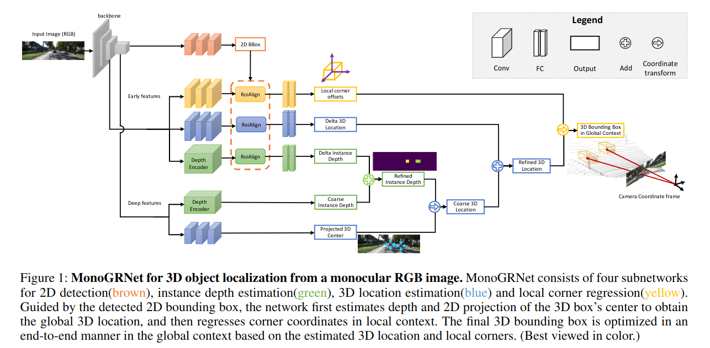

pdf_source: https://arxiv.org/pdf/1811.10247.pdf
code_source: https://github.com/Zengyi-Qin/MonoGRNet
short_title: MonoGRNet
# MonoGRNet: A Geometric Reasoning Network for Monocular 3D Object Localization

本文提出的网络结构可以在0.06s秒内完成一张图片的inference

