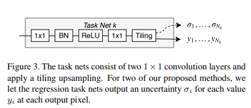

time: 20191027
pdf_source: https://arxiv.org/pdf/1906.08070.pdf
short_title: Single Shot Mono 3D(SS3D)
# Monocular 3D Object Detection and Box Fitting Trained End-to-End Using Intersection-over-Union Loss

本文提出了在单目3D检测中考虑异质噪声，提出了一个backprop through optimization的方法。

## 流程总览

首先一个CNN进行object detection，输出类别score以及2D bounding box，执行NMS删除部分冗余，最后使用一个非线性优化。

### 网络输出

网络输出结果除了分类结果之外还有26维。

2D bounding box对应两个角点4个值。

物体中心与相机的距离(也可以用Z轴距离，性能差距不大)，一个值

观察角$\alpha$预测其sin与cos值，共2个值

物体尺度长宽高，用log值代表，共3个值。

3D bounding box的8个点在相机坐标系的投影，共16个值。

对3Dbox的初始解,以2D框的中心作为物体3D中心在图片的投影,就可以得到对3Dbox的初始估计.

taskNet使得每一个输出会同时带上了对不确定性的估计

### 三种Loss训练方法

第一种传统定义是平稳噪声

Loss函数定义如下:
$$
\begin{aligned} \mathcal{L}_{1} &=\mathcal{L}_{c l s} \\ &+\frac{1}{N} \sum_{j=1}^{N} \sum_{k=1}^{26}\left(\frac{\left\|\mathbf{y}_{k}^{(j)}-f_{k}\left(\mathbf{b}^{(j)}\right)\right\|^{2}}{2 \sigma_{k}^{2}}+\log \sigma_{k}\right) \end{aligned}
$$

本质上就是[Multi Task Learning](https://arxiv.org/pdf/1705.07115.pdf)，
也就是说每一个loss类别会有一个单独的不确定性估计.

第二种定义是异方差噪声

$$
\begin{aligned} \mathcal{L}_{2} &=\mathcal{L}_{c l s} \\ &+\frac{1}{N} \sum_{i}\left(\frac{\left(y_{i}-f_{i}\left(\mathbf{b}_{i}\right)^{2}\right)}{2 \sigma_{i}^{2}}+\log \sigma_{i}-\log P_{\text {prior }}\left(\sigma_{i}^{-2}\right)\right) \end{aligned}
$$

也就是需要tasknet跟随每一个输出输出一个误差值

其中$P_{prior}$在这里被定义为$(\alpha, \beta) = (1, 0.5)$的[伽马分布](https://www.wikiwand.com/zh/%E4%BC%BD%E7%8E%9B%E5%88%86%E5%B8%83)

以上两种方式得到的variance都可以在inference的时候作为对不确定性的估计，也就便于对后端优化

第三种训练方式是backprop through optimization

首先优化问题的定义来自于

$$
E(\mathbf{b} ; \mathbf{y})=\sum_{i=1}^{26} r_{i}(\mathbf{b} ; \mathbf{y})^{2}=\sum_{i=1}^{26}\left(w_{i}\left(y_{i}-f_{i}(\mathbf{b})\right)\right)^{2}
$$

前两种方式的逻辑就是在训练的时候通过loss学习variance，然后直接用于inference。而第三种训练方式就是把optimization放在训练过程中，也就能直接训练误差variance.

这里它在训练的时候使用3D IoU损失。在反传的时候，根据$\hat b = argmin_bE(b,y,\sigma)$以及$\nabla_bE(b, y, \sigma) = 0$
使用[隐函数定理](https://www.wikiwand.com/zh/%E9%9A%90%E5%87%BD%E6%95%B0%E5%AE%9A%E7%90%86)(个人暂时未能理解)

得到

$$
\frac{\partial \hat{\mathbf{b}}}{\partial \mathbf{y}}=-\left[\frac{\partial^{2} E}{\partial \hat{\mathbf{b}}^{2}}\right]^{-1}\left[\frac{\partial^{2} E}{\partial \mathbf{y} \partial \hat{\mathbf{b}}}\right] \approx-\left[\frac{\partial \mathbf{r}}{\partial \hat{\mathbf{b}}}\right]^{+}\left[\frac{\partial \mathbf{r}}{\partial \mathbf{y}}\right]
$$