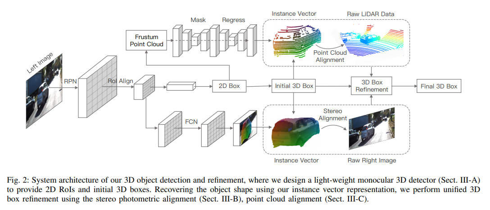
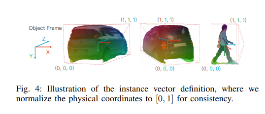

pdf_source: https://arxiv.org/pdf/1909.04942.pdf
short_title: Multi-Sensor Refinement - Li Peiliang
# Multi-Sensor 3D Object Box Refinement for Autonomous Driving

这篇论文源自于沈少杰实验室的学长，非常值得注意的是这篇论文从单目视觉3D检测出发，通过不同的trick融合双目以及点云信息(也就是说在添加双目以及添加点云的时候不需要重新train全新的网络，只需要train小网络或者更改post-opimization),是一套非常科学可用的方案。

结果来看，在单目上创新有限，在单目-双目联合上用处很大，也达到了双目的SOTA(仅次于运算量更多的pseudo lidar)，可惜在lidar融合上数据结果并没有显著高于纯Lidar的SOTA方案。

## 整体结构

从中可知中间一条pipeline是完整的单目预测过程，双目以及点云在这里主要作为辅助

## 单目检测做法

算是比较常见的结构，Faster RCNN->RoI Align->residual prediction

对于深度，网络输出的也是残差，对高度其残差的base估计为
$z_{roi}=f_y\frac{h}{h_{roio}}$其中$h$为3D物体的高度，$h_{roi}$ 为2D RoI高度,网络输出的深度残差为$log\frac{z_{gt}}{z_{roi}}$，定义的网络输出的长宽高残差$\Delta d  = \frac{d-p_d}{\sigma_d} d$，其中$d$为$(w,h,l)$

最终的输出为中心在相机中的投影,深度,长宽高的残差，以及相对观察角的sin,cos值(观察角用multi-bin回归)
 
## 双目Refinement

稍微有点像[Stereo RCNN](https://arxiv.org/pdf/1902.09738.pdf)的想法,通过在局部图像从右目warp到左目上minimizing一个匹配error来估计深度。

这里的算法：

1. 在RoI中类似Segmentation输出28*28 * 4 * classs的sigmoid结果，包含一个分类器+三个回归器,回归部分表明图像这个点对应坐标(normalized to [0,1] for each dimensions)

2. 根据左图这个区域每一个点预测的normalized坐标以及预测的尺寸，将该点在图中的位置转换到世界坐标，再投影到第二张图中。
3. 我们需要减少对应点之间的原图差值
4. 优化深度值

子网络的label来源：借助点云，先得到该点云的实际 instance vector值，然后投影回图片中得到像素级label

## 点云Refinement

1. 使用2D detection结果的 RoI提取出部分点云，
2. 重采样固定n个点
3. point-wise instance seg用于区分foreground
4. 根据foreground的probability,重采样m个点
5. T-Net用于估计物体中心与几何、方向信息，还要做一个instance vector的估计(类似于双目的结果)
6. 优化这个函数,其中$^cp_i$为lidar点的坐标，$^c\hat p_i$为根据中心点、pose、形状、instsance vector估计的坐标值，由于只需要优化深度值，所以可以线性求解
$$
\mathbf{E}_{p} :=\sum_{i=0}^{m}\left\|^{c} \mathbf{p}_{i}-^{c} \hat{\mathbf{p}}_{i}\right\|, \text { with } \quad^{c} \hat{\mathbf{p}}_{i}=\hat{\mathbf{p}}_{o}+\mathbf{R}(\theta)^{o} \mathbf{p}_{i}
$$

### 更多传感器的融合

$$
\begin{aligned} \mathbf{p}_{o}=\underset{\mathbf{p}_{o}}{\arg \min } & \sum_{i=0}^{n}\left\|I_{l}\left(\mathbf{u}_{i}\right)-I_{r}\left(\pi\left(^{c} \hat{\mathbf{p}}_{i}-\mathbf{b}\right)\right)\right\|_{\sum_{s}}+\\ & \sum_{j=0}^{m}\left\|^{c} \mathbf{p}_{j}-^{c} \hat{\mathbf{p}}_{j}\right\|_{\Sigma_{p}} \end{aligned}
$$

两项分别处理相机以及点云数据。

### 其他训练细节

损失函数包括RPN, 2D检测，角度，位置，维度。用[multi-loss](http://openaccess.thecvf.com/content_cvpr_2018/papers/Kendall_Multi-Task_Learning_Using_CVPR_2018_paper.pdf)结合

为了给图片网路提供位置，在输出端加入u,v坐标(grid channels),第一个Conv的权重被复制重用给这新的channel.