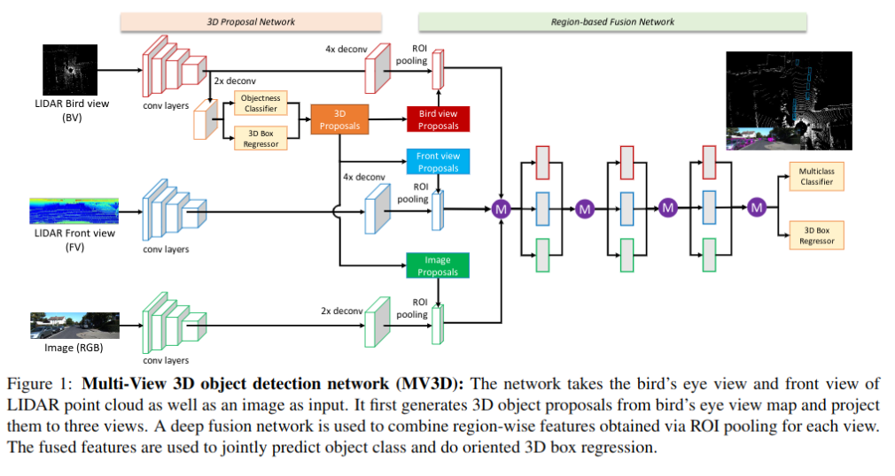

pdf_source: https://arxiv.org/pdf/1611.07759.pdf
code_source: https://github.com/bostondiditeam/MV3D
short_title: MV3D
# Multi-View 3D Detection Network for autonomous Driving

这篇论文结合了多视角，融合Lidar和camera进行三维检测。

##　网络结构

### 数据准备

激光雷达鸟瞰图：

鸟瞰图分为高度图、强度图以及密度图。都先将鸟瞰图分成2D网格

高度图：将点云随机分成M份，每一份中，2D网格中的每一个网格取该处的最高点的高度，最终得到M-channel的高度图

强度图：不分拆，每一网格取该处最高点的反射强度

密度图：不分拆，每一个网格取该处点的密度，用一个log函数规范化

激光雷达前视图：

前视图不分拆，将点云投影到圆柱面上，用极坐标$(r, c)$表示投影图的$(x, y)$，并同样给出高度图，强度图，密度图

RGB图片：正常使用

### 数据融合操作

图中选择的M为elemental——mean操作

实验中重点还是要搞好ablation study