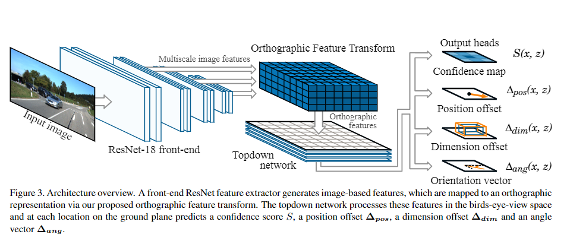
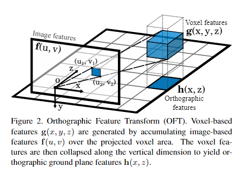
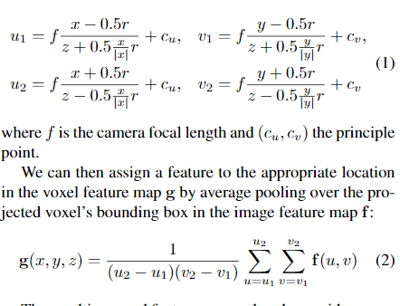

# Orthographic Feature Transform for Monocular 3D Object Detection

这篇论文认为对单个摄像头得到的摄像头进行3D detection的时候，还是需要考虑整个场景的三维结构，而不仅仅是在图像坐标系进行研究。

    在无人车的传统视觉算法中，在单目视觉条件下，如果要测得距离，需要知道摄像头的pitch角度以及所描述的点到摄像头的Z轴距离(经常是摄像头相对地面的高度)。因此这个直觉就是3d detection需要摄像头的外参

## 主要算法贡献

神经网络结构如上图。以下为具体介绍：

### 1. 前特征提取

这个结构采用的是ResNet18 作为前端的特征提取，同时将不同scale的feature maps同时传给下一步的正交变换。这个较为常规。

### 2. 正交变换

这个是本文的第一个主要贡献，用如图的方式将图像坐标系的feature map转换为bird eye view视角的feature map

计算过程：
1. 预定义三维的方块空间，对于每一个大小为r的格子，根据其中心点的坐标逆投影到图像空间中，投影结果再近似为一个矩形，图片坐标的左上角与右上角坐标由以下公式决定
2. 对于点$(x, y, z)$对应的结果$g(x, y, z)$为逆投影上的矩形框内的所有feature map的数值均值。
3. 对于俯瞰图(没有Z)上每一个点的输出结果为对应$(x, y)$竖直方向上所有$g(x, y, z)$的加权求和，其权重为可学习的参数。

### 3. Topdown network

用一般的二维卷积以及ResNet风格的skip-connection进行处理，得到输出

### 4. output

1. 置信度map(概率图)，训练时其真值由真实object为中心的高斯函数得到($\sigma$未给出，多个障碍物的话取各个高斯函数的最大值)
2. position offset 和dimension offset，本来每一个方块的置信度map已经预测了在resolution为r的地图中每一个点是障碍的概率，这里再补充了相对于方块中心的偏移预测。
3. 角度vector map
   
## 有用的实践细节

### Integral Feature Map 
在进行正交变换的时候，由于需要多次求图像中一个个矩形框内数值的和，这里使用动态规划的算法，先求出integral feature map，$F$。其中 $F(u,v)$为$(u,v)$点左上角整个矩形的数值求和。之后每一次求$g(x, y, z)$时需要做求和的时候，只需要做一个利用$F$做一个O(1)的运算即可。

### Skew Loss Function
在做object detection时由于正负样本的问题，一般都需要对负样本给予比较少的惩罚，文中在训练confidence map prediction时，对训练目标$S<0.05$的位置，给予一个0.01的因子。

### Normalizing Dimension and Angle Prediction
对于一个特定的class，已知它的平均长宽高，则需要预测的长宽高变化为$\Delta_{dim}(x, z) = [log \frac{w_i}{w},log \frac{h_i}{h} ,log \frac{l_i}{l}]$

角度输出用$sin，cos$。
$\Delta_{ang}(x,z) = [sin\theta_i, cos\theta_i]$

另外本文的regression都是用$l_1$ loss.

### NMS(non max suppression)
先将置信度map做一个高斯平滑，然后找其中局部最大值点作为输出