time: 20210902
short_title: Recent Collections for Mono3D

# Recent Collections for Mono 3D detection

在IROS2020投稿前后积攒了一系列单目3D检测paper的阅读。这里一次过进行记录,开源在前，未开源在后.

这里列出目前有文章可寻的KITTI排行榜(2020.02.27)

Update(2020.04.02):Update scores for YOLOMono3D

Update(2020.07.24): Update Kinematic 3D

Update(2020.09.08): Update SSL-RTM3D

Update(2021.02.01): Update Ground Aware 3D

Update(2021.03.17): Update CaDDN

Update(2021.04.10): Update MonoFlex, MonoRun, MonoRCNN

Update(2021.06.26): Update MonoEF


| Methods         | Moderate | Easy  | Hard  | Time  |
| --------------- | :------: | :---: | :---: | :---: |
| [dd3d]          |  16.34   | 23.22 | 14.20 |   -   |
| [GUP]           |  15.02   | 22.26 | 13.12 |   -   |
| [AutoShape]     |  14.17   | 22.47 | 11.36 | 0.05  |
| [MonoFlex]      |  13.89   | 19.94 | 12.07 | 0.03  |
| [MonoEF]        |  13.87   | 21.29 | 11.74 | 0.03  |
| [CaDDN]         |  13.41   | 19.17 | 11.46 | 0.64  |
| [GroundAware3D] |  13.17   | 21.60 | 9.94  | 0.05  |
| [Aug3DRPN]      |  12.99   | 17.82 | 9.78  | 0.08  |
| [Kinematic3D]   |  12.72   | 19.07 | 9.17  | 0.12  |
| [MonoRCNN]      |  12.65   | 18.36 | 10.03 | 0.07  |
| [MonoRun]       |  12.30   | 19.65 | 10.58 | 0.07  |
| [YOLOMono3D]    |  12.06   | 18.28 | 8.42  | 0.05  |
| [D4LCN]         |  11.72   | 16.65 | 9.51  |  0.2  |
| [M3DSSD]        |  11.46   | 17.51 | 8.98  |  \*   |
| [SSL-RTM3D]     |  11.45   | 16.73 | 9.92  | 0.04  |
| [Refined-MPL]   |  11.14   | 18.09 | 8.94  | 0.15  |
| [AM3D]          |  10.74   | 16.50 | 9.52  |  0.4  |
| [RTM3D]         |  10.34   | 14.41 | 8.77  | 0.05  |
| [MonoPair]      |   9.99   | 13.04 | 8.65  | 0.06  |
| [SMOKE]         |   9.76   | 14.03 | 7.84  | 0.03  |
| [M3D-RPN]       |   9.71   | 14.76 | 7.42  | 0.16  |

目录:

- [Recent Collections for Mono 3D detection](#recent-collections-for-mono-3d-detection)
  - [GUPNet](#gupnet)
  - [MonoFlex](#monoflex)
  - [MonoEF](#monoef)
  - [MonoRCNN](#monorcnn)
  - [Aug3DRPN](#aug3drpn)
  - [D4LCN](#d4lcn)
  - [M3DSSD](#m3dssd)
  - [RTM3D](#rtm3d)
  - [MonoPair](#monopair)
  - [SMOKE](#smoke)
  - [YOLOMono3D](#yolomono3d)

## GUPNet
[pdf](https://arxiv.org/pdf/2107.13774.pdf) [code](https://github.com/SuperMHP/GUPNet)

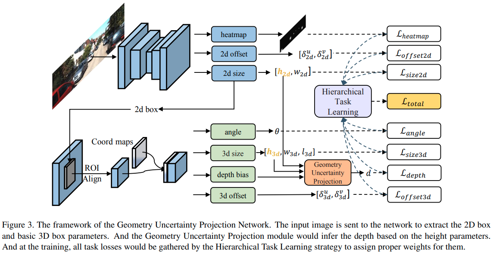

这篇paper是目前少有的使用二阶段检测网络实现高性能的结果.使用centerNet完成2D检测，然后使用RoIAlign提取特征.3D的输出与[MonoFlex]有点相似，输出的是带有不确定的深度，采用的是2D的简要推理加上网络的一个学习值:

$$\begin{aligned}
d_{p} &=\frac{f \cdot h_{3 d}}{h_{2 d}}=\frac{f \cdot\left(\lambda_{h} \cdot X+\mu_{h}\right)}{h_{2 d}} \\
&=\frac{f \cdot \lambda_{h}}{h_{2 d}} \cdot X+\frac{f \cdot \mu_{h}}{h_{2 d}}
\end{aligned}$$

$$\begin{array}{c}
d=L a\left(\mu_{p}, \sigma_{p}\right)+L a\left(\mu_{b}, \sigma_{b}\right) \\
\mu_{d}=\mu_{p}+\mu_{b}, \quad \sigma_{d}=\sqrt{\left(\sigma_{p}\right)^{2}+\left(\sigma_{b}\right)^{2}}
\end{array}$$

$$\mathcal{L}_{\text {depth }}=\frac{\sqrt{2}}{\sigma_{d}}\left|\mu_{d}-d^{g t}\right|+\log \left(\sigma_{d}\right)$$

本文还提出了一个hierarchical task learning.指优先把2D检测训练好，再把WHL训练好，最后再训练depth。"训练好"的评判标准是epochs之间的mean loss相差不大。

```python
self.loss_graph = {'seg_loss':[],
                   'size2d_loss':[], 
                   'offset2d_loss':[],
                   'offset3d_loss':['size2d_loss','offset2d_loss'], 
                   'size3d_loss':['size2d_loss','offset2d_loss'], 
                   'heading_loss':['size2d_loss','offset2d_loss'], 
                   'depth_loss':['size2d_loss','size3d_loss','offset2d_loss']}  
def compute_weight(self,current_loss,epoch):
    T=140
    #compute initial weights
    loss_weights = {}
    eval_loss_input = torch.cat([_.unsqueeze(0) for _ in current_loss.values()]).unsqueeze(0)
    for term in self.loss_graph:
        if len(self.loss_graph[term])==0:
            loss_weights[term] = torch.tensor(1.0).to(current_loss[term].device)
        else:
            loss_weights[term] = torch.tensor(0.0).to(current_loss[term].device) 
    #update losses list
    if len(self.past_losses)==self.stat_epoch_nums:
        past_loss = torch.cat(self.past_losses)
        mean_diff = (past_loss[:-2]-past_loss[2:]).mean(0)
        if not hasattr(self, 'init_diff'):
            self.init_diff = mean_diff
        c_weights = 1-(mean_diff/self.init_diff).relu().unsqueeze(0)
        
        time_value = min(((epoch-5)/(T-5)),1.0)
        for current_topic in self.loss_graph:
            if len(self.loss_graph[current_topic])!=0:
                control_weight = 1.0
                for pre_topic in self.loss_graph[current_topic]:
                    control_weight *= c_weights[0][self.term2index[pre_topic]]      
                loss_weights[current_topic] = time_value**(1-control_weight)
        #pop first list
        self.past_losses.pop(0)
    self.past_losses.append(eval_loss_input)   
    return loss_weights
```

## MonoFlex
[pdf](https://arxiv.org/pdf/2104.02323.pdf) [code](https://github.com/zhangyp15/MonoFlex)

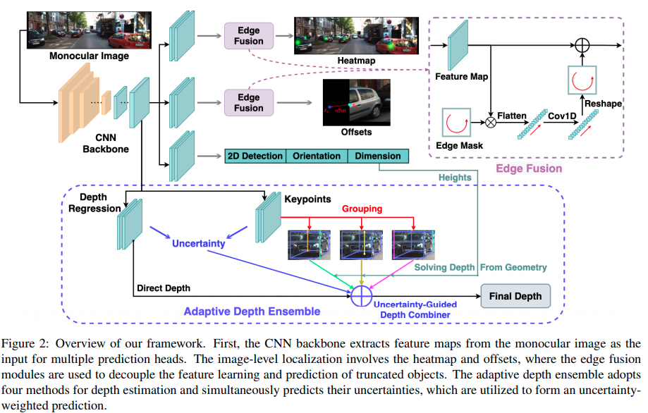

这篇paper在计算深度的时候和MonoRCNN不谋而合，觉得尽管同时找出多个角点很有诱惑力，但是一点点的误差就会造成3D回归很大的错误，所以主要依靠计算角点在图像上的高度来推理深度。

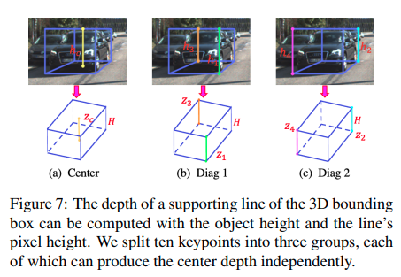

## MonoEF
[pdf](https://openaccess.thecvf.com/content/CVPR2021/papers/Zhou_Monocular_3D_Object_Detection_An_Extrinsic_Parameter_Free_Approach_CVPR_2021_paper.pdf) [code](https://github.com/ZhouYunsong-SJTU/MonoEF)

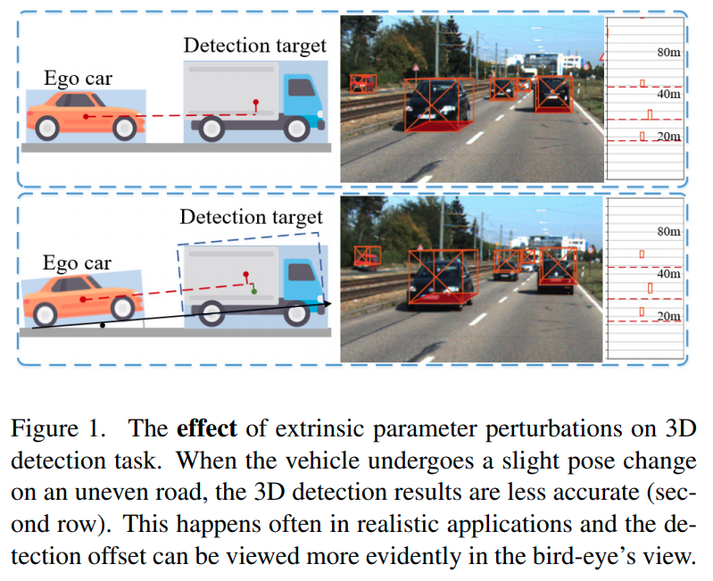

这篇paper关注外参的变动以及外参变动最相机感知效果的影响。同时会主动地通过序列图片预判车辆的运动.

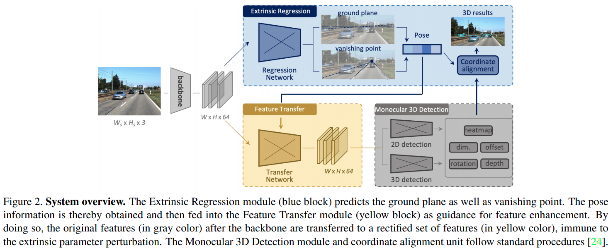


## MonoRCNN
[pdf](https://arxiv.org/pdf/2104.03775.pdf) [code](https://github.com/MagicRock100/MonoRCNN)

这篇paper与MonoFlex有相似的思路，都是用projected visual height来计算深度。这篇文章则是基于two-stage的算法。文章直接指出了keypoints的问题。

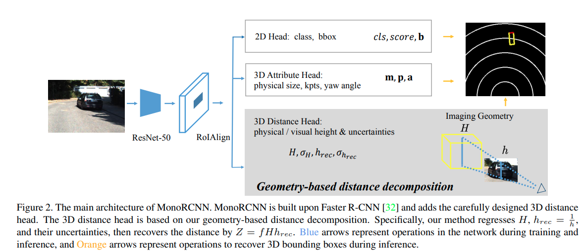

## Aug3DRPN
[pdf](https://arxiv.org/pdf/2107.13269.pdf) 

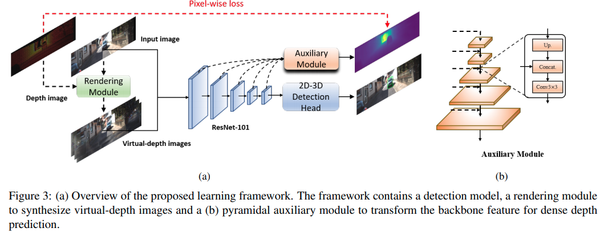

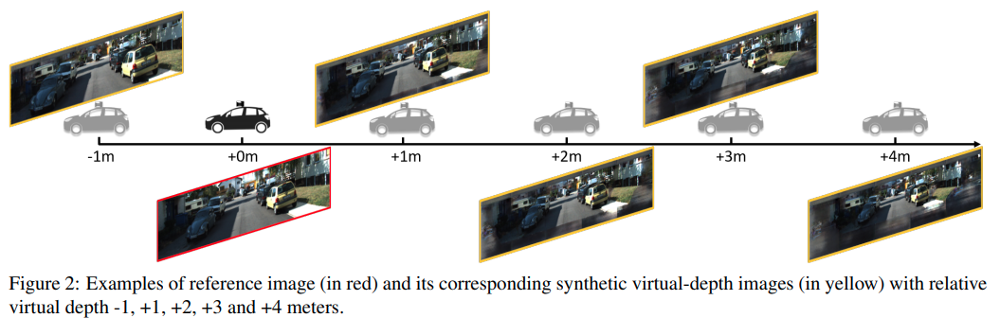

这篇paper基于[M3D-RPN]的做法

- 额外的深度预测
- 利用深度预测，渲染虚拟相机结果,增强训练结果.

## D4LCN
[pdf](https://arxiv.org/pdf/1912.04799.pdf)  [code](https://github.com/dingmyu/D4LCN)


这篇paper完全继承了[M3D-RPN]的衣钵，它不同的地方在于，摒弃了M3D-RPN处理缓慢的height-wise convolution,而是使用单目估计深度，然后使用深度作为卷积核的guide, 这个guide类似于这几篇文章的操作:[guidenet](../other_categories/depth_completion/guideNet.md);[DFN](../Building_Blocks/DynanicFilteringNetwork.md)

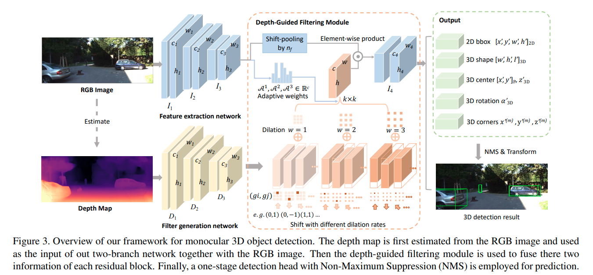

## M3DSSD
[pdf](https://arxiv.org/pdf/2103.13164.pdf) [code](https://github.com/mumianyuxin/M3DSSD)

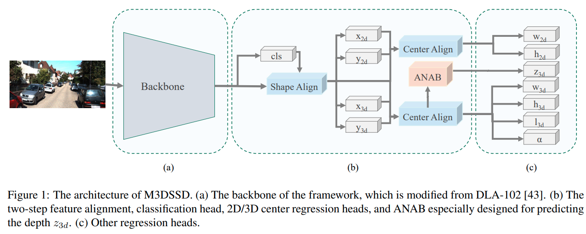

这篇paper采用了大backbone,用deformable convolution的方法，重点解决2D detection中感受野与anchor不匹配问题以及3D中心与2D中心不匹配的问题. Shape alignment 与 center alignment 对应基于2D与3D的两种deformable base shift的产生方式。

另外本文又提出了 Asymmetric Non-Local Attention Block (ANAB)模块, 用于增强感受野.

## RTM3D
[pdf](https://arxiv.org/pdf/2001.03343.pdf) [code](https://github.com/Banconxuan/RTM3D)

这篇文章还没有正式开源，但是github就先开着了。这篇文章在技术上有一定的新意，它使用[CenterNet]的架构估计大量的keypoints以及冗余的3D信息，最后通过最优化融合。使用大量冗余信息它不是第一个,前者比如有[SS3D](Monocular_3D_Object_Detection_and_Box_Fitting_Trained_End-to-End_Using_Intersection-over-Union_Loss.md),但是它绕过了anchor使用CenterNet有一定的新意。
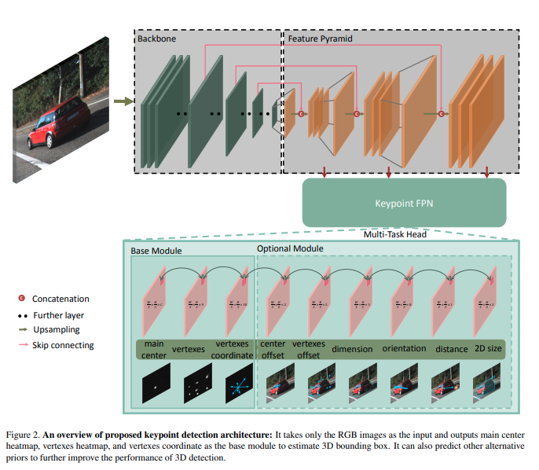
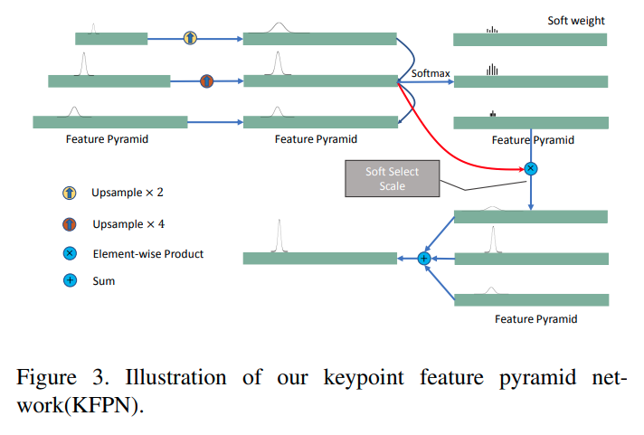


## MonoPair

[pdf](https://arxiv.org/pdf/2003.00504.pdf)

这篇文章是实验室大师兄邰磊在阿里的CVPR2020 paper。有[官方网站](https://sites.google.com/view/chen3dmonopair)

文章的核心创新是第一个使用场景中不同物体之间的相互约束进行优化的paper。

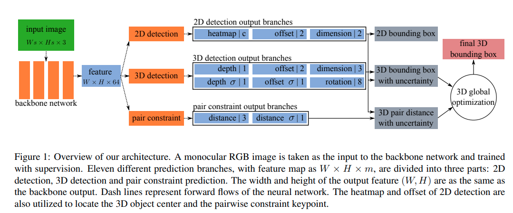


## SMOKE

[pdf](https://arxiv.org/pdf/2002.10111v1.pdf)

这篇paper的创新点不算特别多。
1. 使用了[CenterNet]的架构进行中心点的估计。
2. 使用了distangling loss, 这个来自于[MonoDIS]
3. 数据增强上使用了shifting等方法，但是只是用来train keypoint热图等结构。属于specialized augmentation for specialized cost.可谓深度调参

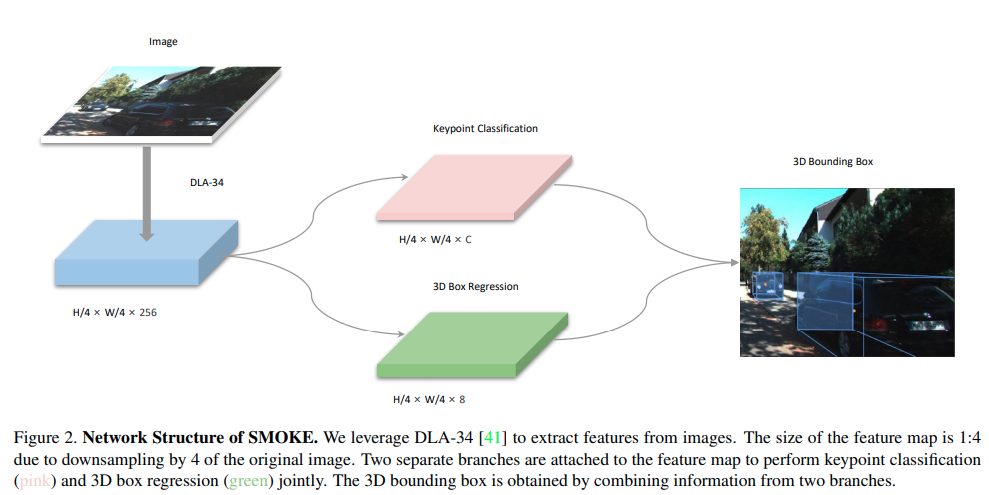

## YOLOMono3D

不多说了，快上车

<iframe src="//player.bilibili.com/player.html?aid=91364947&cid=156014191&page=1" scrolling="no" frameborder="no" framespacing="0" allowfullscreen="true" height=270 width=480> </iframe>

[GUPNet]:#gupnet
[dd3d]:is_plidar_needed.md
[Autoshape]:../other_categories/Summaries/Summary_ICCV_2021.md
[MonoFlex]:#monoflex
[MonoEF]:#monoef
[MonoRCNN]:#monorcnn
[MonoRun]:monorun.md
[CaDDN]:caddn.md
[GroundAware3D]:GroundAwareConvultion.md
[Aug3DRPN]:#aug3drpn
[Kinematic3D]:Kinematic_video3d.md
[SSL-RTM3D]:SSL_RTM3D.md
[M3D-RPN]:M3D-RPN_Monocular_3D_Region_Proposal_Network_for_Object_Detection.md
[D4LCN]:#d4lc
[M3DSSD]:#m3dssd
[Refined-MPL]:./RefinedMPL.md
[AM3D]:AM3D.md
[RTM3D]:#rtm3d
[MonoPair]:#monopair
[SMOKE]:#smoke
[YOLOMono3D]:#yolomono3d
[CenterNet]:../other_categories/object_detection_2D/Object_as_points.md#object-as-point
[MonoDIS]:Disentangling_Monocular_3D_Object_Detection.md