time: 20211216
short_title: Recent Collections for Stereo 3D

# Recent Collections for Stereo 3D detection

近期积攒了一系列双目3D检测paper的阅读。这里一次过进行记录,以结果排列为顺序。

这里列出目前有文章可寻的KITTI排行榜(2020.04.09)

Update:
    2020.0409: Add Disp-RCNN and PL E2E.
    2020.0714: Add CDN
    2021.0126: Add RTS3D

| Methods               | Moderate |  Easy   |  Hard   |  Time  |
| --------------------- | :------: | :-----: | :-----: | :----: |
| [LIGAStereo]          | 64.66 %  | 81.39 % | 57.22 % | 0.4  s |
| [CDN]                 | 54.22 %  | 74.52 % | 46.36 % | 0.6  s |
| [CG-Stereo]           | 53.58 %  | 74.39 % | 46.50 % | 0.57 s |
| [DSGN]                | 52.18 %  | 73.50 % | 45.14 % | 0.67 s |
| [EGFN]                | 46.39 %  | 65.80 % | 38.42 % | 0.09 s |
| [CDN P-LiDAR++]       | 44.86 %  | 64.31 % | 38.11 % | 0.4 s  |
| [Pseudo-LiDAR E2E]    | 43.92 %  | 64.75 % | 38.14 % | 0.4 s  |
| [Pseudo-LiDAR++]      | 42.43 %  | 61.11 % | 36.99 % | 0.4 s  |
| [YOLOStereo3D]        | 40.71 %  | 65.77 % | 29.99 % | 0.08s  |
| [Disp R-CNN] (velo)   | 39.34 %  | 59.58 % | 31.99 % | 0.42 s |
| [ZoomNet]             | 38.64 %  | 55.98 % | 30.97 % | 0.3 s  |
| [OC Stereo]           | 37.60 %  | 55.15 % | 30.25 % | 0.35 s |
| [RTS3D]               | 37.38 %  | 58.51 % | 31.12 % | 0.03 s |
| [Pseudo-Lidar]        | 34.05 %  | 54.53 % | 28.25 % | 0.4 s  |
| [Stereo R-CNN]        | 30.23 %  | 47.58 % | 23.72 % | 0.3 s  |
| [RT3DStereo]          | 23.28 %  | 29.90 % | 18.96 % | 0.08 s |

目录:

- [Recent Collections for Stereo 3D detection](#recent-collections-for-stereo-3d-detection)
  - [LIGAStereo](#ligastereo)
  - [CG-stereo](#cg-stereo)
  - [Pseudo-LiDAR E2E](#pseudo-lidar-e2e)
  - [Pseudo-Lidar++](#pseudo-lidar)
  - [Disp-RCNN](#disp-rcnn)
  - [ZoomNet](#zoomnet)
  - [OC Stereo](#oc-stereo)
  - [RTS3D](#rts3d)
  - [Pseudo-Lidar](#pseudo-lidar-1)
  - [Stereo R-CNN](#stereo-r-cnn)
  - [RT3D Stereo](#rt3d-stereo)

## LIGAStereo
[pdf](https://arxiv.org/pdf/2108.08258.pdf) [code](https://github.com/xy-guo/LIGA-Stereo)

这篇paper是近期来性能第一个超过三/四年前点云检测的双目检测网络。性能上全面超越双目此前的网络。其主要思想是使用类似于 [DSGN]的网络， 但是于此同时，另外训练一个点云检测网络，两个网络输出受相同的监督损失训练，此外双目的cost volume分支在最后一层还会受点云最后一层的知识蒸馏训练。

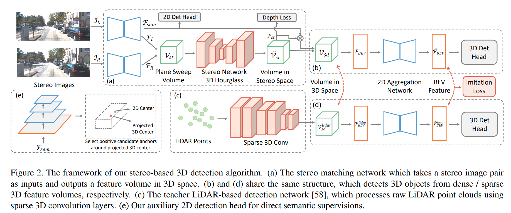

知识蒸馏损失: 
$$
\mathcal{L}_{i m}=\sum_{\mathcal{F}_{i m} \in \mathbb{F}_{i m}} \frac{1}{N_{p o s}}\left\|M_{f g} M_{s p}\left(g\left(\mathcal{F}_{i m}\right)-\frac{\mathcal{F}_{i m}^{l i d a r}}{\mathbb{E}\left[\left|\mathcal{F}_{i m}^{l i d a r}\right|\right]}\right)\right\|_{2}^{2}
$$

## CG-stereo
[pdf](https://arxiv.org/pdf/2003.05505v1.pdf)
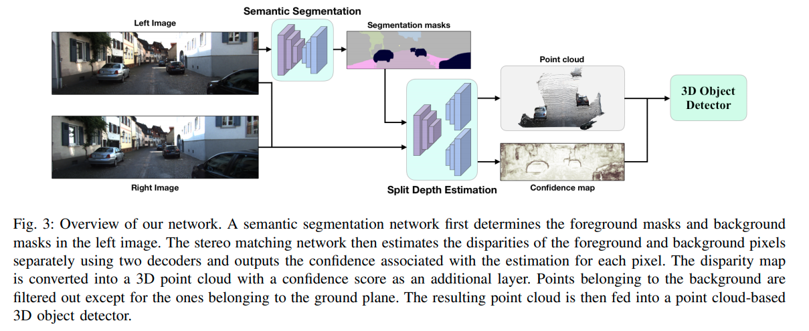
这篇paper来自于 Jason Ku那一组，是目前(2020.03.15)Stereo的SOTA，给pseudo-lidar系列提供了两个很有效的idea。

首先是双目估计中，forground与background的特性差距是很大的，作者认为应当使用两个分别的decoder处理前景与背景的物体，分叉的依据是语义分割的结果。
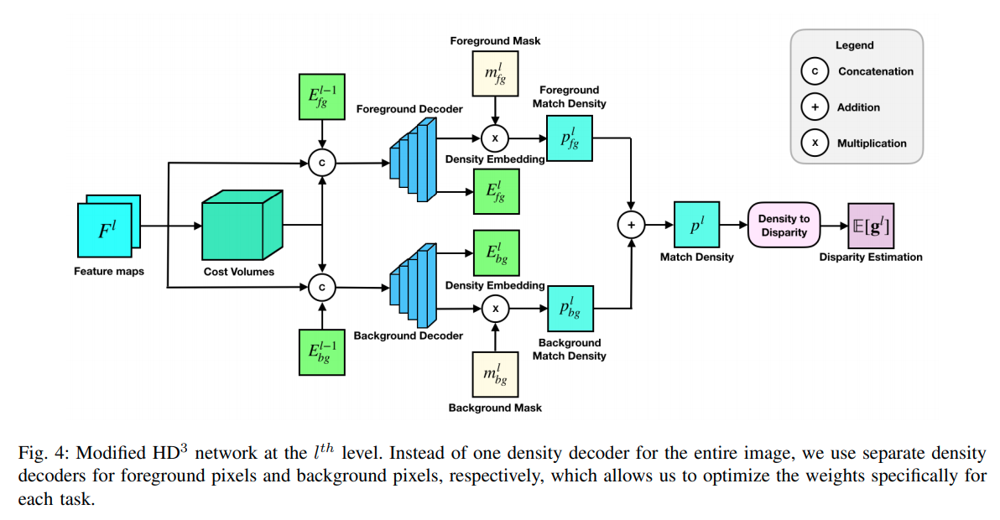
其次是双目估计得到的点之中有很多的噪音，不同点的confidence不同，对后端点云的影响很大，作者这里根据stereo matching的一个confidence map作为一个attention 层输入到点云后端处理中。

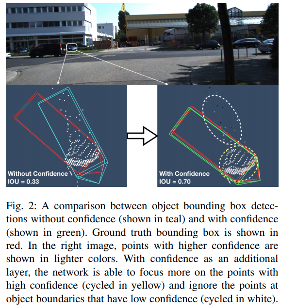

## Pseudo-LiDAR E2E
[pdf](https://arxiv.org/pdf/2004.03080v1.pdf) [code](https://github.com/mileyan/pseudo-LiDAR_e2e)

这篇paper的贡献非常有意义，提到的是过去的Pseudo-lidar算法基本都是完全的二阶段算法，也就是双目生成点云与点云3D检测之间是无法End2End训练的，中间的转换过程是不可导的，因而尽管可以fine-tune,但是梯度的流动会中断,这篇paper的最大贡献在于提出一个CoR模块使得同时可以训练点云生成以及基于点云的物体检测。

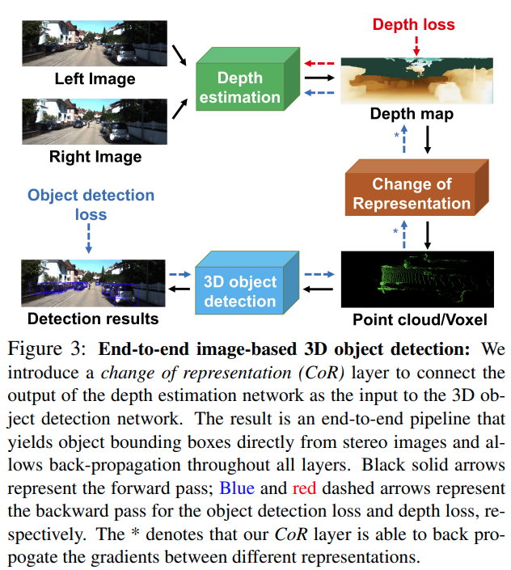

$$\boldsymbol{T}\left(m, m^{\prime}\right)=\left\{\begin{array}{cc}
0 & \text { if }\left|P_{m^{\prime}}\right|=0 \\
\frac{1}{\left|\boldsymbol{P}_{m^{\prime}}\right|} \sum_{\boldsymbol{p} \in \boldsymbol{P}_{m^{\prime}}} e^{-\frac{\left\|\boldsymbol{p}-\hat{p}_{m}\right\|^{2}}{\sigma^{2}}} & \text { if }\left|P_{m^{\prime}}\right|>0
\end{array}\right.$$

$$\boldsymbol{T}(m)=\boldsymbol{T}(m, m)+\frac{1}{\left|\mathcal{N}_{m}\right|} \sum_{m^{\prime} \in \mathcal{N}_{m}} \boldsymbol{T}\left(m, m^{\prime}\right)$$

voxel里面每一个bin都对应一个基类，每一个bin是自己与周围的加权求和。从而voxel可导

## Pseudo-Lidar++
[pdf](https://arxiv.org/pdf/1906.06310.pdf)  [code](https://github.com/mileyan/Pseudo_Lidar_V2)

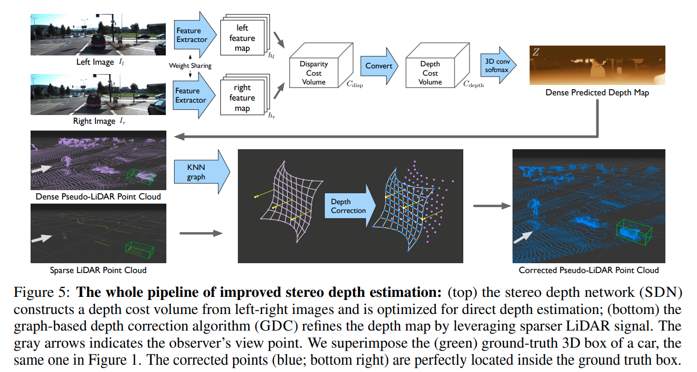

这篇paper的主要新意有两点

在深度估计上，作者给出一个新的insight，就是均匀的3D卷积很可能是disparity-based cost volome的一个error source，比如说对于disparity比较高的点，可以smooth out，但是对于disparity比较小的点则不应该同等级别的smooth out(会产生很大误差)。所以作者将disparity cost volume的深度方向求倒数，并线性插值得到depth cost volume,然后在depth cost volume上面做3D卷积。

在后处理上，作者融合了深度补全(depth completion)的思想，由于disparity是离散的，所以会引起很多不应该的误差，进而作者考虑使用低线数的lidar(开源的一个方案线数是4)作为一个ground truth的补偿。这里不进一步展开。

作者在KITTI上提交了两个成绩(PL++),标题下面给出的是春双目而没有GDC的成绩，有GDC的成绩会更高一些。

## Disp-RCNN
[pdf](https://arxiv.org/pdf/2004.03572v1.pdf) [code](https://github.com/zju3dv/disprcnn)
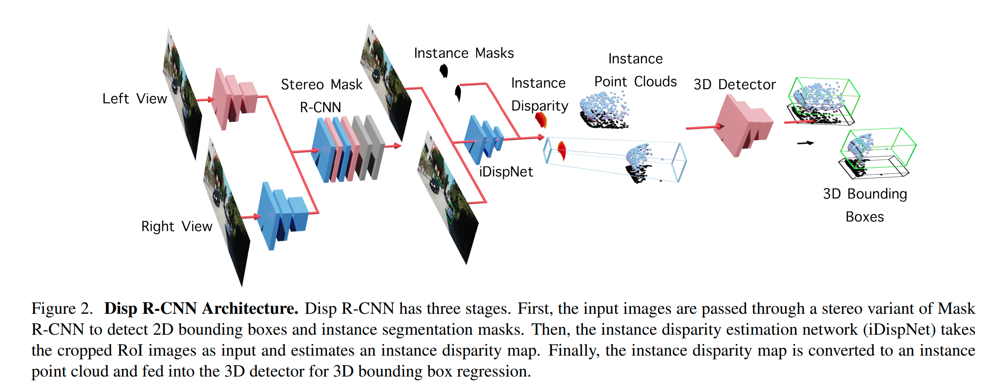

这篇paper的主要不同点在于使用RoIPooling从原图(作者指出不应该从feature中采样，因为Disparity要求邻近像素结果不同，但是Instance Segmentation会要求邻近像素结果相同)中采样,然后从Pooling后的结果重建Disparity以及局部点云(这个模块在数学处理上要小心)，然后使用点云检测输出结果。

这篇paper还有使用pretrained的双目重建网络，得到密集的pseudo Ground Truth Disparity. Loss的构成比较复杂，具体看paper

## ZoomNet
[pdf](https://arxiv.org/pdf/2003.00529.pdf) [code](https://github.com/detectRecog/ZoomNet)

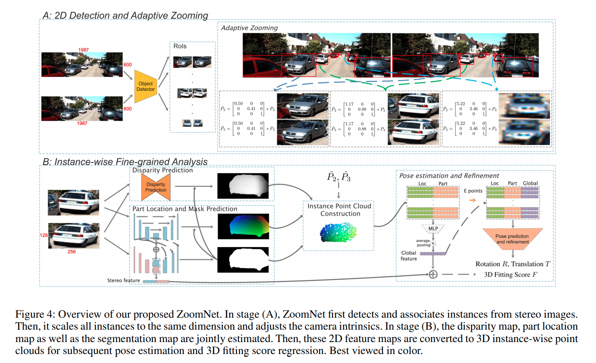

使用2D检测先得到两个车子咋图片的位置，然后分别resize,并且调节名义相机参数(zooming)。

中介辅助预测的内容包括disparity, instance segmentation, part location(每一个像素相对于车子中心x, y, z轴的位置，这个一般使用点云和稠密深度图进行标注)。得到点云后将feature 链接，然后用类似于point net的方式预测最终结果。

## OC Stereo
[pdf](https://arxiv.org/pdf/1909.07566.pdf)

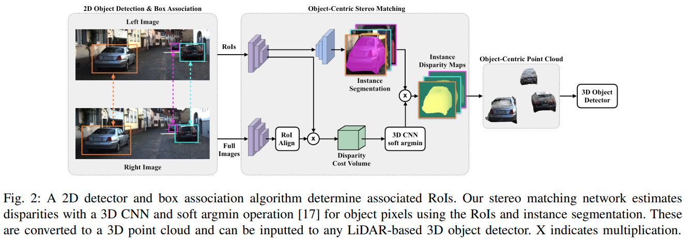

这篇paper的想法是使用RoIAlign将左右目两个区域的feature 提出来，然后使用instance seg与Cost volumn计算对应pixel处的disparity。

作者对于RoIAlign前后的segmentation pixel的位置关系做了很细致的解释。

在得到局部RGB点云之后作者使用[AVOD](https://github.com/kujason/avod) 进行3D检测。

## RTS3D
[pdf](https://arxiv.org/pdf/2012.15072.pdf) [code](https://github.com/Banconxuan/RTS3D)

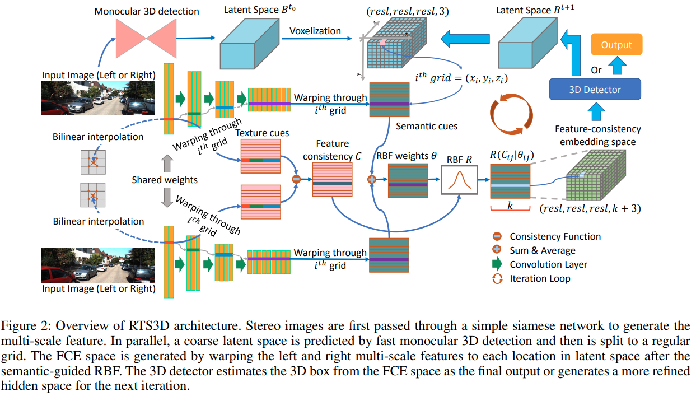

这篇paper推理时的操作是先让一个单目检测网络输出一个检测结果。 然后另外使用一个类似pointnet的机制去增强mono的结果.

- 用两个resnet分别输出两张图的feature
- 在predicted bounding box的附近生成一个cube voxel
- 根据calibration matrix以及cube voxel从双目Feature 上sample特征。
- 使用CNN处理sample得到的特征输出最终结果

## Pseudo-Lidar
[pdf](https://arxiv.org/pdf/1812.07179.pdf) [code](https://github.com/mileyan/pseudo_lidar)

这篇paper理论上来说是pseudo-lidar的第一篇文章

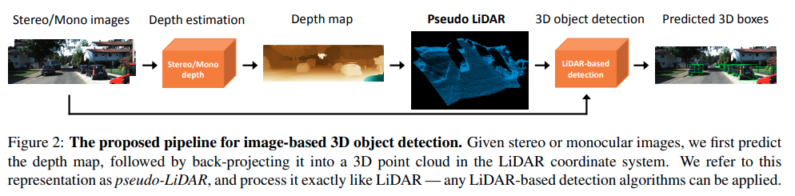

思路目前回看比较地直接，双目深度估计方面，作者使用pretrain [PSMNet](../other_categories/others/PSMNet.md).注意这个PSMNet是在sceneflow数据集，以及training set的点云数据作为监督的。lidar 3D检测方面，作者使用[AVOD](https://github.com/kujason/avod)

## Stereo R-CNN
[pdf](https://arxiv.org/pdf/1902.09738.pdf) [code](https://github.com/HKUST-Aerial-Robotics/Stereo-RCNN)

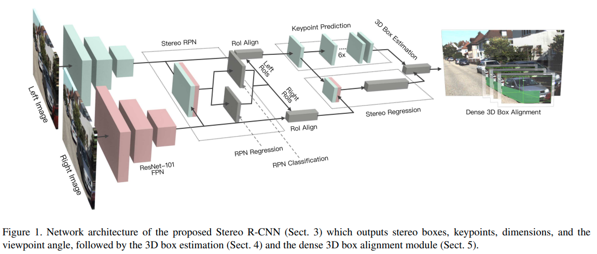

几个训练细节:

1. positive anchors 的threshold提高了。
2. 多预测一个Keypoint的位置，如下图
3. SSIM，利用双目的disparity，后处理优化深度值。

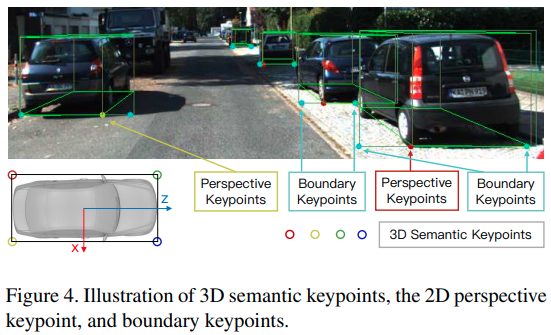

## RT3D Stereo
[pdf](https://www.mrt.kit.edu/z/publ/download/2019/Koenigshof2019Objects.pdf)
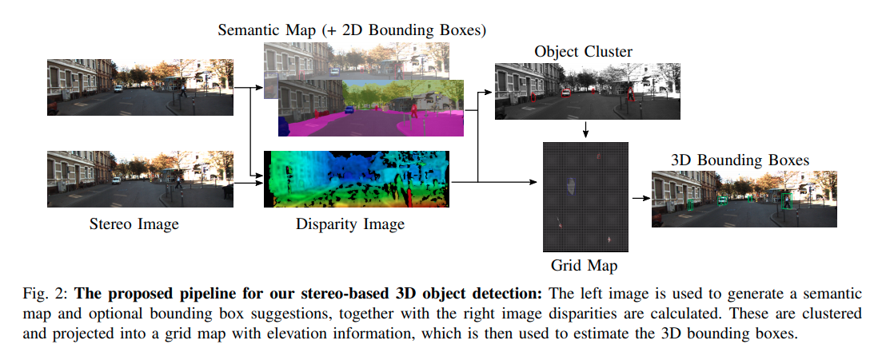

训练细节:

1. 使用单一一个ResNet解决2D 检测以及语义分割的encoding.用的是[二作作者的同时检测与语义分割网络.pdf](https://arxiv.org/pdf/1905.02285.pdf)
2. Disparity使用的是block matching的传统方法，
3. 作者根据语义分割以及detector结果分割出相关像素，然后聚类，然后以优化凸包的方式得出结果。由于作者没有开源，很多内容有待商榷。

$$argmin (N_{out}/N+ (k_l(l-μ_l)/σ_l )^2+(k_w(w-μ_w)/σ_w )^2)$$

[LIGAStereo]:#ligastereo
[CDN]:CDN.md
[CDN P-LiDAR++]:CDN.md
[CG-Stereo]:#cg-stereo
[DSGN]:DSGN.md
[EGFN]:EGFN.md
[Pseudo-LiDAR E2E]:#pseudo-lidar-e2e
[Pseudo-LiDAR++]:#pseudo-lidar
[YOLOStereo3D]:YOLOStereo3D.md
[Disp R-CNN]:#disp-rcnn
[ZoomNet]:#zoomnet
[OC Stereo]:#oc-stereo
[RTS3D]:#rts3d
[Pseudo-Lidar]:#pseudo-lidar_1
[Stereo R-CNN]:#stereo-r-cnn
[RT3DStereo]:#rt3d-stereo