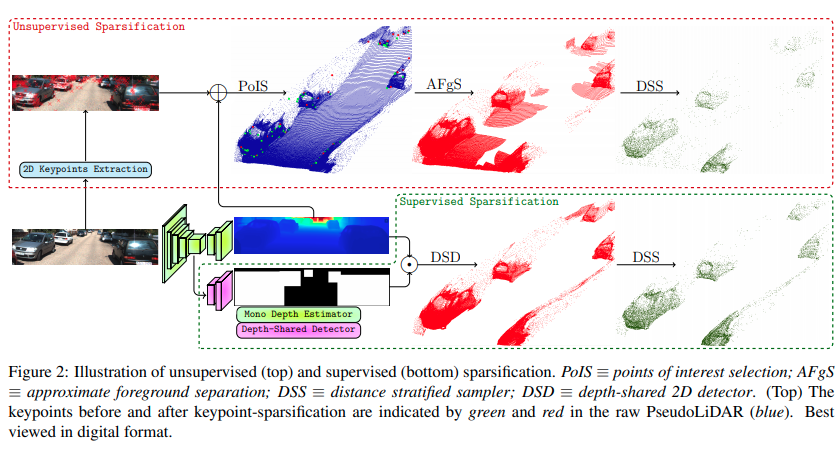

time: 20191224
pdf_source: https://arxiv.org/pdf/1911.09712.pdf
short_title: RefinedMPL

# RefinedMPL: Refined Monocular PseudoLiDAR for 3D Object Detection in Autonomous Driving

这篇论文的目标在于优化pseudolidar的前端部分(点的生成与数量精简)。作者写了较长的introduction说明了本文的动机。在目前的pseudo-lidar框架下，我们需要根据RGB图片生成一个密集的点云深度估计，但是简单计算可以发现，这种方法生成的密集点云比64线甚至128线lidar生成的点云更加密集，尤其是对距离较为近的物体，可知pseudo-lidar的密集点云其实对检测精度没有什么显著的提升，因而精简点云对计算速度以及性能都有帮助.

在不考虑目标检测的情况下，本文提供了下采样点云的方式.(未开源)

## 流程总览

本文提供了两种方式，一种是有监督的情况下进行点云预处理，一种方式是无监督地使用点云预处理。本文这里用的是Sparsification,因为主要目标是滤掉不需要的过多的点

监督的方式：
* 语义分割网络同时输出深度估计以及2D目标检测框
* 从2D目标检测框中选出框内的点
* DSD采样

非监督方式：
* 单目输出深度估计
* 从原图输出2D关键点(LoG maximum)
* 投影关键点
* 背景点分离
* DSD采样

## DSD采样

随机下采样的问题在与这样容易大幅度地减少较远处较小的(同时较为难的)物体的点，这样会使得detection结果变差，作者的思路是根据点到相机的距离进行采样(个人感觉描述不清)

本文后续的3D检测使用的是pointRCNN，最终实现了目前(2019-12-24查看)的SOTA第二名

