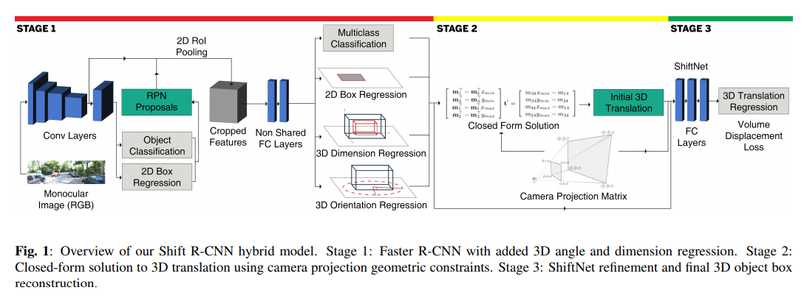
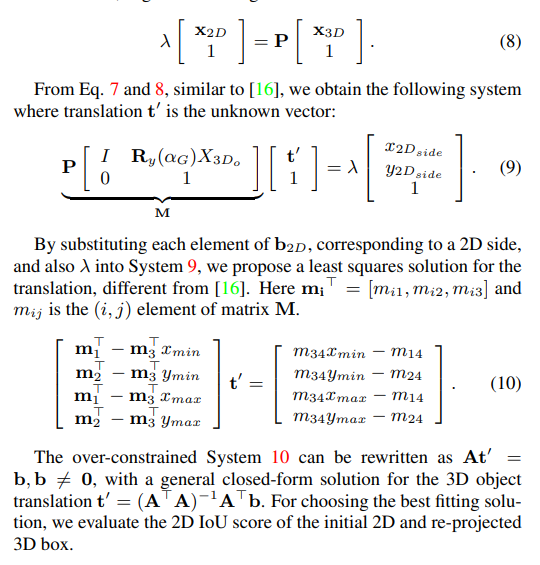

pdf_source: https://arxiv.org/pdf/1905.09970.pdf
short_title: Shift RCNN
# SHIFT R-CNN: DEEP MONOCULAR 3D OBJECT DETECTION WITH CLOSED-FORM GEOMETRIC CONSTRAINTS

这篇论文的在理论上主要是三大贡献，第一是三步走的基于Faster-RCNN的 Shift R-CNN，第二是Volume Displacement Loss (VDL)用于训练网络。

# 工作流程

## 2D 检测与3D结构参数估计

使用Faster-RCNN的RPN输出Proposal以及2D框预测，后续全连接层输出分类、物体大小以及物体方向。

1. 物体方向回归同样得选择回归$sin$,$cos$值，同时多一个$L_1$cost要求$sin^2 + cos^2 = 1$，这里只要求输出观测角\alpht_L$也就是$\alpha_G - \theta_{ray}$
2. 物体大小回归同样选择回归$log$值，
3. 最终加权输出总和

## 闭环约束求出相对位置

这个问题最终能转换为一个最小二乘的问题

## ShiftNet进一步优化

把上一部分以及第一部分的信息，包括$t, \bold b_{2D}， \bold d, (sin(\alpha_L), cos(\alpha_L)), (sin(\alpha_G), cos(\alpha_G))$,输入到两层全连接层中然后输出最终目标。

## Volume Displacement Loss

目的是正确地提升3D IOU,但是3D IOU直接搞并不可导。这里给出新的思路, $\Delta t$为世界坐标中的$x, y, z$差值

$$\Delta t_{\alpha G}  = R_y(\alpha G) \Delta t$$

$$ L = w \times h \times |\Delta x_{\alpha G}| + w \times l \times |\Delta y_{\alpha G}| + h \times l \times |\Delta z_{\alpha G}|$$