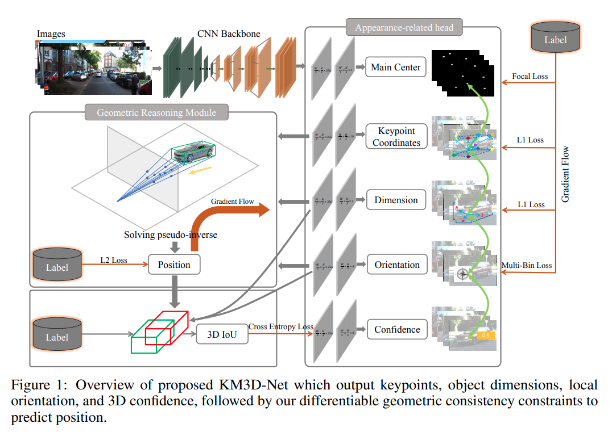
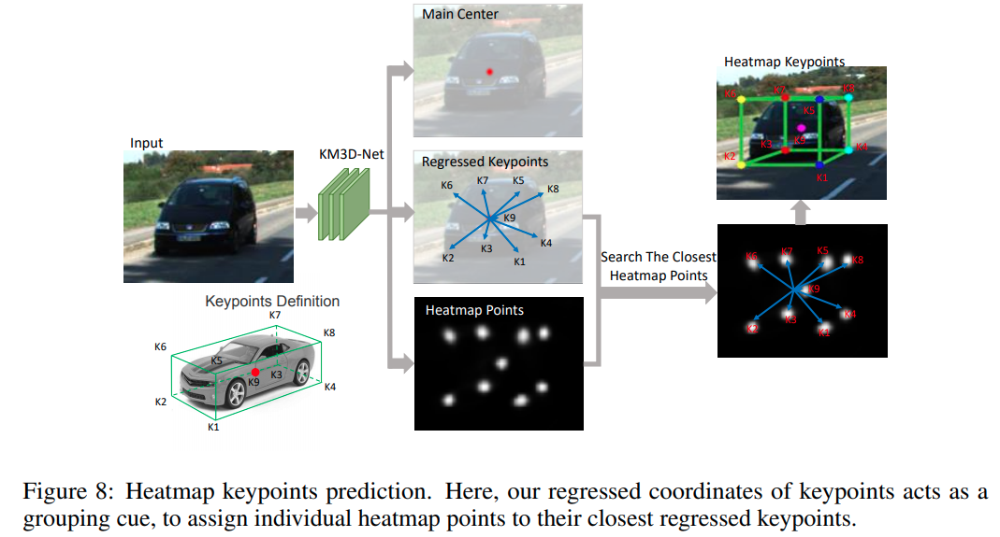
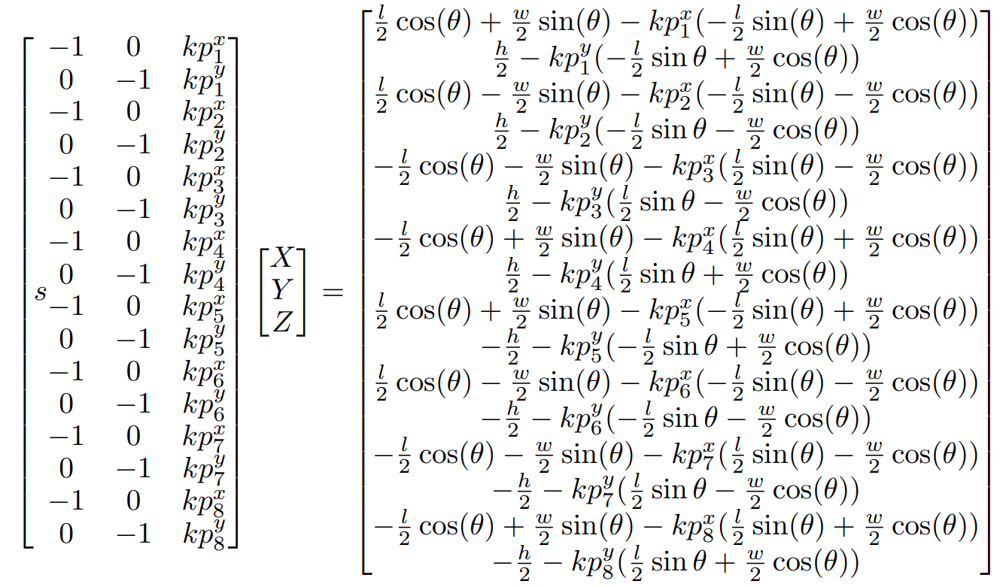
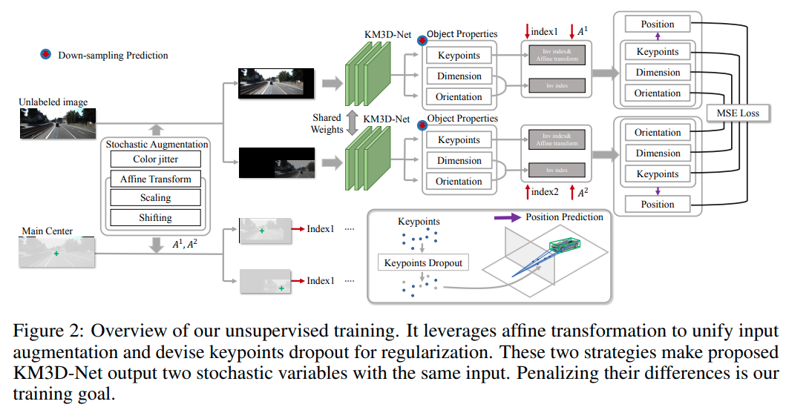

time: 20200908
pdf_source: https://arxiv.org/abs/2009.00764
code_source: https://github.com/Banconxuan/RTM3D
short_title: SSL-RTM3D

# Monocular 3D Detection with Geometric Constraints Embedding and Semi-supervised Training

这篇 paper与 [RTM3D]是同一作者，思路也是一脉相承，需要注意的是这里关于semi-supervised training的定义是使用的ground truth 更少，同时可以在test set上面做fine-tune使得结果更鲁棒.

其最终性能很不错，具体在 [Collections for Mono3D] 里面有排名。

## KM3D-Net

核心监督结构如图

架构上延续了[Object as Point](../other_categories/object_detection_2D/Object_as_points.md)以及][RTM3D]的思路，热图预测角点为核心特点.

另外可以看到最大的不同在于不再直接预测深度值，3D 位置转而通过最优化进行求解，并且由于运算过程可导，也使得距离值能够直接反馈到输出端。(个人理解这是一个对于anchor free比较大的突破，在此之前anchor free没法通过物体2D bounding boxes的大小得到深度值的先验，影响回归算法的精度，如今本文使用伪逆求解将约束涵盖在运算过程中，理论上可以大幅度提升anchor-free的上限,在多自由度的数据集[cityscapes](Metric_3d.md)上，这也开启了使用[BPnP](../Building_Blocks/Bpnp.md)的可能性)

最后求解$[X,Y,Z]$的线性系统方程为:

## Unsupervised

本文给出的所谓 unsupervised的思路主要是为了提高系统的鲁棒性，也就是在 unlabeled data上，要求经历不同数据增强后的预测值相似度比较高。这个本质上不能替代 supervised的作用，supervised依然很重要，但是这个方法在使用恰当的情况下可以提升系统的鲁棒性。 作者的训练方法是让supervised和unsupervised数据成batch一起训练。

[RTM3D]:RecentCollectionForMono3D.md
[Collections for Mono3D]:RecentCollectionForMono3D.md