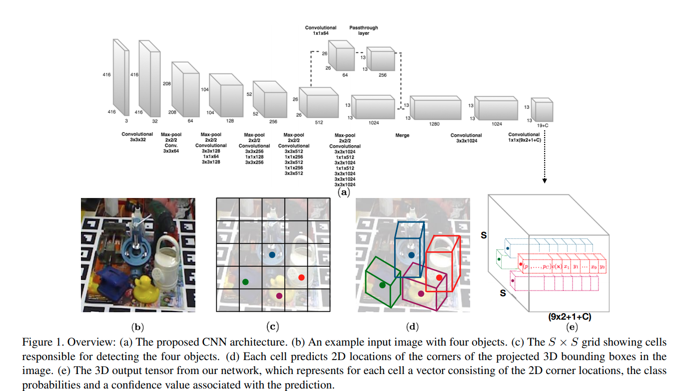
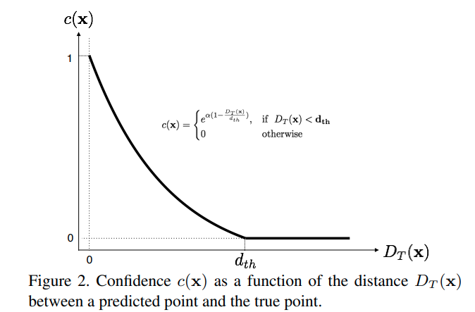

time: 20200107
pdf_source: https://arxiv.org/pdf/1711.08848.pdf
code_source: https://github.com/microsoft/singleshotpose
short_title: single-stage 3D Pose Estimation

# Real-Time Seamless Single Shot 6D Object Pose Prediction

这篇论文是一篇较为基础的3D物体检测文章，进行的是在基本已知物体scale的情况下,从单一RGB图片中还原物体的位置与姿态的任务。

这篇文章有开源的代码，同时对于本文而言是[这篇文章](pvnet.md)的相关前置.

## 总体架构

这篇文章借用YOLO的架构,输入为一张图，用dense anchor box预测各个位置上不同物体的大致位置，同时这个anchor box还会输出物体的9个控制点在图中的相当坐标，包含一个中心点以及8个长方体框的角点。另外输出$C$个分类指标以及$1$个objectness指标，这个指标的目标，由一个指数函数决定

已知9个点之后，使用opencv的[solvePnP](https://docs.opencv.org/2.4/modules/calib3d/doc/camera_calibration_and_3d_reconstruction.html#solvepnp)函数直接求得物体的相对位移与相对姿态。

