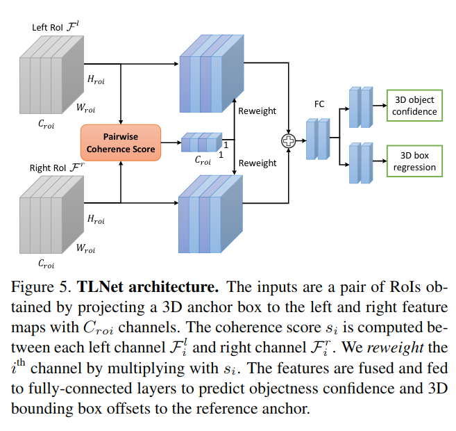

pdf_source: https://arxiv.org/pdf/1906.01193.pdf
code_source: https://github.com/Zengyi-Qin/TLNet
short_title: TLNet
# Triangulation Learning Network: from Monocular to Stereo 3D Object Detection

这篇论文的主要contribution是三部分，第一部分是一个可靠的单目3D detector baseline；第二部分是Triangulation Learning；第三部分是feature reweighting strategy。

## Baseline Monocular Network单目baseline

### 正面视角 Anchor Generation

使用深度学习下采样，得到一个$G_x \times G_y$的网格,每一个网格里面的值代表这个网格有目标的概率，从这些potential cells出发射出一个圆台，在台体中均匀取样形成3D anchors proposals。

### 3D 盒体proposal以及refinement

使用 RoIAlign，也就是传统的RCNN方式做

## Triangulation Learning Network

### TL-Net:Object level triangulation

输入是一对ROI，一致性评分 Pairwise Coherence Score是一个 $1 \times 1 \times C_{roi}$的权重张量，然后分别改变两个图中各个特征通道的权重，然后相加，再全连接输出。

这个Coherence Score是两个特征feature map的余弦距离，作者的论点是如果3D位置正确，那么anchor box投影到左右相机中的特征会相似，也都是物体的feature， 若偏了则差距会很大，随机、完全无关的条件下reweight 权重会为0，最终输出的confidence也会有所影响。