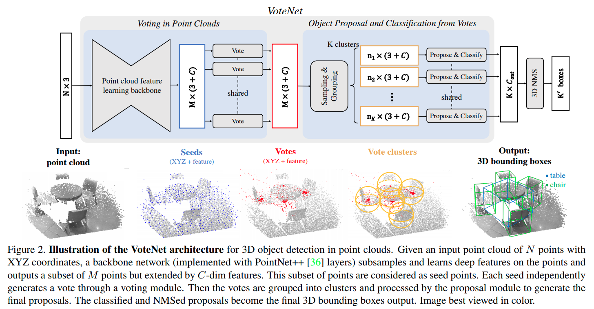
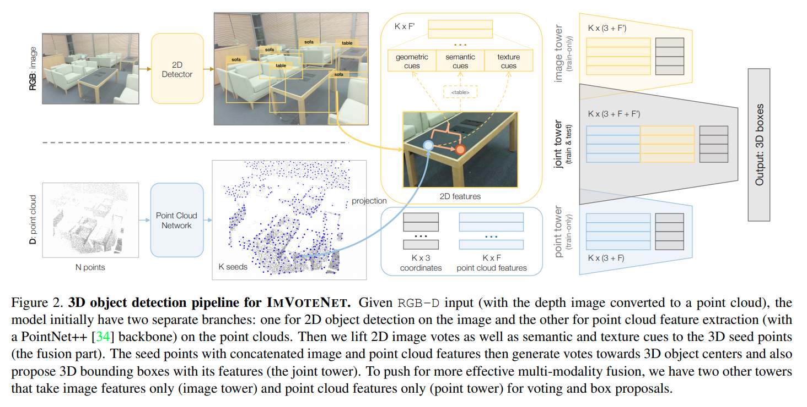
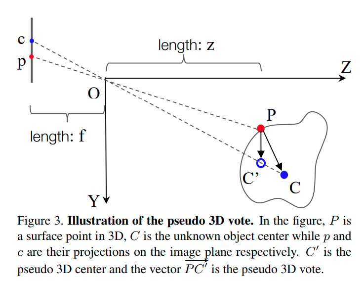

time: 20200303
pdf_source: https://arxiv.org/pdf/1904.09664.pdf
code_source: https://github.com/facebookresearch/votenet
short_title: VoteNet & ImVoteNet
# VoteNet & ImVoteNet
另外ImVoteNet的pdf: 
<a href="https://arxiv.org/pdf/2001.10692v1.pdf">
<i class="fa fa-file-pdf-o"> pdf</i>
</a>

这两篇paper是相关且连续的idea，这里连续阅读
# VoteNet

作者的理解是，由于点云与实际点的位置有一定的距离，因而inference 物体的中心有难度，这里借助hough-voting的思路.

算法pipeline:

使用PointNet++ 提取特征，使用最远点取样，下采样的到M个seed point.

每一个seedpoint 经过MLP，得到object 中心与seed point的$dx, dy, dz$以及特征残差$df$.

根据最远点采样以及基础的threshold距离进行聚类。

每一个聚类里面的点用线性层进行融合， 其中$z_i'$为归一化的距离值，$h_i$为每一个点的特征
$$
p(\mathcal{C})=\operatorname{MLP}_{2}\left\{\max _{i=1, \ldots, n}\left\{\operatorname{MLP}_{1}\left(\left[z_{i}^{\prime} ; h_{i}\right]\right)\right\}\right\}
$$

# ImVoteNet

这篇论文在votenet的基础上解决两个问题，第一个是如何使用image detector辅助seed points进行voting，第二个是如何融合两者的feature 对最后的3D信息进行回归。

在第一个问题上，ImVoteNet的设定是2D detector的中心与物体的3D中心在同一个投影线上。如下图

假设$p$是物体上的点，也就是点云的一个点，点P产生vote时需要预测一个$\vec{PC}$.现有的数据为点$P$的三维坐标、在图片上的投影$p$, 以及$C$在图片中的投影$c$.

$$
\begin{aligned}
\vec{p} \vec{c} &=\left(u_{2}-u_{1}, v_{2}-v_{1}\right)=(\Delta u, \Delta v) \\
&=\left(f\left(\frac{x_{2}}{z_{2}}-\frac{x_{1}}{z_{1}}\right), f\left(\frac{y_{2}}{z_{2}}-\frac{y_{1}}{z_{1}}\right)\right)
\end{aligned}
$$
$$
\overrightarrow{P C^{\prime}}=\left(\frac{\Delta u}{f} z_{1}, \frac{\Delta v}{f} z_{1}, 0\right)
$$

3D voting时只需要再预测$\Delta z = z' - z$，降低了搜索空间。

关于第二个问题，作者提出使用三个与2D detector无关的feature

Geometric Cues for each seed point:

$$
\left(\frac{\Delta u}{f} z_{1}, \frac{\Delta v}{f} z_{1}, \frac{\overrightarrow{O C^{\prime}}}{\|\overrightarrow{O C^{\prime}}\|}\right)
$$

Semantic Cues for each seed point:

对应2D detector输出时的分类矢量(不使用RoI Align处理后的矢量，为了让这个网络与 detector 无关)

Texture Cues for each seed point:

将seed point投影到原来的RGB图上，将这个RGB vector 作为 texture cues赋予给这个点。

Fusion:

作者让点云、图片分别各自进行detection，training时直接融合。使用了[gradient blending.pdf](https://arxiv.org/pdf/1905.12681.pdf)这个trick.
