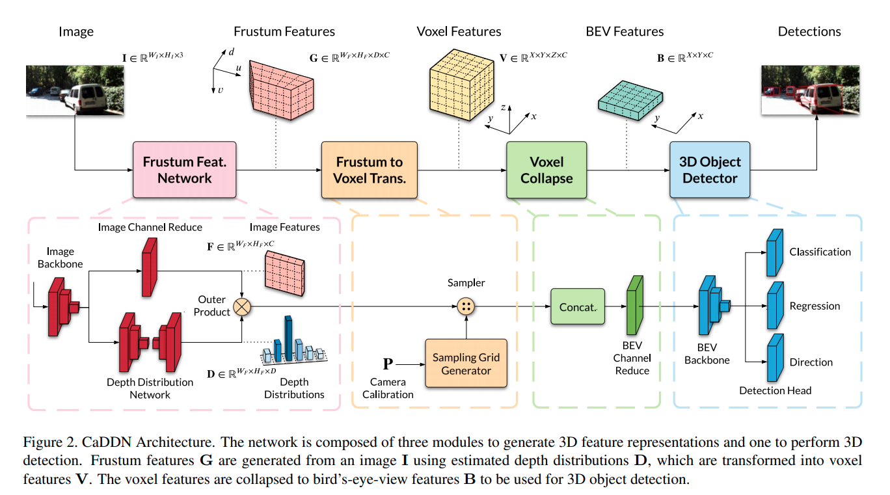
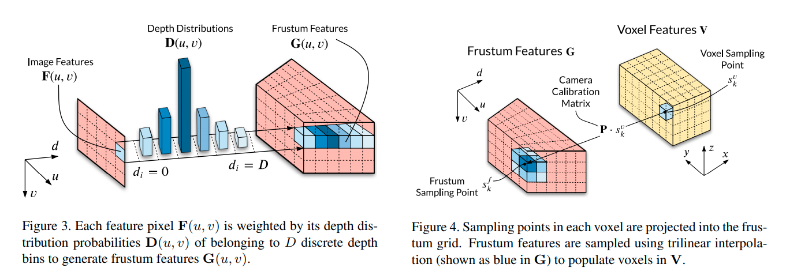

time: 20210317
pdf_source: https://arxiv.org/pdf/2103.01100.pdf
code_source: https://github.com/TRAILab/CaDDN
short_title: CaDDN

# Categorical Depth Distribution Network for Monocular 3D Object Detection

这篇paper (caddn) 提出了一个one-stage的单目3D detection模型，速度不快但是点数较为理想。思路上类似于[DSGN](DSGN.md)的端到端坐标转换，是比较有泛用性的算法。

## Model Architecture 系统模型

Frustum Feature Network输出的Image Feature 为backbone 下采样比例为4的输出，使用 $1\times 1$卷积对通道数进行下采样, 得到$F \in \mathbb{R}^{W_F \times H_F \times C}$.

Depth Distribution Network 采用 ASPP融合多尺度数据，同样输出下采样比例为4的输出,输出的是深度bin分布, 得到$D \in \mathbb{R}^{W_F \times H_F \times D}$.

Sampler 的输入为$F$, $D$的外积 $G \in \mathbb{R}^{W_F\times H_F\times D\times C}$.

从相机坐标转换到BEV的做法系统如下图:

估计实现方法是采用空间中的 grid_sample 函数，实现文中提及的三线性插值.

### BEV Detection

作者使用卷积层将Voxel Feature $V \in \mathbb{R}^{X\times Y\times Z\times C}$坍缩成单层的BEV特征$B\in \mathbb{R}^{X\times Y\times C}$. 之后采用[PointPillars](https://github.com/traveller59/second.pytorch)的输出Head输出最终结果.

### Depth Encoding

网络中实际上嵌入了一个基于bin分类深度预测网络，这个深度预测网络对深度的encoding/discretization是关键。

本文采用的是线性增加离散(linear-increasing discretization LID).其公式为:

$$
    d_c = d_{min} + \frac{d_{max} - d_{min}}{D(D+1)} \cdot d_i(d_i+1)
$$

训练这个网络的时候使用Focal Loss, 同时对不同点的深度给予不同的权重。如果一个点在2D bounding box内，则其权重$\alpha_{fg} = 3.25$, 否则为$\alpha_{bg} = 0.25$

