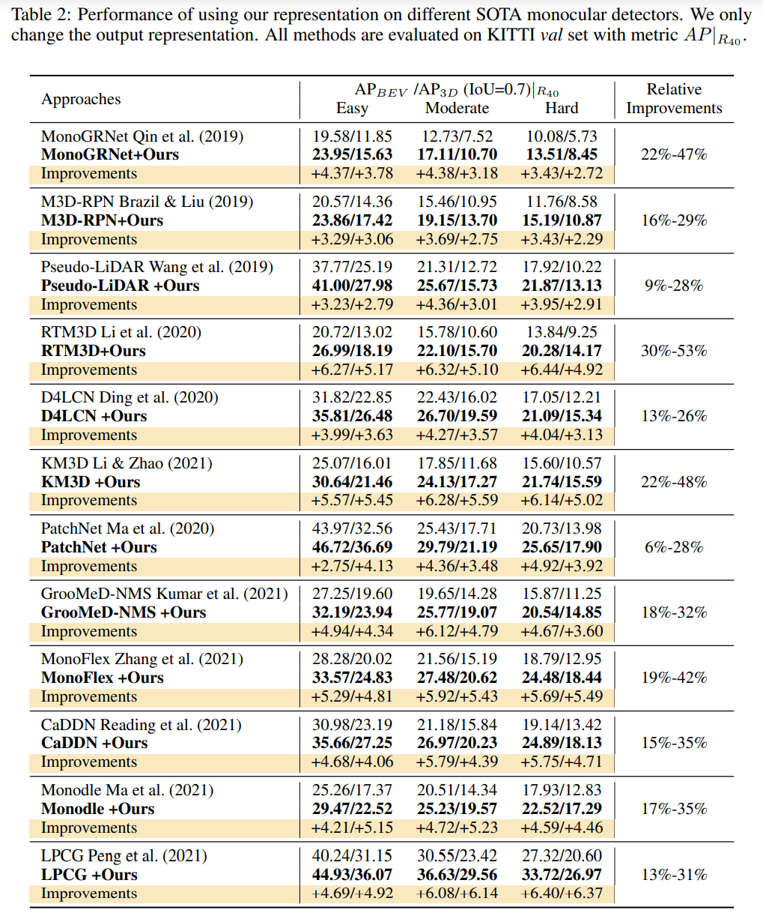

time: 20211209
pdf_source:https://openreview.net/forum?id=mPlm356yMIP

# Digging Into Output Representation For Monocular 3D Object Detection

这篇paper是ICLR 2022的一篇撤稿。论评价以及理论上的原创性其实并不够高，甚至不一定有实用性，但是它数值上扰动了单目检测的刷分生态。是值得注意的论文。

这篇论文采用增加采样的方案，数值上提升了3D recall并且得到的AP很高。

采用的方案是对每一个网络现成的输出做了一些增广处理。简单来说就是对每一个检测结果，多预测数个低概率的深度上有偏移的3D预测框。

偏移后的深度修正概率(用此概率乘以原有的分类概率得到新的置信度)为:

$$t(s) = e^{-\frac{(s-z)^2}{\sigma^2}}$$

$$\sigma = e^{\frac{z}{\lambda}}$$

在KITTI上$\lambda=80$,对每一个检测出来的物体，多输出6个估计值。对深度做$[\plusmn 2, \plusmn 1, \plusmn 0.5]$的扰动，同时近距离(10米内)的检测不做这样的扰动。

刷榜的提升相当惊人。感觉这个文章的做法是数值上尝试平衡precision recall 理论上不是很特别，但是性能上很神奇。
