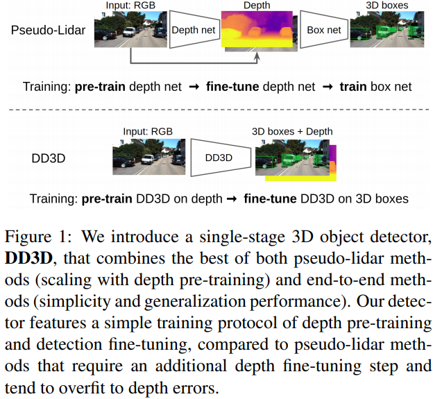
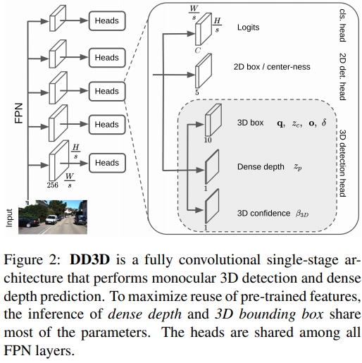

time: 20210928
pdf_source: https://arxiv.org/pdf/2108.06417.pdf
code_source: https://github.com/TRI-ML/dd3d
# Is Pseudo-Lidar needed for Monocular 3D Object detection? (DD3D)

这篇paper在单目3D检测上融合了很多细节的想法，达到了很高的性能点数

- 使用受监督的单目深度估计作为预训练，一方面数据量很大，另一方面可以允许跨domain的预训练(检测数据量少而深度估计数据量大，可以在别的数据集上先预训练深度估计，再在目标环境下训练检测)。
- 使用FCOS anchor-free框架，与2D检测目前的做前沿方案融合。
- 预测的深度值受camera parameter影响，即深度会被$F_x$ 归一化，考虑了内参的变化后，预测结果不再与某一相机参数挂钩，且训练时可以用更丰富的数据增强。
- 使用了[disentangled loss](Disentangling_Monocular_3D_Object_Detection.md). 
- 预测输出视觉转换后的四元数，与cityscape等新数据集的要求符合，对相机俯仰角的变化更鲁棒，更容易直接使用。

输出头的描述:

- 四元数$(q_w, q_x, q_y, q_z)$, 表示的是allocentric orientation的四元数，也就是需要考虑相机的观测。但是只估计三个自由度
- 深度估计网络输出$z_{\{c,p\}}$, $z_c$对应物体的中心距离， $z_p$对应单目深度预训练时使用的深度，而网络输出与实际深度之间的关系如下，其中$\sigma_l$. $\mu_l$是每一个FPN层里面可以学习的参数: 
$$
\begin{array}{l}
d=\frac{c}{p} \cdot\left(\sigma_{l} \cdot z+\mu_{l}\right) \\
p=\sqrt{\frac{1}{f_{x}^{2}}+\frac{1}{f_{y}^{2}}}
\end{array}
$$
- $\mathbf{o} = (\Delta_u, \Delta_v)$代表
- $\delta=(\delta_W, \delta_H, \delta_L)$代表和当前类别的bounding boxes的deviation。
- $\beta_{3d}$表示3D bounding boxes预测的置信度。它可以被转换为一个概率值$P_{3D} = (1 + e^{\beta_{3D}})^{-1}$, 预测时与分类的结果相乘，作为NMS和排序的标准，训练时用网络的average disentangled L1 Loss作为监督。

$$
\mathcal{L}_{2 \mathrm{D}}=\mathcal{L}_{\mathrm{reg}}+\mathcal{L}_{c l_{8}}+\mathcal{L}_{c t r}
$$

$$
\mathcal{L}_{3 \mathrm{D}}\left(\mathbf{B}^{*}, \hat{\mathbf{B}}\right)=\frac{1}{8}\left\|\mathbf{B}^{*}-\hat{\mathbf{B}}\right\|_{1}
$$

