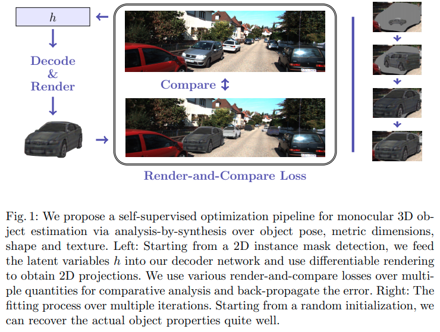
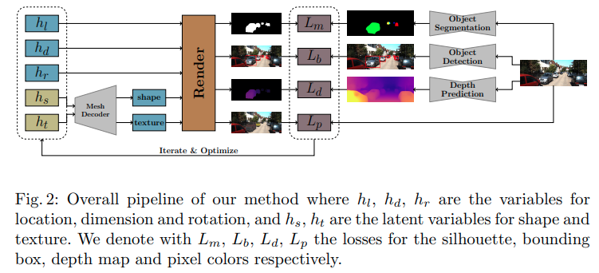
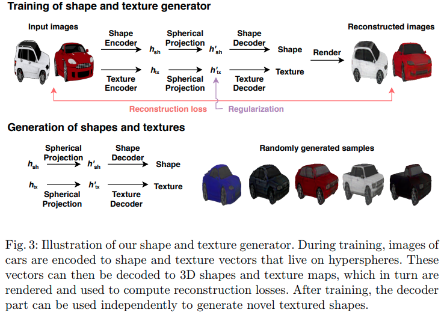

time: 20201004
pdf_source: https://arxiv.org/pdf/2009.14524.pdf

# Monocular Differentiable Rendering for Self-Supervised 3D Object Detection

这篇paper处理的问题是自监督单目3D检测。做法是优化最小的渲染误差。

从2D instance mask出发，从一些隐变量$h$出发解码生成投影render图像，与图片结果进行比较，迭代修正重投影误差得到目标解。

## Pipeline

总体pipeline如图。比较简单的内容是图片右侧的部分，从图片中提取物体分割，物体检测以及深度预测结果，前两者使用的是在COCO上训练好的Mask RCNN网络，在这里不再微调。深度预测使用的是self-supervised的[PackNet](https://arxiv.org/pdf/1905.02693.pdf)

mesh的生成采用的是GAN的 2D to 3D https://arxiv.org/pdf/1811.10719.pdf 

rendering采用的是 neural renderer https://arxiv.org/pdf/1711.07566.pdf

