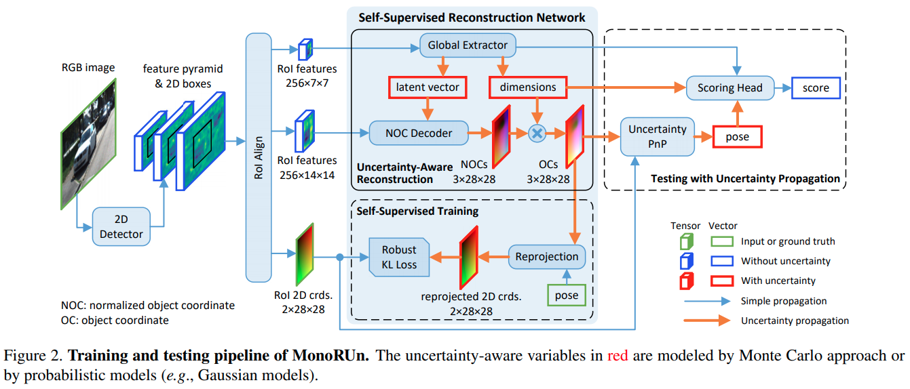
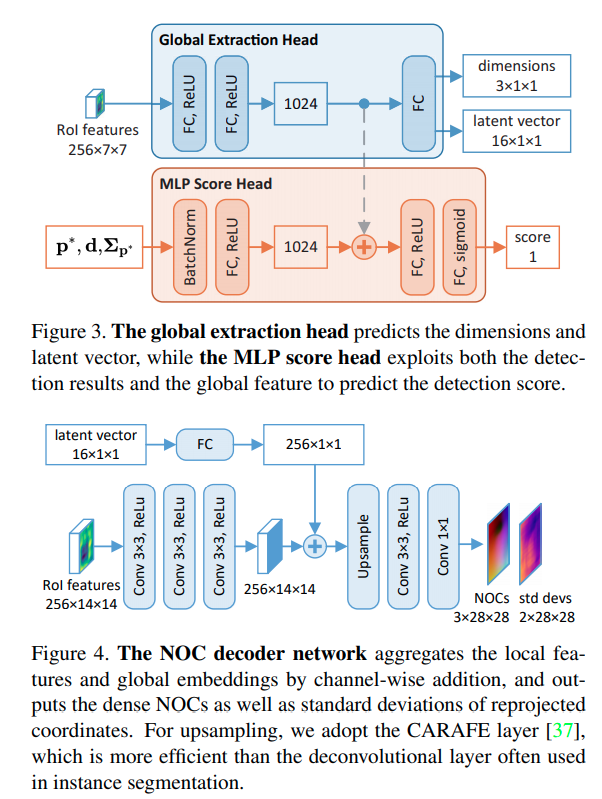

time: 20210325
pdf_source: https://arxiv.org/pdf/2103.12605.pdf
code_source: https://github.com/tjiiv-cprg/MonoRUn

# MonoRUn: Monocular 3D Object Detection by Reconstruction and Uncertainty Propagation

这篇paper用一个二阶段的模块以及稠密的PnP匹配，绕过了对距离的直接预测。

## 做法

尽管本文在self-supervision上的用词值得商榷，但是其算法值得模仿。

首先是使用二阶段物体检测器框出物体并提取其特征。这个特征输出 score, latent vector以及物体的dimensions. 再输出每一个像素点在车辆坐标系下的位置 normalized by dimensions。

训练的时候利用ground truth 姿态计算每一个pixel predict的三维坐标，然后反投影回来,得到误差如下

$$
\mathbf{r}_{(u, v)}=K\left(\mathbf{R} \mathbf{x}_{(u, v)}^{\mathrm{OC}}+\mathbf{t}\right)-\left[\begin{array}{l}
u \\
v
\end{array}\right]
$$

$$
\mathrm{x}^{\mathrm{OC}}=\mathrm{x}^{\mathrm{NOC}} \circ \mathrm{d}
$$

在推理的时候使用 Uncertainty aware PnP 对这个稠密PnP问题进行求解。

