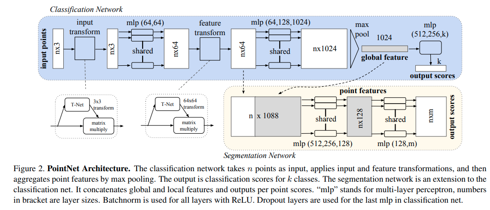
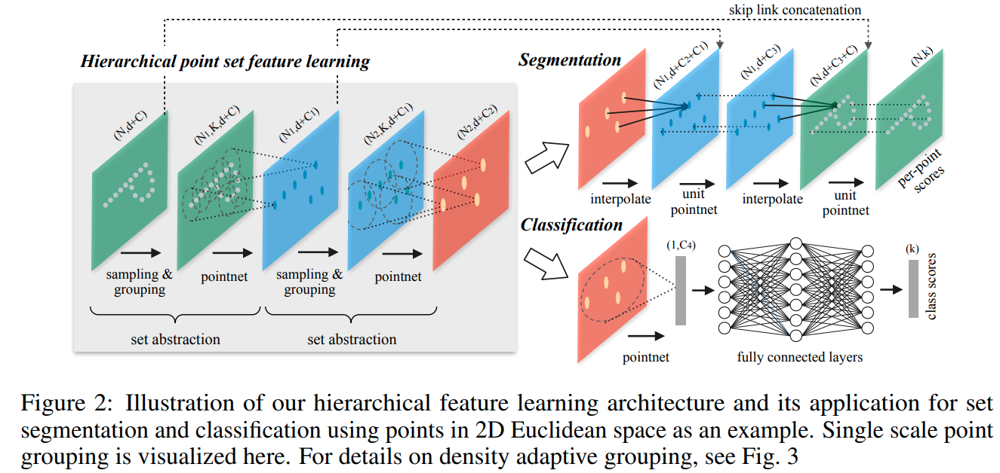
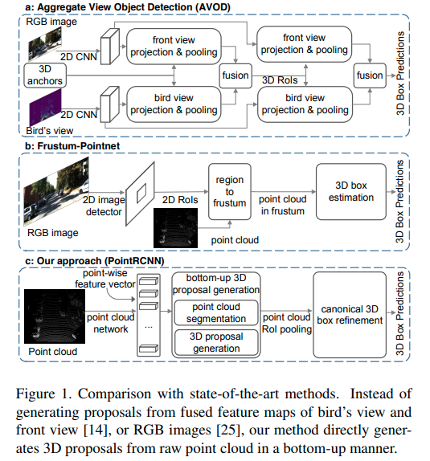
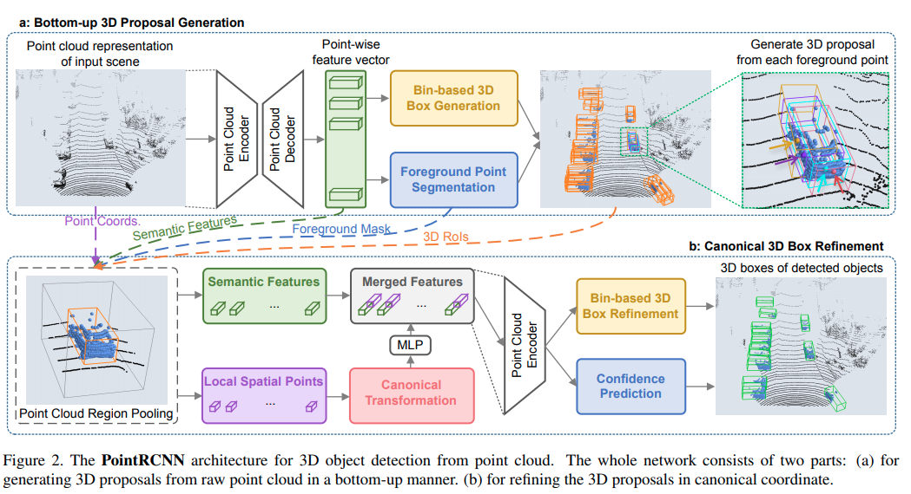

time: 20200421
pdf_source: https://arxiv.org/pdf/1706.02413.pdf
code_source: https://github.com/charlesq34/pointnet2

# Collections on PointNet and follow-ups

PointNet是目前点云处理中相当重要的一个部分，与Voxel总体并行。

Related paper:
[Frustum Pointnet](Frustum_PointNets_for_3D_Object_Detection_from_RGB-D_Data.md)

#　PointNet

[pdf](https://arxiv.org/pdf/1612.00593.pdf) [code](https://github.com/charlesq34/pointnet)

PointNet有一个很好的CSDN介绍[博客](https://blog.csdn.net/LIU2089735320/article/details/88967738https://blog.csdn.net/LIU2089735320/article/details/88967738).

核心思想:

1. 运算应当是轮换不变的，适应无序的点云。
2. 理解点云的关键点在于找到合适的投影，边界/面上的关键点决定了对点云的理解。

第一点给出的启发是以全连接层、坐标转换层以及max-pooling为主要运算方式。

坐标转换层与全连接层不同的地方在于转换权重矩阵的行列式应与旋转矩阵性质类似，作者给出了这样Regularization Loss 作为约束:
$$L_{r e g}=\left\|I-A A^{T}\right\|_{F}^{2}$$

第二点引入了Critical Points的概念，简单而言就是最后Maxpooling中，如果点$p$有至少一个channel是Maxpooling操作对应的$argmax$,那么点$p$就是一个critical point.显然，Critical Point的数量不能超过这个矢量的channel数，图中为1024.
作者通过可视化表明了这里的Critical Point在实际中也基本对应稀疏的、一组最有表达力的点。

语义分割网络中，作者将全局矢量concat到每个点自己的feature中，然后全连接输出分类。

# PointNet++
[pdf](https://arxiv.org/pdf/1706.02413.pdf) [code](https://github.com/charlesq34/pointnet2) [Faster Pytorch](https://github.com/sshaoshuai/Pointnet2.PyTorch)

从应用场景可知，PointNet面对的是简单物体的mesh/point cloud组成，但是在面对大场景时有两个问题。第一个是无法处理数量巨大的点云，第二个是由于及其强调无序性以及依赖于全局feature，带来的核心问题是无法对局部点云结构进行推理，没有利用大场景中点云多处小规模聚类的特点。

## Set Abstraction Layer = sampling + grouping + pointnet;

Sampling使用最远点采样(FPS), [code](https://github.com/charlesq34/pointnet2/blob/master/tf_ops/sampling/tf_sampling_g.cu).循环采样，每一个新采样的点距离现有点的距离。

Grouping使用Ball query寻找keypoint附近K个最近的点，输入为$N\times (d+C)$个点，中心点$N'\times d$,输出为$N'\times K\times (d+C)$,[code](https://github.com/charlesq34/pointnet2/blob/master/tf_ops/grouping/tf_grouping_g.cu)

PointNet Layer,将K个最近的点输入到pointNet中。得到这个聚类的新features

## Point Feature Propagation for Set Segmentation

这对应的是skip connection 以及上采样的步骤，作者采用的是与现有点距离成反比的3D interpolation, [code](https://github.com/charlesq34/pointnet2/tree/master/tf_ops/3d_interpolation).

$$f^{(j)}(x)=\frac{\sum_{i=1}^{k} w_{i}(x) f_{i}^{(j)}}{\sum_{i=1}^{k} w_{i}(x)} \quad \text { where } \quad w_{i}(x)=\frac{1}{d\left(x, x_{i}\right)^{p}}, j=1, \ldots, C$$

将网络前面的features 经过$1\times 1$卷积concat到插值结果中。

# PointRCNN: 3D Object Proposal Generation and Detection from Point Cloud
[pdf](https://arxiv.org/pdf/1812.04244.pdf) [code](https://github.com/sshaoshuai/PointRCNN)

这是一个two-stage的model, 使用segmentation pointcloud网络，得到每一个点的features，生成一个anchor 3D box，以及前后景分割。作者对anchor 3D box用的是bin-based generation,使得这里的每一个输出都会是分类输出。

