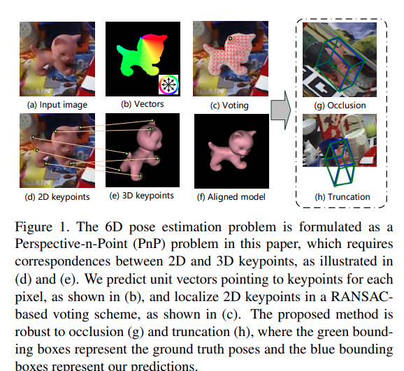
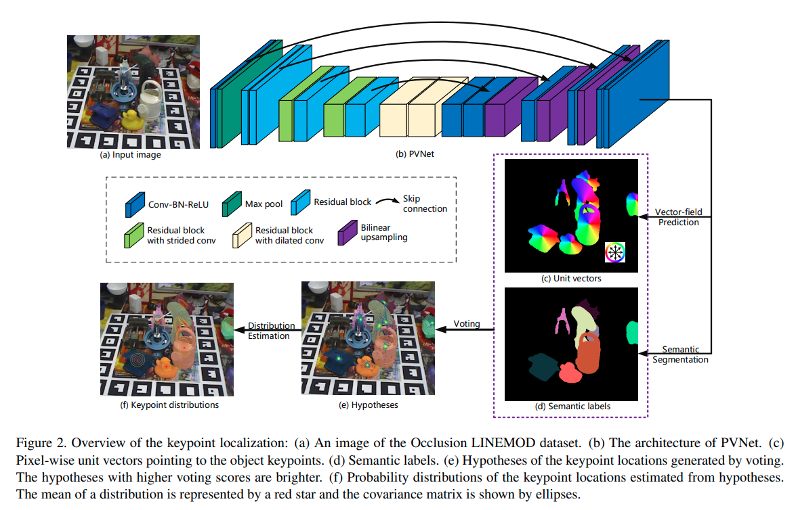
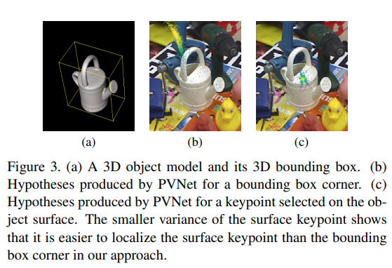

time: 20200107
pdf_source: https://arxiv.org/pdf/1812.11788.pdf
code_source: https://github.com/zju3dv/pvnet
short_title: PVNet
# PVNet: Pixel-wise Voting Network for 6DoF Pose Estimation

这篇文章解决的也是在基本已知物体scale甚至更多信息的情况下,从单一RGB图片中还原物体的位置与姿态的任务。

##　Motivation
如[前文]的做法，在做keypoint回归时作者发现了两个问题.

第一，遮挡甚至物体超出图片范围的情况。直接回归精度有限而使用heatmap([比如PAF](../other_categories/others/openpose_part_afinity_fileds.md))会面临的问题则是完全无处理物体超出图片范围的情况。

第二, 直接使用PnP求解姿态的问题在于没有考虑不同keypoint有不同的不确定性，如何求得这个不确定性(本文提供了更有趣的思路)也是一大问题。

第三，[前文]设定其PnP问题的控制点为长方体的8个角点以及中心点，然而作者发现由于角点容易偏离物体表面，因而网络根据图片像素特征进行的回归结果效果一般，作者指出应当尽可能让控制点在物体表面

## 结构
总体pipeline 如图:

输入图片，神经网络输出语义分割结果，以及keypoints矢量场。然后使用voting确定各个物体的keypoints的期望值与方差，最后使用PnP求解物体的位姿

## Keypoints as Intersections
网络在keypoints矢量场这里需要输出的是这个点到对应物体各个keypoints的单位方向矢量。则对应keypoints由本object所有像素的方向矢量决定。本文使用基于ransac的voting方式决定keypoints的最终概率分布。

算法：
1. 使用语义分割label过滤目标像素
2. 随机选择两个矢量，求出它们的角点，重复$N$次，得到$N$个hypothesis $h_i$
3. 所有像素对这$N$个prior进行投票,每个hypothesis的权重为$w_{k, i}=\sum_{\mathbf{p} \in O} \mathbb{I}\left(\frac{\left(\mathbf{h}_{k, i}-\mathbf{p}\right)^{T}}{\left\|\mathbf{h}_{k, i}-\mathbf{p}\right\|_{2}} \mathbf{v}_{k}(\mathbf{p}) \geq \theta\right)$其中$\theta$为点乘结果的threshold，这里设定为0.99
4. 求得这个keypoint的均值与方差
$$
\begin{aligned}
&\boldsymbol{\mu}_{k}=\frac{\sum_{i=1}^{N} w_{k, i} \mathbf{h}_{k, i}}{\sum_{i=1}^{N} w_{k, i}}\\
&\boldsymbol{\Sigma}_{k}=\frac{\sum_{i=1}^{N} w_{k, i}\left(\mathbf{h}_{k, i}-\boldsymbol{\mu}_{k}\right)\left(\mathbf{h}_{k, i}-\boldsymbol{\mu}_{k}\right)^{T}}{\sum_{i=1}^{N} w_{k, i}}
\end{aligned}
$$

## Groud Truth Keypoints Selection
作者这里选择了更全面的建模效果，是一个基于FPS(farthest point sampling)的算法,使得点尽可能在物体表面，同时隔得足够远，但是需要物体的完整建模，这里暂且略过。

## Uncertainty-driven PnP

由于前面得到的Keypoints带有不确定性的估计，这里在计算的时候就可以带上不确定性进行PnP优化，也就是求解一个非线性优化:
$$
\begin{aligned}
\underset{R, \mathbf{t}}{\operatorname{minimize}} & \sum_{k=1}^{K}\left(\tilde{\mathbf{x}}_{k}-\boldsymbol{\mu}_{k}\right)^{T} \mathbf{\Sigma}_{k}^{-1}\left(\tilde{\mathbf{x}}_{k}-\boldsymbol{\mu}_{k}\right) \\
& \tilde{\mathbf{x}}_{k}=\pi\left(R \mathbf{X}_{k}+\mathbf{t}\right)
\end{aligned}
$$

在本文的开源库中，作者使用CUDA加速了 Ransac voting,用opencv的[solvePnP](https://docs.opencv.org/2.4/modules/calib3d/doc/camera_calibration_and_3d_reconstruction.html#solvepnp)得到位姿的初始解，然后使用Ceres库考虑不确定性迭代得到最后结果。

[前文]:./SingleStage3DPoseEstimation.md