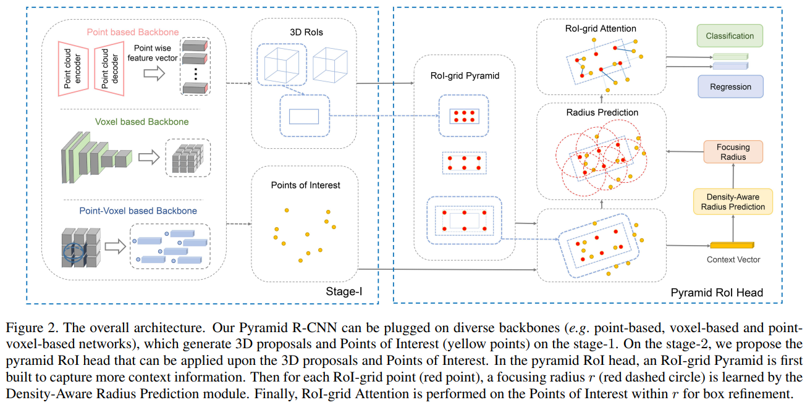
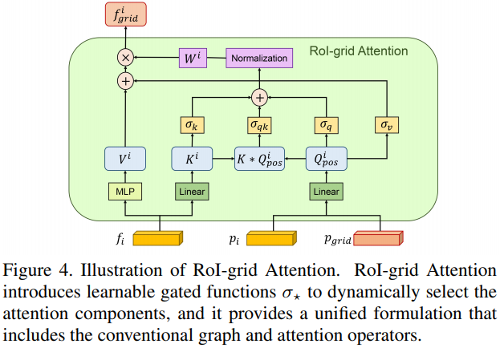

time: 20210908
pdf:https://arxiv.org/pdf/2109.02499.pdf

# Pyramid R-CNN: Towards Better Performance and Adaptability for 3D Object Detection

这篇文章主要处理的是two-stage的 基于点云的三维检测。

其核心思路如下:

- 改善了two-stage detection的特征提取模块。
- 观察到数据集中点的稀疏性，有7%的物体中只有不超过10个点。因而考虑需要initial prediction外面的测量点的特征来辅助判断物体的实际位置和形态。
- 做法上，首先是提出了RoI-grid Pyramid, 层级式地增加可以被"RoI"包含的点的范围，从而进一步考虑了附近的点。
- 提出了高泛用度的自适应的特征提取方法 RoI-grid Attention。
- 可学习的，自适应地对临近点搜索的半径进行预测。
- 有一大优点，可以嫁接于多种one-stage网络(backbone网络)，适用多种关键点表达。

## RoI-grid Pyramid

本文首先解释了为什么点云需要考虑proposal之外的点，而图片不需要。
- 点云过于稀疏
- 图片Dense, 且有明确的更大的感受野。

$$
p_{\text {grid }}^{i j k}=\left(\frac{W}{N_{w}}, \frac{L}{N_{l}}, \frac{H}{N_{h}}\right) \cdot(0.5+(i, j, k))+\left(x_{c}, y_{c}, z_{c}\right)
$$

## RoI-grid Attention

已经有了一些keypoint以及RoI, 从上文的公式会得到一系列需要采样的grid点的位置, 对每一个点的附近$r$距离内的所有点的特征进行融合，这个$r$的计算在后面表述，融合的时候有一系列的可能的方法。

- Pooling-based Operator: $f_{grid}^{pool} = \underset{i\in\Omega(r)}{\text{maxpool}} (\text{MLP}(\text{cat}([f_i, p_i - p_{grid}])))$
- Graph-based Operator: $
f_{\text {grid }}^{\text {graph }}=\sum_{i \in \Omega(r)} W\left(Q_{\text {pos }}^{i}\right) \odot V^{i} = \sum_{i \in \Omega(r)} W\left(Q_{\text {pos }}^{i}\right) \odot \text{MLP}(f_i) = \sum_{i \in \Omega(r)} W\left(\text{Linear}(p_i - p_grid)\right) \odot \text{MLP}(f_i)
$
- Attention-based Operator: $f_{\text {grid }}^{\text {atten }}=\sum_{i \in \Omega(r)} W\left(Q_{\text {pos }}^{i} K^{i}\right) \odot V^{i}$
- RoI-grid Attention: $f_{\text {grid }}=\sum_{i \in \Omega(r)} W\left(\sigma_{k} K^{i}+\sigma_{q} Q_{p o s}^{i}+\sigma_{q k} Q_{\text {pos }}^{i} K^{i}\right)$
$\odot\left(V^{i}+\sigma_{v} Q_{\text {pos }}^{i}\right)$

通过$\sigma$的不同取值，可以把本文提出的融合方法变成上面几个方法。这些参数是用全连接层输出的sigmoid函数来自适应学习的。

