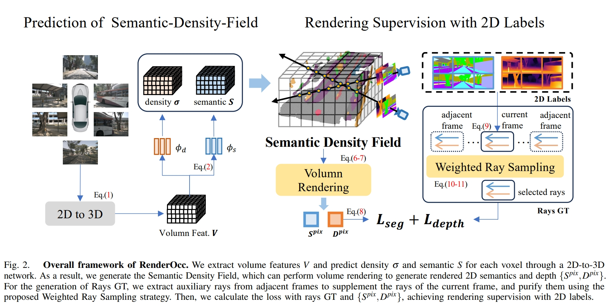

time: 20230927
pdf_source: https://arxiv.org/pdf/2309.09502.pdf
code_source: https://github.com/pmj110119/RenderOcc
short_title: RenderOcc

# RenderOcc: Vision-Centric 3D Occupancy Prediction with 2D Rendering Supervision

这篇paper呈现了基本完整的由NeRF作为训练方法的纯相机视觉三维Occupancy的方案。

此前主要的3D Occupancy训练都需要使用3D Label进行监督，而3D Label的成本以及纯视觉车辆上监督数据的获取难度一直是车辆部署的痛点。

NeRF的诞生使得可微分渲染走进了深度学习CV社区，能否通过可微分渲染、就像重投影训练单目深度一样、几乎自监督地训练三维占据网格?这个问题对于纯视觉的感知落地方案有相当重要的价值。相比于单目深度+语义分割+投影的分布方案，三维占据网格方案的优势也是很多的:

1. 从输出的数据排列来说，在空间中均匀分布的栅格比在图片域中均匀分布的像素更实用，投影过程中有很多算力是浪费在密集地近端场景。
2. 从输出的结构来说，由于MonoDepth限定了被遮挡的物体、物体被遮挡的部分完全没有任何输出，而栅格输出使得网络可以通过相邻帧的监督、帮助本帧预测场景中被遮挡的部分；猜测被遮挡的部分，甚至输出被遮挡部分的不确定性。而不像MonoDepth一样直接无法输出。
3. 三维占据网格方案理论上可以与车辆planning / prediction等一同训练，有更广的扩展空间。

与此同时NeRF重投影渲染与单目深度训练有一定不同，也带来了相应的挑战:

1. 对于动态物体，单目深度可以利用同向同速物体在相机上相对位置相对稳定、与远处背景物体相似这个极强的先验，同时滤掉大部分的动态物体以及天空等动态物体。但是对于3D Occupancy的训练来说无法使用这个Trick。去除背景、处理动态物体需要新的方案。
2. 单目深度网络基本由纯卷积网络组成，网络组成简单、速度快、占用显存少。而2D-3D的网络，尽管有[DeformAttention](../other_categories/object_detection_2D/deformable_detr.md)带来性能的大幅提升，但是整体模型大小仍然较大。在进行重投影，尤其是基于NeRF的可微分渲染时，花费的显存资源较大。
3. 在三维数据中，加剧了数据label不平衡的问题，尤其是由于模型规模、NeRF、多帧渲染的显存耗费，最终可微分渲染往往被迫只能随机采样一定数量的射线，少样本数据的保存也成为问题。

这篇paper同样面对前文提到的这几个挑战，并提出了相应的修正Trick。

### Network Structure

理论上来说本文提出的方法是对2D-3D网络是不敏感的，实验中采用的网络是BEVStereo.

而在最终输出密度density与semantic的时候,density的activation function为 [softplus](https://pytorch.org/docs/stable/generated/torch.nn.Softplus.html)

$$\text{Softplus}(x) = \frac{1}{\beta} * \text{log}(1+\text{exp}(\beta * x))$$

保证了:

- 激活函数非负，且可以非常高，全部定义域可以训练。
- 在初始化的时候，密度约为0.7, 渲染采样会偏向于近处的网格。

### Rendering Supervision

这篇paper采用的是深度与语义分割监督。深度默认来自于当帧点云，实验中来自于SFM的深度投影同样能完成训练，只是准确度有一定的区别。而语义分割来自于语义点云对图片的投影。

投影方法与训练方式与NeRF一致。

$$
\begin{aligned}
& \alpha\left(z_k\right)=1-\exp \left(-\sigma\left(z_k\right) \beta_k\right) \\
& T\left(z_k\right)=\exp \left(-\sum_{t=1}^{k-1} \sigma\left(z_t\right) \beta_t\right)
\end{aligned}
$$

$$
\begin{aligned}
& S^{\text {pix }}(r)=\sum_{k=1}^N T\left(z_k\right) \alpha\left(z_k\right) S\left(z_k\right), \\
& D^{\text {pix }}(r)=\sum_{k=1}^N T\left(z_k\right) \alpha\left(z_k\right) z_k,
\end{aligned}
$$

$$
L=L_{\text {seg }}\left(S^{p i x}, \hat{S}^{p i x}\right)+L_{\text {depth }}\left(D^{p i x}, \hat{D}^{p i x}\right)+L_{r e g}(\sigma)
$$

其中语义分割的损失为 cross-entropy, 深度损失为 SILog, regularization Loss采用的是 distortion loss和TV loss.

而渲染点的采样方案，采用的是 mip360-sampling

### Auxiliary Rays:

在nuscenes这种相邻相机几乎没有重叠区域的数据集上进行采样，不可避免需要处理多帧数据。这篇paper在nuscenes采用前后共七帧的图像进行重投影。随机采样的时候是有侧重的，

- 类别平衡，根据像素点出现的频率计算权重$W_b$

$$
W_b(r)=\exp \left(\lambda_s *\left(\frac{\max (M)}{N(\mathbf{C}(r))}-1\right)\right)
$$

- 动态清除。降低相邻帧的权重，并且相邻帧动态类别的权重基本设置为0

