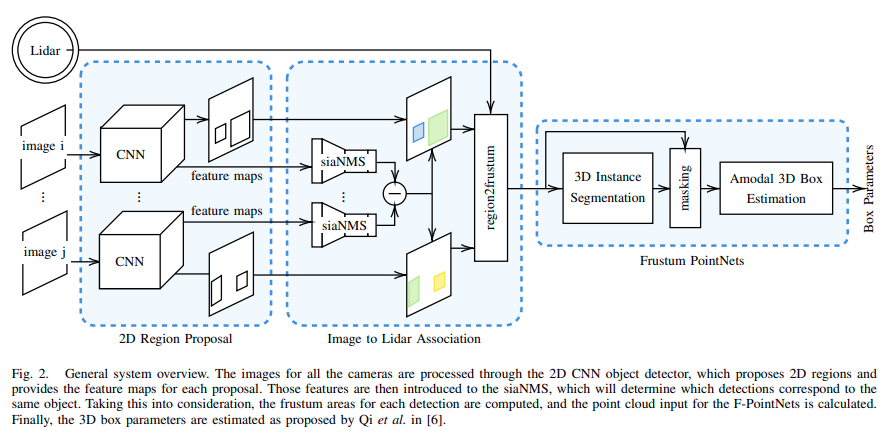
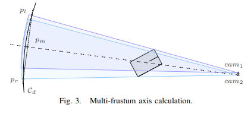

pdf_source: https://arxiv.org/pdf/2002.08239.pdf
time: 20200228
short_title: siaNMS

# siaNMS: Non-Maximum Suppression with Siamese Networks for Multi-Camera 3D Object Detection

这篇paper尝试解决的问题是相机与点云融合场景中的一个问题，就是说一个物体同时被两个相机拍摄时，如何充分利用两个相机的信息进行融合。

## 总体结构

这篇文章总体架构跟随[Frustum Network](Frustum_PointNets_for_3D_Object_Detection_from_RGB-D_Data.md)的设计。使用2D 物体检测算法得到物体的2维框，在二维框对应的方形柱台中找出点云子集，使用Point Net作最后的3D前后景分割已经3D参数回归。

## siaNMS的理解与训练方法

作者采取一个比较直观的设计考虑，对于RoIpooling得到的每一个车子的Feature Map，如果它们属于同一辆车，那么这两个feature就会比较接近。

### Inference过程

对于两个相机里面发现的object，经过siaNMS得到它们的feature，计算它们之间的距离。使用[匈牙利算法](https://www.wikiwand.com/zh/%E5%8C%88%E7%89%99%E5%88%A9%E7%AE%97%E6%B3%95)得到最佳两两匹配结果，如果两个匹配框并集(union)内有点云，则这些点云都会作为这个物体Frustum内的点。

简单的表述来说就是被匹配认为是同一个物体的相机框内的点，合并后的相机主轴设计为

### Training 方法

这里使用[nuscene]数据集，[nuscene]的一个特征是标记每一个场景里面每一辆车的instance ID。作者先使用2D detector得到每一个场景里面每一辆车在每一个摄像头中RoIAlign后的特征图。

训练过程中，每一个样本由一辆同时在两个摄像头中出现的车的特征图，一个为参考样本$x^r$, 一个为正样本$x^p$，同场景另一辆随机车辆作为负样本$x^n$。训练一个siaNMS网络，输入是2D aligned后的特征图，输出是一个$d$维的矢量。

我们希望正样本与参考样本的矢量接近而负样本与参考样本的矢量距离远。
$$
\begin{array}{l}
\left\|f\left(x_{i}^{r}\right)-f\left(x_{i}^{p}\right)\right\|_{2}<\alpha \\
\left\|f\left(x_{i}^{r}\right)-f\left(x_{i}^{n}\right)\right\|_{2}>\beta
\end{array}
$$

因而损失函数为：
$$
\begin{aligned}
\mathcal{L}=& \frac{1}{2} \sum_{i}^{N}\left[\max \left(\left\|f\left(x_{i}^{r}\right)-f\left(x_{i}^{p}\right)\right\|_{2}-\alpha, 0\right)^{2}+\right.\\
&\left.\max \left(\beta-\left\|f\left(x_{i}^{r}\right)-f\left(x_{i}^{n}\right)\right\|_{2}, 0\right)^{2}\right]
\end{aligned}
$$

训练完之后这个模块可以作为一个plug-and-play的独立模块加入网络之中，用于融合不同相机图片的图像信息。
从论文示例图可以看到这个模块可以显著提升边界处的detection结果。

[nuscene]:https://www.nuscenes.org/
