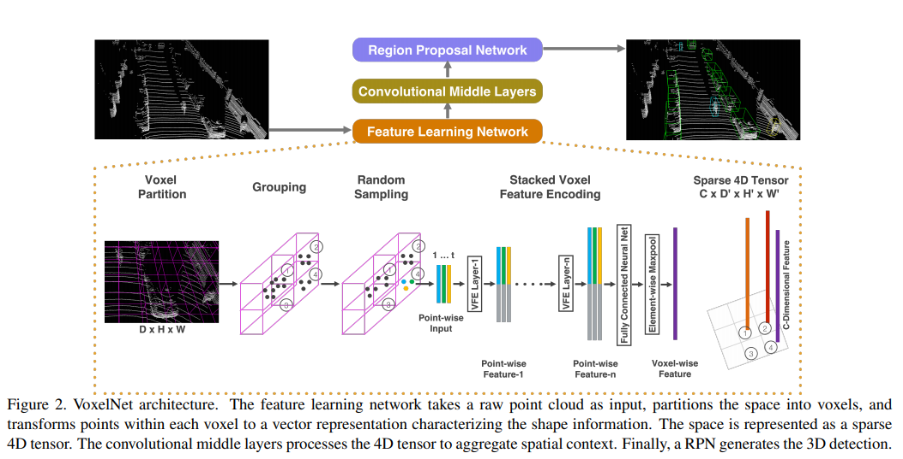

pdf_source: https://arxiv.org/pdf/1711.06396.pdf
code_source: https://github.com/qianguih/voxelnet
short_title: VoxelNet
# VoxelNet: End-to-End Learning for Point Cloud Based 3D Object Detection

点云投影到三维网格，每一个网格内通过随机取点加全连接传播，得到一个单一的feature-vector。关键是对于这样一个稀疏的4D矩阵，在后面如何快速进行矢量运算，这里使用稀疏表达，用hash table建立快速index。

