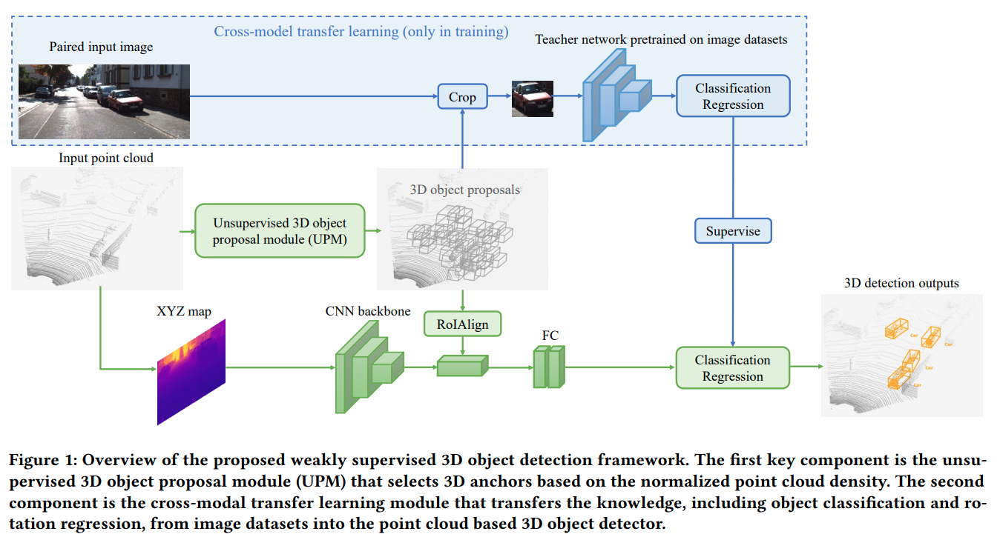
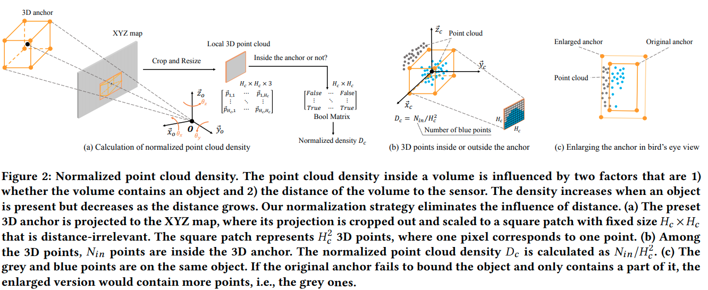

time: 20200818
pdf_source: https://arxiv.org/pdf/2007.13970.pdf
code_source: https://github.com/Zengyi-Qin/Weakly-Supervised-3D-Object-Detection

# Weakly Supervised 3D Object Detection from Point Clouds

这篇paper提出了VS3D框架，任务是不使用3D bounding boxes作为监督信号，实现基于点云的3D物体检测。

## 整体框架

### Unsupervised 3D object proposal module (UPM)

这一部分的任务是提出proposal, 作者的思路是首先在3D世界中密集地采样proposals,然后根据prior，如果一个proposal内点的密度比较大，那么这个框有更大的概率有感兴趣的物体。但是点的密度与距离也有关系，因而需要排除距离的因素，作者提出了 normalized point cloud density $D_c$这个概念。注意地面上的点需要用RANSAC平面拟合先去除。

所有$D_c < \delta$的proposals都被理解为负样本，而剩下的样本根据上图(c)中的做法扩大$1 + \epsilon$倍,保证proposal基本能完整的包含整个object.

然后作者发现对于正确检测的物体，点云的点都在 bounding boxes的边缘。在bounding box坐标系下，在x,y,z方向上平移，使得x,y,z方向上都与最偏的点相切。

至此，得到的proposal是不带旋转，且没有类别标注的。
### cross-model transfer learning module

作者使用Pascal3D+的label，得到预训练的detector以及view-point regressor.

分类训练的时候，由于需要考虑teacher network的不确定性,对于score高于$s_j$或者低于$s_l$ (也就是较为确定的结果)的结果。

$$\mathcal{L}_{r}=-[\hat{s} \log (\tilde{s})+(1-\hat{s}) \log (1-\tilde{s})] \cdot \mathbb{1}\left(s \notin\left[s_{l}, s_{h}\right]\right)$$
