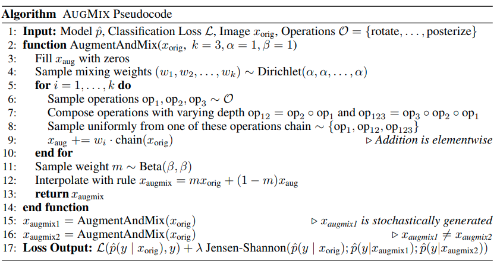
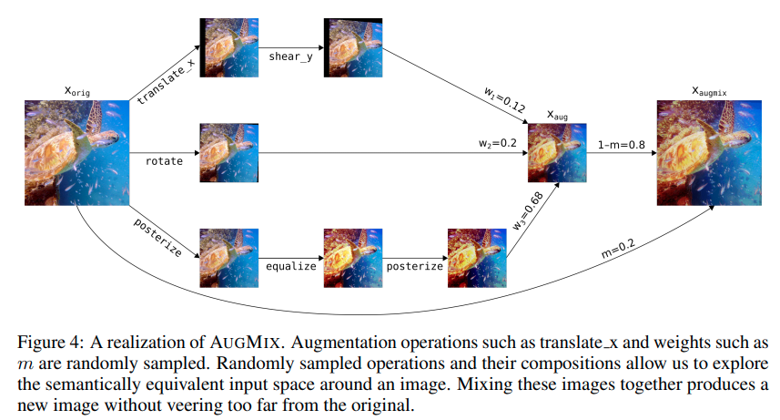

time: 20191209
pdf_source: https://arxiv.org/pdf/1912.02781.pdf
code_source: https://github.com/google-research/augmix
short_title: AugMix

# AUGMIX: A SIMPLE DATA PROCESSING METHOD TO IMPROVE ROBUSTNESS AND UNCERTAINTY

这篇谷歌的文章提供了一个对于分类model容易使用的自动数据增强范式。与使用强化学习等其他方法不同，谷歌提出的算法只包含随机采样加上一个附加的损失函数项。开源的代码为简单的numpy与pytorch，较为易懂。

## 伪代码

作者提出的数据加强的采样结果不是多个数据加强的简单层叠(深度上的链接)，作者认为这种做法很容易使得得到的数据偏离真实数据集太远，所以提出的是一个综合了广度和深度复合组合方式，一个例子如图

损失函数上需要加上[Jensen-Shannon divergence].

## Jensen-Shannon divergence

Jensen-Shannon divergence本质上是[KL divergence]的一个扩展.

本文的三元的JS divergence定义为

$$
\operatorname{JS}\left(p_{\text {orig }} ; p_{\text {augmix } 1} ; p_{\text {augmix } 2}\right)=\frac{1}{3}\left(\mathrm{KL}\left[p_{\text {orig }} \| M\right]+\mathrm{KL}\left[p_{\text {augmix } 1} \| M\right]+\mathrm{KL}\left[p_{\text {augmix } 2} \| M\right]\right)
$$

注意[Pytorch的KL-divergence]在实现上稍稍有坑。本文代码有完整的实现。

[Jensen-Shannon divergence]:https://www.wikiwand.com/en/Jensen%E2%80%93Shannon_divergence

[KL divergence]:https://www.wikiwand.com/en/Kullback%E2%80%93Leibler_divergence
[Pytorch的KL-divergence]:https://pytorch.org/docs/stable/nn.html#torch.nn.KLDivLoss