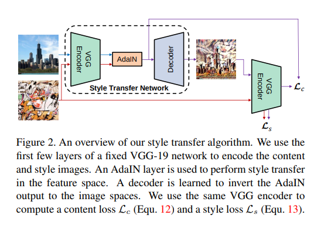

code_source: https://github.com/xunhuang1995/AdaIN-style
pdf_source: https://arxiv.org/pdf/1703.06868.pdf
short_title: AdaIn Style Transfer
# Arbitrary Style Transfer in Real-time with Adaptive Instance Normalization

这篇文章提出了Style Transfer相当长一段时间的SOTA或者baseline，也就是AdaIN模块。

## 背景知识 Normalization 回顾

本文除了基础的BatchNorm(完整batch)以及InstanceNorm(不考虑batch)还回顾了Conditional Instance Normalization(CIN). 

CIN层为每一个style学习一套InstanceNorm的参数$\gamma^s, \beta^s$

$$
\operatorname{CIN}(x ; s)=\gamma^{s}\left(\frac{x-\mu(x)}{\sigma(x)}\right)+\beta^{s}
$$

实验可知对CIN网络而言，BN的结果总体不如IN的结果

## Adaptive Instance Normalization

AdaIN公式:

$$
\operatorname{AdaIN}(x, y)=\sigma(y)\left(\frac{x-\mu(x)}{\sigma(x)}\right)+\mu(y)
$$

其中$x$ 为content input而$y$为style input.本质上来说就是对content instance使用instance normalization 转换为style instance的均值与方差.

## 网络结构与训练方法

网络结构如图

将两张图同时输入到VGG encoder中，执行AdaIN，对content结果decode得到输出图

### Content Loss

利用VGG encode style-transfered picture,

$$\mathcal{L_c} = ||f(g(t)) - t||_2$$
其中$f$为encoder, $g$为decoder， $t$为AdaIN处的输出，也就是对特征向量取L2误差

### Style Loss

以前有使用[格拉姆矩阵的相关性误差的](https://github.com/keras-team/keras/blob/master/examples/neural_style_transfer.py),这里超链接给的例子来自于keras的例子。本文这里使用另一个[别人](https://arxiv.org/pdf/1701.01036.pdf)提出的误差

$$
\begin{array}{c}{\mathcal{L}_{s}=\sum_{i=1}^{L}\left\|\mu\left(\phi_{i}(g(t))\right)-\mu\left(\phi_{i}(s)\right)\right\|_{2}+} \\ {\sum_{i=1}^{L}\left\|\sigma\left(\phi_{i}(g(t))\right)-\sigma\left(\phi_{i}(s)\right)\right\|_{2}}\end{array}
$$

其中$\mu, \sigma$指求均值与方差,$\phi_i$指VGG-19中的某一层的输出。
