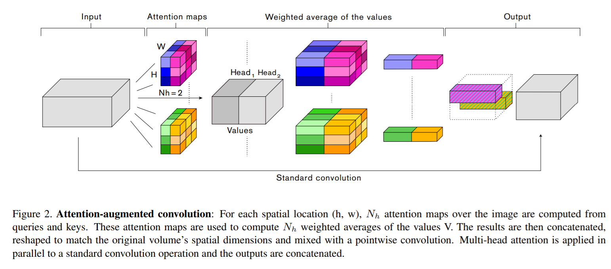

time: 20191105
pdf_source:https://arxiv.org/pdf/1904.09925.pdf
short_title: Attention Augmented Convolution
code_source: https://github.com/leaderj1001/Attention-Augmented-Conv2d
# Attention Augmented Convolutional Networks

这篇文章基于[transformer](Attention_is_all_you_need.md)，将attention直接附加在卷积层中,理论上来说可以用于替代卷积层.

## 图片上的self-attention

设输入张量形状为$(H, W, F_{in})$，这里忽略Batch.首先摊平为一维变为$X$矢量，然后直接使用[transformer](Attention_is_all_you_need.md)中的自注意力层

$$
    O_h = Softmax(\frac{(XW_q)(XW_k)^T}{\sqrt{d_k^h}})(XW_v)
$$

其中$W_q, W_k, W_v$分别是输出维度为$d_k, d_k, d_v$的全连接层的权重矩阵。

输出再Concat为MHA

$$
    MHA(X) = Concat[O_1,...,O_{N_h}]W^O
$$
最后会被reshape成为$(H, W, d_v)$的形状.

## 二维positional embedding

同[transformer](Attention_is_all_you_need.md),我们需要一个传递相对位置信息的方式，我们要求这个embedding能够使网络对位置敏感，但是不能让网络对平移敏感,这里来源来自于music transformer.

像素$i=(i_x, i_y)$对像素$j=(j_x,j_y)$的attention logits为
$$
    l_{i,j} = \frac{q_i^T}{\sqrt(d^h_k)}(k_j + r^W_{j_x-i_x} + r^H_{j_y-i_y})
$$
其中$q_i$是像素$i$对应的query vector,$k_j$是像素$j$的key vector,

上文的self-Attention计算可以转化为
$$
O_h = Softmax(\frac{QK^T + S^{rel}_H + S^{rel}_W}{\sqrt{d^h_k}})V
$$
也就是softmax分子加了两项,其中$S^{rel}_H[i,j] = q_i^Tr^H_{j_y,i_y}, S^{rel}_W = q_i^Tr^W_{j_x-i_x}$。

论文说这个$r$的一种做法是直接存成一个$(HW, HW, d_k^h)$矩阵，但是这样不太好，所以采取了Music Transform的算法，更省内存，具体看代码(原文就是这样)，这些参数可学习。

## Attention Augmented conv

$$
    AAConv(X) = Concat[Conv(X), MHA(X)]
$$
