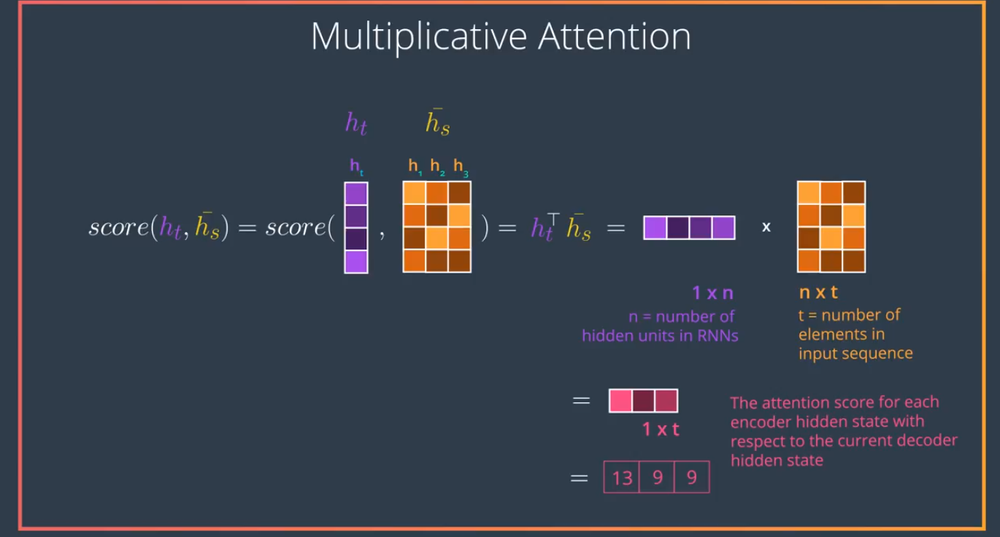
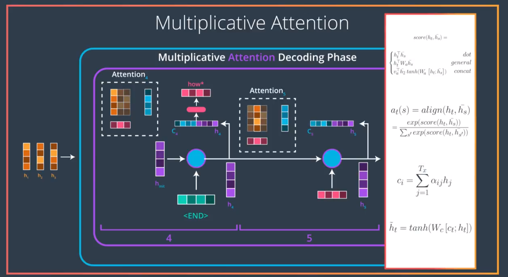
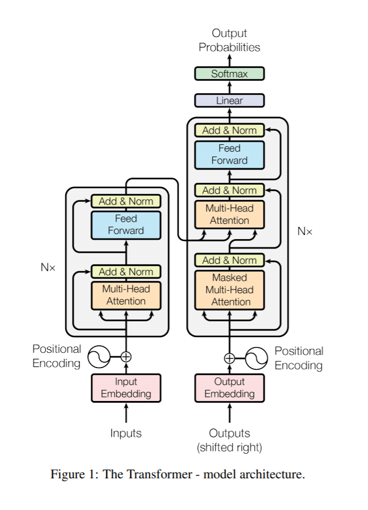
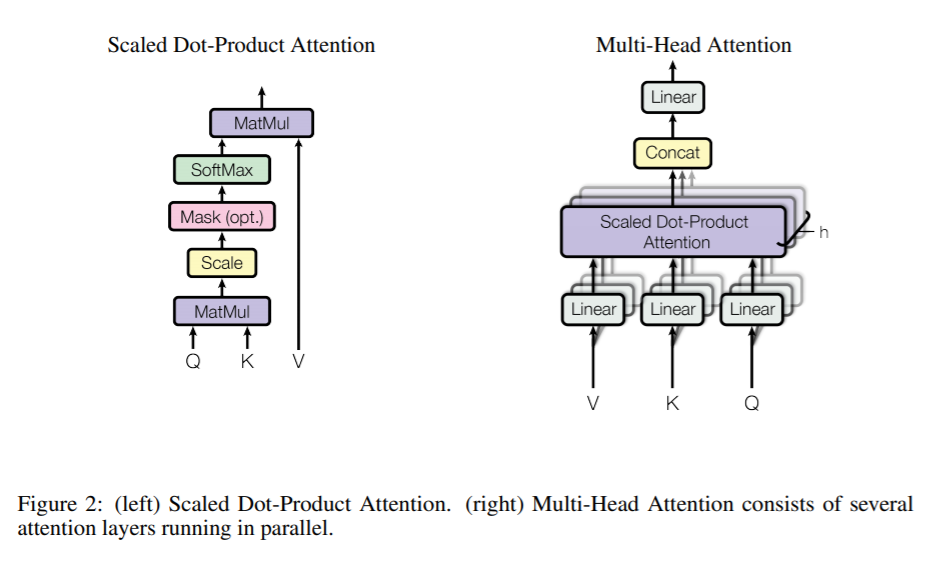
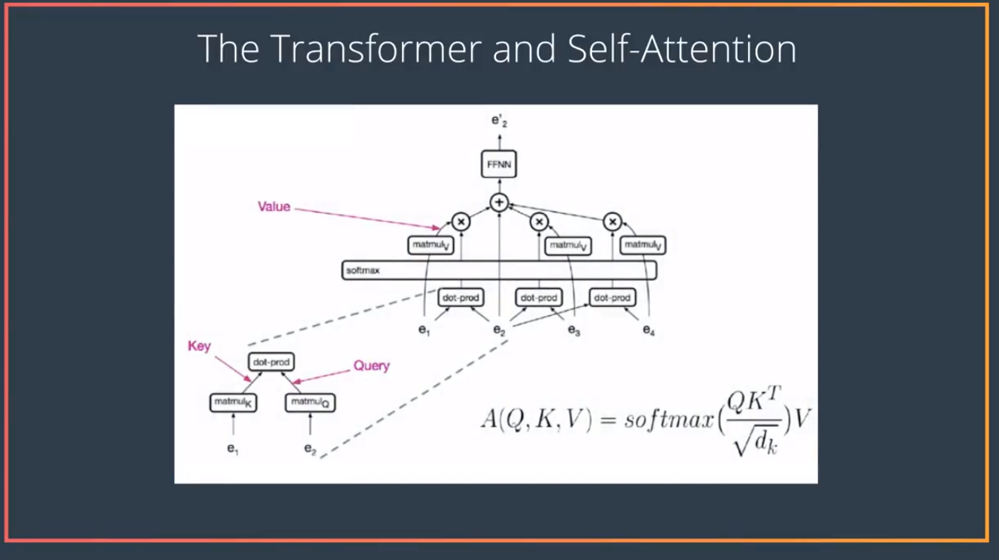
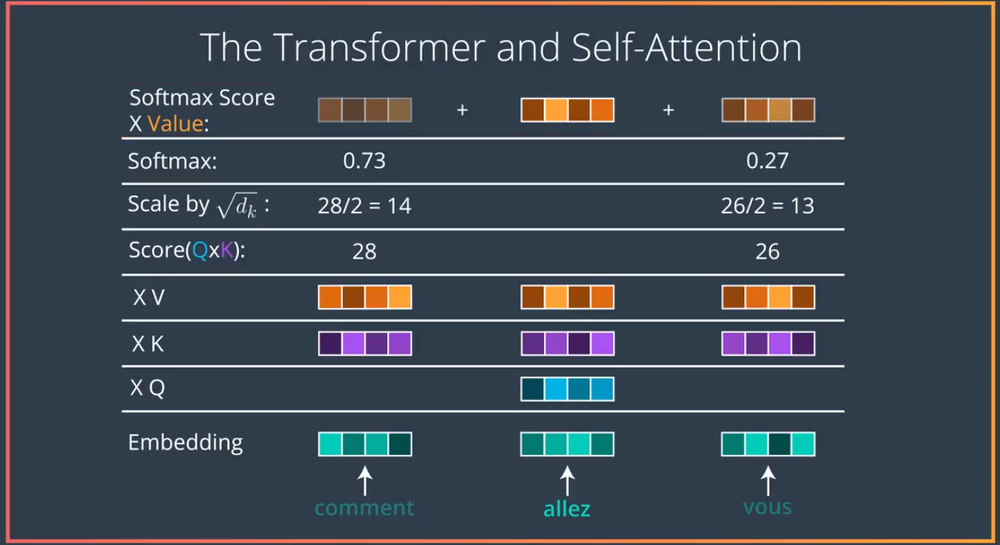

time: 20191105
pdf_source: https://arxiv.org/pdf/1706.03762.pdf
short_title: Self-Attention Mechanism

# Attention is all you need

这篇论文是自注意机制在时序模型中广泛使用的开始。本文提到的Transformer以及对应的层都已经成为了Pytorch的标准层.

## attention 基础回顾

这里引用几张Udaicty纳米学位的课程截图

首先Attention network的Embedding将时序的每一个输入(单词)，翻译成一个个对应的key vector $K$.
用本论文中的用词来描述，就是说RNN的隐藏层是Query $Q$, RNN解码过程中的输入为 value vector $V$

## Transformer 系统总览

在"RNN"的每一层的结构如图,在embedding之后,输入与输出分别输入到一个multi-head self attention模块里面，相当于在输入输出内部自己先做一次attention,然后输入经过一个全连接前馈网络后，成为下一个attention module的$Q$与$K$,输出部分的processed embedding直接作为这个模块的$V$.最后输出经过前馈网络处理输出。

注意本文系统实际上没有使用RNN,只是借用了上文的notation.

## Multi-head Attention

左侧attention的公式
$$
Attention(Q,K,V) = softmax(\frac{QK^T}{\sqrt{d_k}})V
$$

右侧的公式
$$
\begin{aligned}
    MultiHead(Q,K,V)&=Concat(head1,..head_h) W^O \\
    where head_i &= Attention(QW_i^Q, KW_i^k, VW_i^V)
\end{aligned}
$$
本文以及pytorch的实现中选择的$h=8$

## 前馈模块

$$
FFN(x) = ReLU(W_1x+b_1)W_2 + b_2 
$$

## Positional Encoding

由于本文最终完全抛弃RNN, 这里需要给模型输入位置信息，以让model认识到这是一个序列问题。

Positional encoding的维度为$d_{model}$与embedding一致

这里用的公式是
$$
\begin{aligned}
PE_{(pos,2i)} &= sin(pos/10000^{2i/d_{model}}) \\
PE_{(pos,2i+1)}&=cos(pos/10000^{2i/d_{model}})
\end{aligned}
$$

$pos$指位置，而$i$指维度,每一维对应一个正弦,这个矢量和embedding相加。

## Self attention Udacity supplyment

