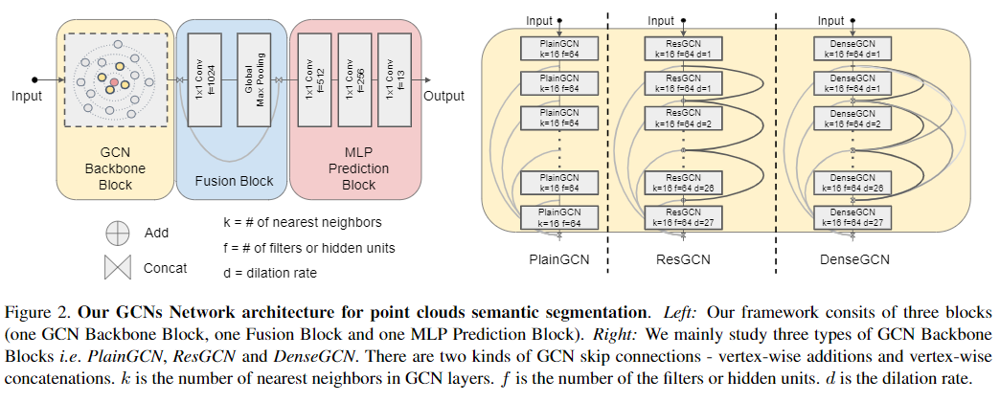
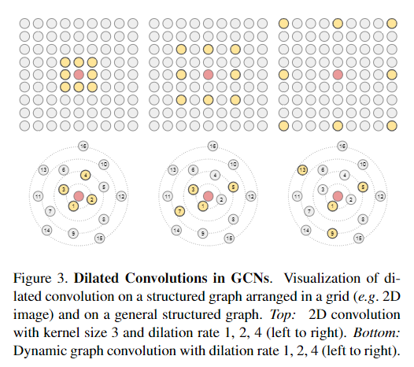

pdf_source: https://arxiv.org/pdf/1904.03751.pdf
code_source: https://github.com/lightaime/deep_gcns
short_title: Deep GCN
# Can GCNs Go as Deep as CNNs

这篇论文是近期图卷积网络的重要突破之一。意义在于对基本卷积的一个复制，将基础卷积相关的连接算法移植到图卷积中。

## 图卷积网络的Res连接以及Dense连接

与基础的ResNet和DenseNet一致，Res代表层输入与层输出相加。Dense则是多层输入、输出的Concatenation。

## 图卷积网络的Dilated Convolution

本文卷积采取的方案是K-nearest-neighbor的方案，寻找与当前点距离最近的k个点进行卷积，若扩展为dilatedConv，则距离最近的点进行排序，每隔几个点找出一个卷积点。

从实时运算的角度来看，需要建立一个KDtree， 对于每一层的网络都要对每一个点进行KNN的搜索。实时运算速率一般，但是能得到更好的结果。